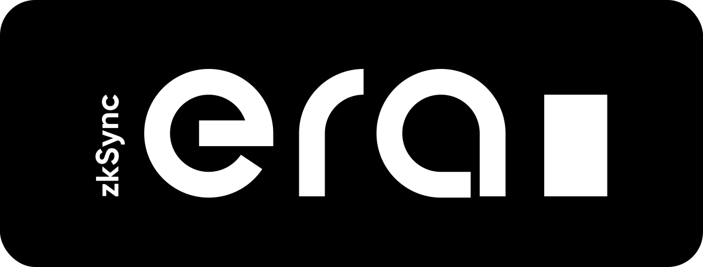

# zkSync Era: System Contracts

zkSync Era is a layer 2 rollup that uses zero-knowledge proofs to scale Ethereum without compromising on security or
decentralization. Since it's EVM compatible (Solidity/Vyper), 99% of Ethereum projects can redeploy without refactoring
or re-auditing a single line of code. zkSync Era also uses an LLVM-based compiler that will eventually let developers
write smart contracts in C++, Rust and other popular languages.

## system-contracts

To keep the zero-knowledge circuits as simple as possible and enable simple extensions, we created the system contracts.
These are privileged special-purpose contracts that instantiate some recurring actions on the protocol level. Some of the
most commonly used contracts:

`ContractDeployer` This contract is used to deploy new smart contracts. Its job is to make sure that the bytecode for each deployed 
contract is known. This contract also defines the derivation address. Whenever a contract is deployed, a ContractDeployed 
event is emitted.

`L1Messenger` This contract is used to send messages from zkSync to Ethereum. For each message sent, the L1MessageSent event is emitted.

`NonceHolder` This contract stores account nonces. The account nonces are stored in a single place for efficiency (the tx nonce and
the deployment nonce are stored in a single place) and also for the ease of the operator.

`Bootloader` For greater extensibility and to lower the overhead, some parts of the protocol (e.g. account abstraction rules) were
moved to an ephemeral contract called a bootloader. 

We call it ephemeral because it is not physically deployed and cannot be called, but it has a formal address that is used 
on msg.sender, when it calls other contracts.

## License

The zkSync Era system-contracts are distributed under the terms of the MIT license.

See [LICENSE-MIT](LICENSE-MIT) for details.

## Official Links

- [Website](https://zksync.io/)
- [GitHub](https://github.com/matter-labs)
- [Twitter](https://twitter.com/zksync)
- [Twitter for Devs](https://twitter.com/zkSyncDevs)
- [Discord](https://discord.gg/nMaPGrDDwk)

## Disclaimer

zkSync Era has been through lots of testing and audits. Although it is live, it is still in alpha state and will go
through more audits and bug bounties programs. We would love to hear our community's thoughts and suggestions about it!
It is important to state that forking it now can potentially lead to missing important security updates, critical
features, and performance improvements.
