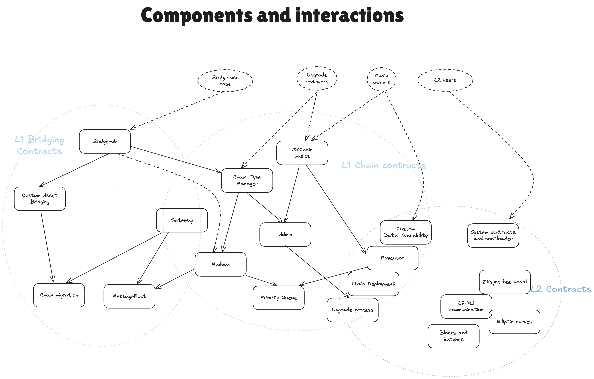

# ZK Stack contracts specs

- [Glossary](./glossary.md)
- [Overview](./overview.md)
- [Bridging](./bridging/overview.md)
    - [Bridgehub](./bridgehub/overview.md)
        - [Chain registry](./bridgehub/chain_registry.md)
        - [L1 ecosystem contracts](./bridgehub/bridgehub.md)
    - [Asset Router](./asset_router/overview.md)
- [Chain Management](./chain_managment/overview.md)
    - [Chain type manager](./chain_managment/chain_type_manager.md)
    - [Admin roles](./chain_managment/admin_roles.md)
    - [Chain genesis](./chain_managment/chain_genesis.md)
    - [Upgrade process](./chain_managment/upgrade_process.md)
- [Settlement contracts](./settlement_contracts/overview.md)
    - [L1 smart contracts](./settlement_contracts/l1_smart_contracts.md)
    - [Data availability](./settlement_contracts/data_availability.md)
        - [Custom DA](./settlement_contracts/data_availability/custom_da.md)
        - [Rollup DA](./settlement_contracts/data_availability/rollup_da.md)
        - [Standard pubdata format](./settlement_contracts/data_availability/standard_pubdata_format.md)
        - [State diff compression v1 spec](./settlement_contracts/data_availability/state_diff_compression_v1_spec.md)
    - [Priority Queue](./settlement_contracts/priority_queue.md)
- [L2 System Contracts](./l2_system_contracts.md)
    - [Batches and blocks on ZKsync](./l2_system_contracts/batches_and_blocks_on_zksync.md)
    - [Elliptic curve precompiles](./l2_system_contracts/elliptic_curve_precompiles.md)
    - [L2 processing of L1->L2 transactions](./l2_system_contracts/l2_processing_of_l1->l2_txs.md)
    - [System contracts bootloader description](./l2_system_contracts/system_contracts_bootloader_description.md)
    - [ZKsync fee model](./l2_system_contracts/zksync_fee_model.md)
- [Gateway](./gateway/overview.md)
    - [Chain migration](./gateway/chain_migration.md)
    - [Gateway protocol upgrades](./gateway/gateway_protocol_upgrades.md)
- [Upgrade History](./upgrade_history.md)
    - [Gateway upgrade](./upgrade_history/gateway_upgrade.md)

