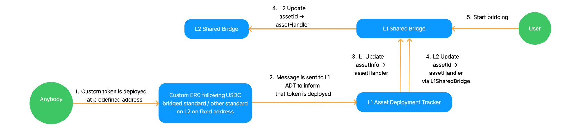
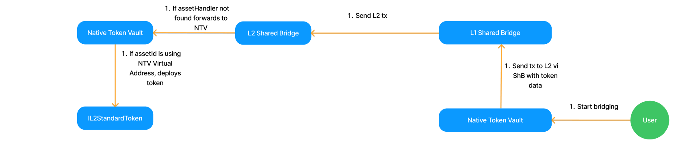

# Custom Asset Bridging

## High-level Overview

### Reason for changes

The goal was to be build a modular bridge which separates the logic of L1<>L2 messaging from the holding of the asset. This enables bridging many custom tokens, assets which accrue value over time (like LRTs), WETH, and even custom assets like NFTs.

This upgrade only contains the framework, the logic of the custom bridges can be developed by third parties.

### Major changes

In order to achieve it, we separated the liquidity managing logic from the Shared Bridge to `Asset Handlers`. The basic cases will be handled by `Native Token Vaults`, which are handling all of the standard `ERC20 tokens`, as well as `ETH`.

### New concepts

- AssetDeploymentTracker => contract that manages the deployment of asset handlers across chains. It is the contract that registers these asset handlers in the AssetRouters.
- AssetHandler => contract that manages liquidity (burns/mints, locks/unlocks) for specific token (or a set of them)
- assetId => identifier to track bridged assets across chains linked to specific asset handler.

### Normal flow

Assets Handlers are registered in the Routers based on their assetId. The assetId is used to identify the asset when bridging, it is sent with the cross-chain transaction data and Router routes the data to the appropriate Handler. If the asset handler is not registered in the L2 Router, then the L1->L2 bridging transaction will fail on the L2 (expect for NTV assets, see below).

`assetId = keccak256(chainId, asset deployment tracker = msg.sender, additionalData)`

Asset registration is handled by the AssetDeploymentTracker. It is expected that this contract is deployed on the L1. Registration can be permissionless depending on the Asset (e.g. the AssetHandler can be deployed on the chain at a predefined address, this can message the L1 ADT, which can then register the asset in the Router). Registering the L1 Handler in the L1 Router can be done via a direct function call from the L1 Deployment Tracker. Registration in the L2 Router is done indirectly via the L1 Router.

The Native Token Vault is a special case of the Asset Handler, as we want it to support automatic bridging. This means it should be possible to bridge a L1 token to an L2 without deploying the Token contract beforehand and without registering it in the L2 Router. For NTV assets, L1->L2 transactions where the AssetHandler is not registered will not fail, but the message will be automatically be forwarded to the L2NTV. Here the contract checks that the asset is indeed deployed by the L1NTV, by checking that the assetId contains the correct ADT address (note, for NTV assets the ADT is the NTV and the used address is the L2NTV address). If the assetId is correct, the token contract is deployed.

## Known Issues

### storage layout

L2SharedBridge will be a system contract, L2NativeTokenVault will replace it (the storage layout is still not yet backwards compatible)

### bridgehubDeposit API change

> /// @notice Allows bridgehub to acquire mintValue for L1->L2 transactions.

    /// @dev If the corresponding L2 transaction fails, refunds are issued to a refund recipient on L2.
    function bridgehubDepositBaseToken(
        uint256 _chainId,
        bytes32 _assetId,

Note, that the new SB is not compatible with both:

- old Mailbox on Era
- old Bridgehub
- And vice versa.

We need to either:

- ensure that all 3 get upgraded at the same time. Upgrading BH and SB at the same time is feasible IMHO. But upgrading DP (Mailbox) in the same transaction may not be.
- have a concrete plan for such case. E.g. explicitly tell that the legacy deposits will stop working. In this case we need to check (at the very least visually) that the worst thing that can happen is just deposits not working and not some funds lost
- Add the corresponding legacy functions

### Not allowing legacy withdrawals

> require(!\_isEraLegacyEthWithdrawal(\_chainId, \_l2BatchNumber), "ShB: legacy eth withdrawal");

No method to finalize an old withdrawal.
We will manually finalize all legacy withdrawals before the upgrade, i.e. withdrawals that happened before the previous Bridgehub upgrade.

### Custom Errors not implemented

> require(expectedDepositAmount == \_depositAmount, "3T"); // The token has non-standard transfer logic

Custom errors will be introduced for all contracts.

## Migration plan

- Bulkheads will need to be migrated (methods added)
- Tokens will have to be transferred (methods added)
