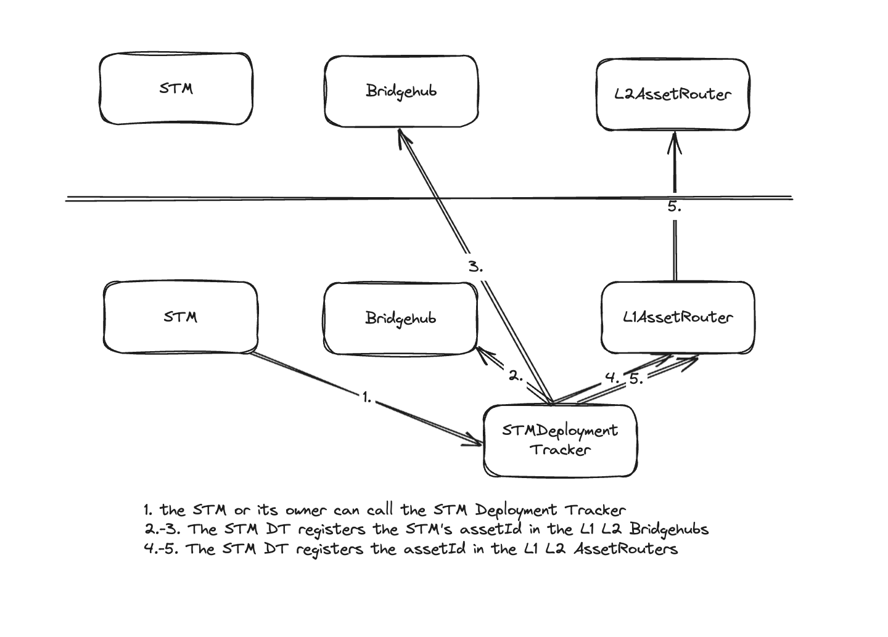
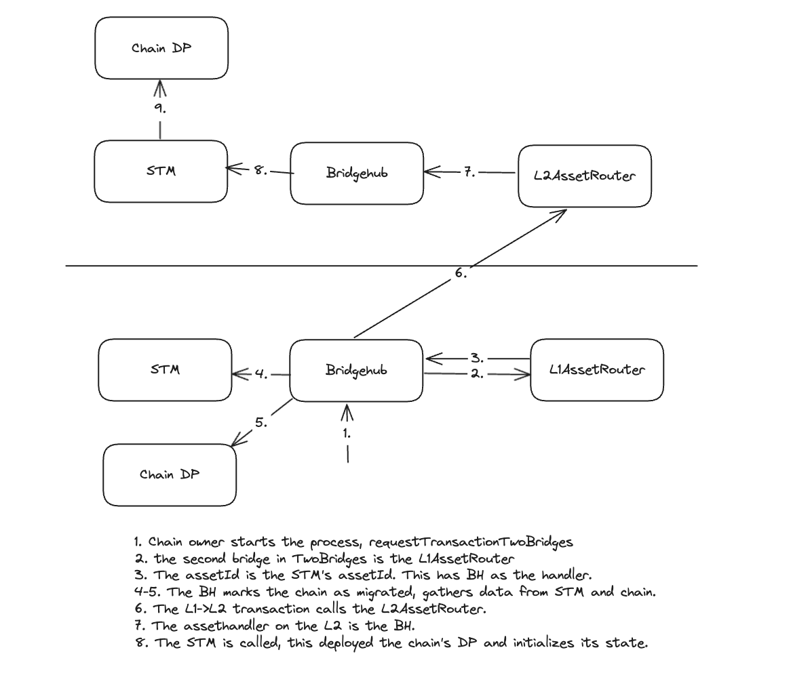

# Chain migration

Chain migration uses the Custom Asset Bridging framework:

- STMs can be deployed on the Gateway. Each STM has its own assetId.
- The STM Deployment Tracker deployed on L1 registers assetId in the L1 and L2 AssetRouters, with the Bridgehub as the AssetHandler. It also registers the L1 and L2 STM contracts to be associated to the assetId in the Bridgehubs.
- Bridging of a chain happens via the Bridgehub, AssetRouters, and STM.

_Note these are separate calls_

_Note these are a single call with an L1->L2 txs_
