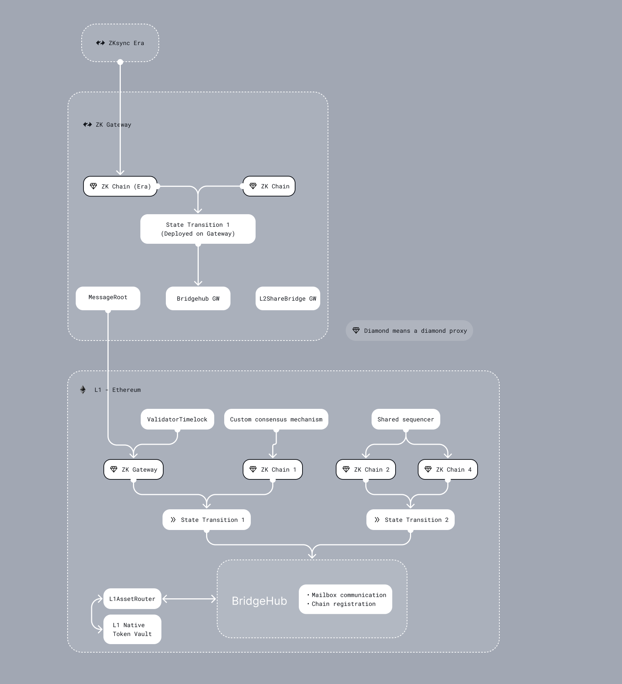

# Contracts review - Gateway

## Intro

The ZK Gateway is a proof composition layer that will allow chains to settle seamlessly to Ethereum while doing interop (interop not yet supported). In this first version the Gateway is an instance of the EraVM.

List of changes and new features:

- Priority Queue uses a Merkle tree structure to store the transactions. This is needed for efficient migration to and from the Gateway. The merkle tree is a DynamicIncrementalMerkleTree, for more information see the PriorityQueue doc.
- Custom Data Availability contracts. This is needed to handle the relayed data availability on the Gateway.
- L1 -> Gateway -> ZKChain transactions. This is done by forwarding transactions to Chain's Mailbox on the Gateway via the Gateway's Mailbox.
- ZKChain -> Gateway -> L1 transactions. This is done by aggregating the logs of different chains in the MessageRoot contract, and sending a single log to L1.
- Migration of chains to and from the Gateway. This is done using our Custom Asset Bridging framework, each STM has an assetId and is managed by a shared STMDeploymentTracker, the L2AssetRouter = L2SharedBridge is deployed on the Gateway, but only holds the chains as assets, with the Bridgehub as the AssetHandler.

Other smaller changes:

- The setChainId upgrade is updated to become the Genesis upgrade with an L2 contract (deployed at genesis in user-space).
- The Bridgehub, MessageRoot, L2SharedBridge and L2NativeTokenVault contracts are now deployed at genesis on the L2 at fixed addresses in user space.
- The SharedBridges are renamed to AssetRouters.
- Merkle.sol was moved from state-transition/libraries to common/libraries.

Known issues, and features that still need to be implemented:

- ZKChain -> Gateway -> L1 transactions are not yet supported.
- Chains cannot yet leave the Gateway. Failed migration to the Gateway cannot yet be reclaimed.
- Upgrade process, how do we upgrade to CAB bridge, to the new system contracts.
- We had the syncLayer internal name previously for the Gateway. This has not been replaced everywhere yet.
- permissions for some functions are not properly restricted yet, mostly they are missing a modifier.
- Bridgehub setAssetHandlerAddressInitial `address sender` might be an issue.
- MessageRoot should be renamed to MessageRootAggregator

## Initial Scope

- l1-contracts/contracts/
  - FullMerkle.sol
  - DynamicIncrementalMerkle.sol
  - Merkle.sol
  - PriorityTree.sol
  - CalldataDA.sol
  - ReleyedSLDAValidator.sol
  - Mailbox/\_writePriorityOp function (not other functions)
  - Executor.sol
- da-contracts/contracts/\*
- system-contracts/contracts/
  - PubdataChunkPublisher.sol
  - L1Messenger.sol
  - Compressor.sol
- l2-contracts/contracts/
  - data-availability/\*
  - L2ContractHelper.sol

## Later scope

The majority of the rest of the changes. This makes the scope quite big, so please focus on the initial scope in more detail, and if you have time include the later scope.

- MessageRoot.sol
- STMDeploymentTracker.sol
- Bridgehub.sol
- Config.sol
- L2ContractAddresses.sol
- StateTransitionManager.sol
- ValidatorTimelock.sol
- DiamondInit.sol
- ZkSyncHyperchainStorage.sol
- Admin.sol
- L1GenesisUpgrade.sol
