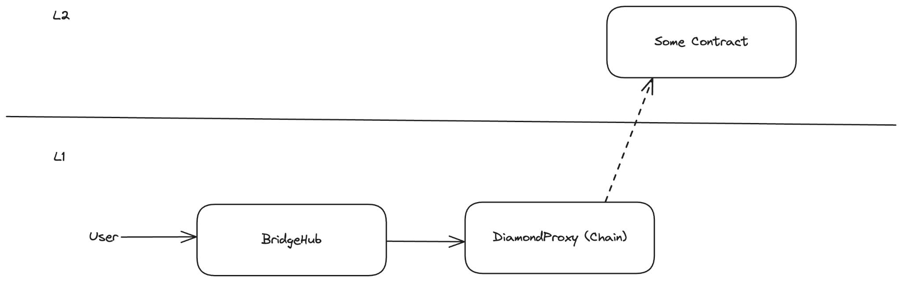
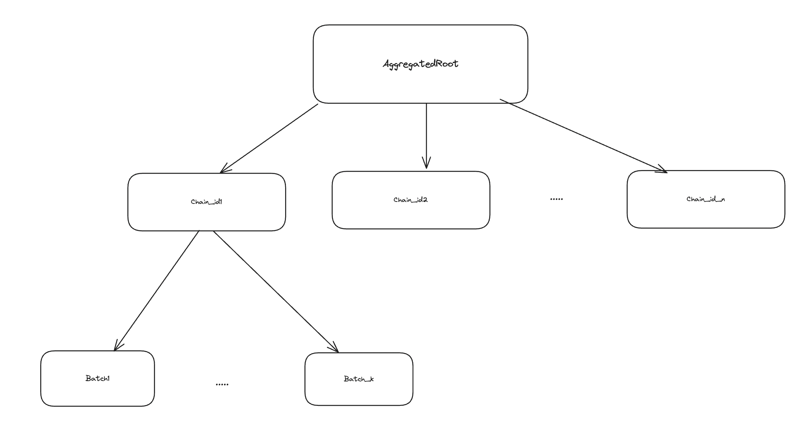

# Messaging via Gateway

Messaging for chains using the Gateway has two components, receiving messages from L1 and sending messages to it.

## L1 -> Gateway -> ZK Chain transactions

Transaction are sent from the Chain's Mailbox (on L1) to the Gateway's L1 Mailbox. From here they are routed to the BH on the Gateway, which forwards them to the Chain's Mailbox on the Gateway.

## ZK Chain -> Gateway -> L1 transactions

Messages sent from the ZK Chain to L1 are aggregated in the MessageRoot contract on the Gateway. Logs are first aggregated for a single chain across batches in a DynamicIncrementleMerkleTree, and then the roots of chains are aggregated in a FullMerkle Tree.

The benefits of this architecture are:

- the DI Merkle Tree allows chains to send multiple batches after each other, while not "burying" older batches (the Merkle paths to them will not be long unlike in a rolling hash solution).
- the Full Merkle Tree allows each chain to update the tree individually, they only need to recalculate a single branch. Storage is cheaper on the Gateway than on L1.
- Rollups publish all their L2->L1 transaction data, but for Validiums chains need to have access to the chain-level message roots to be able to construct merkle paths to every message. The Full Merkle provides this.
