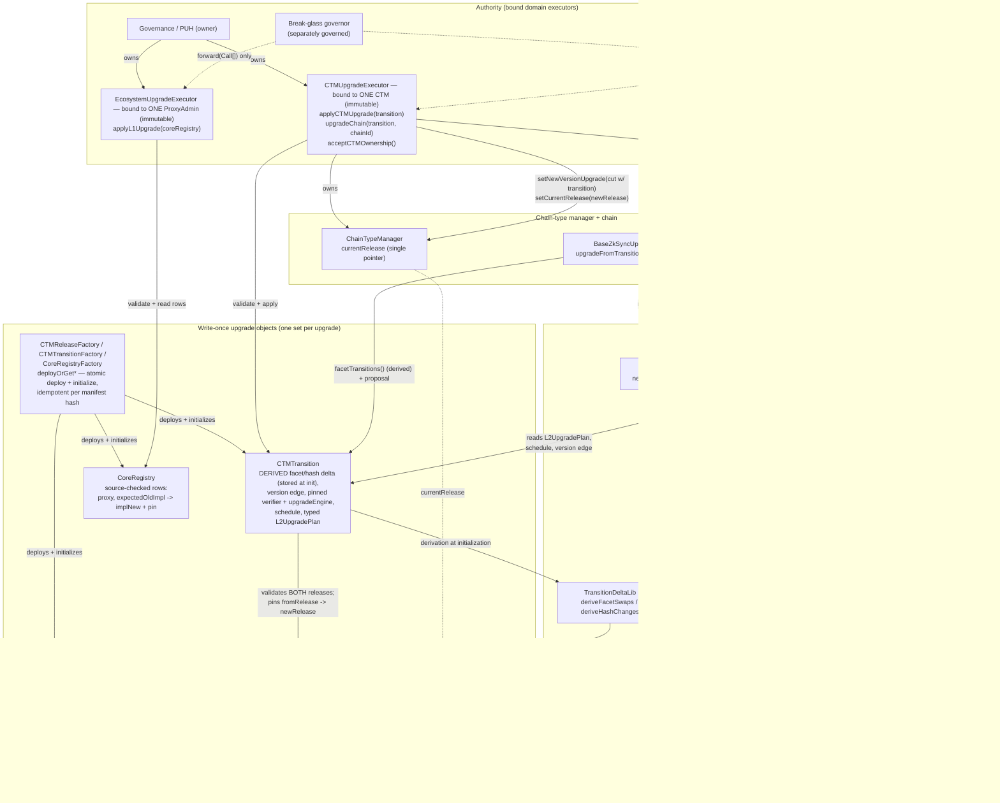

# Registry-Driven Protocol Upgrades

**Status:** Implemented for v32 (era-contracts PR #2270). v32 is the first registry-driven
release; the on-chain executor path drives upgrades from v33 onward (v32 itself ships through the
legacy governance-calldata pipeline, see "Legacy path" below).
**Scope:** L1 + L2 era-contracts, upgrade tooling, governance proposal shape.

The model separates two concepts that earlier drafts conflated:

- a **release** — what a chain _is_: the complete installed state (explicit facet routing,
  `DiamondInit`, base-system hashes, genesis parameters, force-deployment descriptor). A release
  is **version-independent** reusable chain state — a verifier-only patch reuses the same
  release — and carries **no VM flag** (VM identity is single-sourced from the pinned
  `DiamondInit.IS_ZKSYNC_OS` immutable).
- a **transition** — how release A _becomes_ release B. Crucially, the transition's facet cuts
  and base-system hash changes are **NOT authored**: they are **DERIVED** from the
  `(fromRelease, newRelease)` pair at initialization and stored (`TransitionDeltaLib`). What
  governance reviews is two releases plus the transition's own concerns: the version edge
  (`oldProtocolVersion -> newProtocolVersion`), the pinned verifier, the pinned `upgradeEngine`,
  the schedule, and the typed `L2UpgradePlan`.

Both are storage-backed, **write-once** contracts generated per upgrade, initialized exactly once
from an audited manifest, committing `manifestHash = keccak256(manifest)`. Every address either
object names carries its expected `EXTCODEHASH` **inline and mandatorily** — there is no
detached, optional pin list. On-chain code reads them; governance only approves "apply this
pinned transition".

## Contract map

## Contracts

| Contract                                                             | Where                          | Role                                                                                                                                                                                                                                                                                               |
| -------------------------------------------------------------------- | ------------------------------ | -------------------------------------------------------------------------------------------------------------------------------------------------------------------------------------------------------------------------------------------------------------------------------------------------- |
| `CTMRelease`                                                         | `contracts/upgrades/registry/` | Write-once description of one release: `DiamondInit` + pin, complete `GenesisFacet[]` (address, freezability, **explicit non-empty selectors**, **inline pin**), base-system hashes, `fixedForceDeploymentsData`, genesis params (+ genesis-upgrade pin). **No version, no verifier, no VM flag.** |
| `CTMTransition`                                                      | `contracts/upgrades/registry/` | Write-once description of one hop. Authored: version edge, pinned `verifier`, pinned `upgradeEngine`, schedule, `L2UpgradePlan`. **Derived at init** from `(fromRelease, newRelease)` and stored: `UpgradeFacetSwap[]` + base-system hash changes. `fromRelease` is mandatory (never zero).        |
| `CoreRegistry`                                                       | `contracts/upgrades/registry/` | Write-once **source-checked** L1 ecosystem rows: `ecosystemRows()` returns `EcosystemContractRow[]` (key, proxy, `expectedOldImpl`, `implNew`, inline pin). No proxy admin (the executor is bound to it), no protocol versions.                                                                    |
| `TransitionDeltaLib`                                                 | `contracts/upgrades/registry/` | DERIVES the facet swaps + hash changes from a release pair; rejects duplicate selectors within a release's routing. Replaces the previous author-then-prove convergence model.                                                                                                                     |
| `ICTMRelease` / `ICTMTransition` / `ICoreRegistry`                   | `contracts/upgrades/registry/` | Read interfaces used by consumers (CTM, DiamondInit, `BaseZkSyncUpgrade`, composer, executors).                                                                                                                                                                                                    |
| `ReleaseFacetReader`                                                 | `contracts/upgrades/registry/` | `newChainInstallations(release)` — genesis facet cuts straight from the release's explicit routing (no self-description fallback).                                                                                                                                                                 |
| `GenesisManifestLib`                                                 | `contracts/upgrades/registry/` | `buildGenesisManifest(GenesisConfig)` → the genesis `ReleaseManifest`. Explicit routing + codehash pins are captured from the just-deployed facets AT BUILD TIME (`ISelfDescribingFacet.selectors()` / `EXTCODEHASH`); nothing self-describes at consumption time.                                 |
| `CTMUpgradeComposer`                                                 | `contracts/upgrades/registry/` | Pure composition **from a transition**: `buildUpgradeCutData`, `buildL2UpgradeTx` (composed whenever the plan has ANY L2 side — deployments **or** a delegate call), `buildProposedUpgrade`. L2 tx type comes from the target release's `DiamondInit.IS_ZKSYNC_OS`.                                |
| `CTMReleaseFactory` / `CTMTransitionFactory` / `CoreRegistryFactory` | `contracts/upgrades/registry/` | Atomic, **idempotent** deploy-and-initialize (`deployOrGet*`): one transaction, keyed by manifest hash — no uninitialized window, and a same-manifest front-run just does the caller's work. One factory per type (combined exceeds EIP-170).                                                      |
| `CTMUpgradeExecutor`                                                 | `contracts/upgrades/registry/` | Executor **bound to one immutable CTM**. Fixed logic: `applyCTMUpgrade(transition)`, `upgradeChain(transition, chainId)` (owner during the window, **permissionless after the old-version deadline**), `acceptCTMOwnership()`.                                                                     |
| `EcosystemUpgradeExecutor`                                           | `contracts/upgrades/registry/` | Executor **bound to one immutable ecosystem `ProxyAdmin`**. Fixed logic: `applyL1Upgrade(coreRegistry)` — source-checked: at `implNew` ⇒ skip, at `expectedOldImpl` ⇒ upgrade, anything else ⇒ revert (a stale registry can never downgrade a proxy).                                              |
| `UpgradeExecutorBase`                                                | `contracts/governance/`        | Shared base: `Ownable2Step` (owner = PUH) drives the fixed entrypoints; `forward(Call[])` is gated by a **separately governed `breakGlassGovernor`** (own two-step handover) — raw authority that CAN bypass transition invariants, so it belongs to a distinct holder (e.g. a security council).  |

**Validation API.** `validate()` **reverts** (`RegistryCodehashMismatch`, uninitialized, …) and is
called on every execution path — executor entrypoints, transition initialization (which validates
**both** its releases), `upgradeFromTransition`. `verifyAll()` returns `bool` for inspection and
deployment tooling. Enforcement is never left to an advisory predicate.

## Data model: the CTM stores one pointer

`ChainTypeManagerBase` keeps a single release pointer and derives all genesis data by reading it:

- **`currentRelease`** — the release every new chain is created at. Set at CTM initialization and
  moved by `setCurrentRelease` (owner-only; the executor calls it inside `applyCTMUpgrade`).
  `storedBatchZero()` / `l1GenesisUpgrade()` are views over
  `ICTMRelease(currentRelease).genesisParams()`. When the release is pinned, the CTM validates
  VM identity against `IDiamondInit(release.diamondInit()).IS_ZKSYNC_OS()` — one source, no
  manifest flag to drift.

There is no per-version registry map: the upgrade cut itself carries the transition address
(`upgradeEngine.upgradeFromTransition(transition)` as init calldata), so the committed cut and
the facet-delta source are the _same object_ — the registry identity cannot be carried twice.
CTM binding is commitment-based: the cut hash is written only by the CTM-bound executor, and a
chain accepts only the cut its own CTM committed. The old `genesisRegistry` /
`upgradeRegistryForVersion` / inline-genesis slots are retained only as `__DEPRECATED_`
placeholders for the upgradeable-proxy layout.

## Flow A — genesis (creating a new chain)

1. `L1Bridgehub.createNewChain(chainId, chainTypeManager, baseTokenAssetId, admin)` records the
   base-token asset id + settlement layer, then calls the CTM with the **minimal**
   `createNewChain(chainId, admin)`.
2. The CTM builds a genesis `DiamondCutData` with **empty** `facetCuts`,
   `initAddress = currentRelease.diamondInit()`, empty `initCalldata`, and deploys the
   `DiamondProxy`.
3. `DiamondInit.initialize(chainId, admin)` — delegatecalled from the proxy constructor, so
   `msg.sender` is the CTM — reads the CTM's `currentRelease`, installs the release's explicit
   facet routing via `ReleaseFacetReader.newChainInstallations`, and reads the base system
   contract hashes from the release.
4. The CTM runs the genesis upgrade (`IAdmin.genesisUpgrade`) using the release's
   `fixedForceDeploymentsData` + genesis-upgrade address. Genesis factory-dep **bytecodes** are
   published out-of-band (bytecodes supplier) and referenced by hash.

Chain migration between settlement layers: `forwardedBridgeBurn` forwards only
`(admin, protocolVersion)`; the destination CTM rebuilds the genesis cut from its **own**
`currentRelease` in `forwardedBridgeMint` → `_deployNewChain(chainId, admin)`.

## Flow B — a registry-driven protocol upgrade

Governance (PUH) owns the two bound executors, which own the CTM and the ecosystem `ProxyAdmin`
respectively. A per-upgrade proposal is a sequence of fixed-signature executor calls:

- `EcosystemUpgradeExecutor.applyL1Upgrade(coreRegistry)` — `validate()`s the registry, then
  walks the source-checked rows: a proxy already at `implNew` is skipped (idempotence), a proxy
  at `expectedOldImpl` is upgraded, a proxy at anything else **reverts** — replaying a stale
  registry cannot downgrade a proxy a later upgrade already moved.
- `CTMUpgradeExecutor.applyCTMUpgrade(transition)` — `validate()`s the transition, then asserts
  **both edges independently, before any mutation**:
  - release edge: `ctm.currentRelease() == transition.fromRelease()` — rejects execution from the
    wrong release and (since the call moves `currentRelease`) replays;
  - version edge: `ctm.protocolVersion() == transition.oldProtocolVersion()`.
    It then calls `setNewVersionUpgrade(cut, oldV, deadline, newV, verifier)` — where the cut's
    init is `upgradeEngine.upgradeFromTransition(transition)` — and
    `setCurrentRelease(transition.newRelease())`, so chains created after the upgrade start at the
    new release. Schedule (timestamp, deadline) comes from the transition, not call arguments,
    and the transition refuses to exist with `deadline < upgradeTimestamp`
    (`TransitionDeadlineBeforeUpgrade`) — the old protocol can never be disabled before chains
    are allowed to upgrade.
- Per chain, `CTMUpgradeExecutor.upgradeChain(transition, chainId)` — recomposes the same cut
  (checked against the committed `upgradeCutHash`). **Execution policy:** owner-driven during
  the upgrade window; **permissionless** once the old-version deadline passes — at that point the
  upgrade is operationally mandatory and execution carries no discretionary inputs (chain admins
  additionally retain their own direct execution path on the chain diamond).

When a chain executes the upgrade, `BaseZkSyncUpgrade.upgradeFromTransition` validates the
transition, applies the **derived** `transition.facetTransitions()`, then runs the
transition-composed `ProposedUpgrade` — one object sources both the facet changes and the
proposal, and that object's delta is a pure function of the two signed releases.

**Bootstrap (migration into this architecture).** `fromRelease` is **never zero**: one-time
migration accommodations live in one-time migration code, not in every future transition. The
v32 legacy upgrade scripts install `currentRelease` on every CTM (`setCurrentRelease` in the
governance calldata; fresh Gateway CTMs pin it at genesis), so every v33+ transition has a real,
validated source release. A pre-v32 CTM that never received its v32 leg must get one before it
can take a registry-driven transition.

**Patches.** There is exactly ONE patch representation: a same-release transition. (The old
side-door — `createNewPatchUpgrade` + `DefaultUpgrade.patchUpgrade`, which accepted an arbitrary
delegatecalled upgrade contract outside the transition model — is removed.) The rules compose:
a SemVer patch bump must reuse the departing release (`PatchMustReuseRelease`); a same-release
transition's derived facet/hash delta is **empty by construction**, and it must not carry an L2
payload either (`SameReleaseTransitionHasPayload`) — verifier/schedule-only. A patch keeps
`currentRelease` at the same release, so genesis for new chains keeps resolving by identity.
Transitions also refuse `newProtocolVersion <= oldProtocolVersion` (`ProtocolVersionTooSmall`) —
the same rule chains enforce at execution and the CTM enforces in `setNewVersionUpgrade`.

**Derivation, and the honest scope of the guarantee.** The L1-side guarantee is: _the facet
routing and base-system hashes an existing chain ends up with are byte-for-byte what a fresh
chain at `newRelease` gets_ — true by construction, because the delta is derived from the
release pair (duplicate selectors in a release's routing are rejected). The **L2 side is
reviewed-and-pinned data, not proven**: L1 cannot verify L2 execution effects, so the
`L2UpgradePlan` (typed force-deployments, delegate target + calldata, factory deps) is
shape-validated at initialization — a plan whose data the composed transaction would never
execute is rejected (`MalformedL2UpgradePlan`), and delegate-only plans compose a real
transaction (they are never silently dropped) — but what the delegate _does_ on L2 is covered by
review of the pinned payload, not by an on-chain proof.

**Atomic, idempotent deployment.** The registry objects have unauthenticated one-shot
initializers, so deploying and initializing in separate transactions would leave an
uninitialized, front-runnable instance. The factories (`deployOrGetRelease` /
`deployOrGetTransition` / `deployOrGetCoreRegistry`) do both in ONE transaction and keep a
`manifestHash -> instance` registry: a same-manifest front-run merely does the caller's work
(the existing, verified instance is returned), and a different manifest lands in a different
slot. Deterministic addresses are deliberately not part of the model (CREATE2 derivation differs
between EVM and EraVM; nothing needs the address predictable — the CTM stores the pointer).
On Gateway, the CTM deployer calls the directly-deployed `CTMReleaseFactory` inside its own
transaction (embedding the release's creation code would exceed the EIP-3860 initcode cap), so
the Gateway bootstrap release also has no uninitialized window; its address stays predictable
off-chain as the factory's first CREATE.

**Legacy path.** `deploy-scripts/upgrade/default-upgrade/*` still targets _pre-v32_ CTMs and keeps
encoding the old `setChainCreationParams`; the struct + entrypoint live in
`ILegacyChainTypeManager` (not on the current CTM) so those scripts still compile.
`CTMUpgrade_v32` deploys the genesis release as part of the v32 deploy and emits
`setCurrentRelease` in the governance calldata — v32 itself ships through this legacy pipeline;
the executor path above is how v33+ ships.

## Manifest tooling

The local-environment manifest (`scripts/registry-manifests/v32-local.json`) is emitted and
consumed by the anvil registry-driven upgrade runner
(`test/anvil-interop/run-registry-driven-upgrade-test.ts`): `REGEN_REGISTRIES=1` rebuilds it from
a live deployment (emit), the CI default replays it and fails on any drift (consume). The
manifest carries the two releases' complete explicit routing and the transition's authored
fields — **no facet swaps**: the reviewable artifact is the state, not a hand-written delta.
Production release/transition instances for a real upgrade are deployed by the upgrade-prepare
pipeline (`CTMUpgrade_v32` for v32).

## Assumptions / invariants

- **`currentRelease` is mandatory.** A CTM with `currentRelease == 0` cannot create chains;
  `setCurrentRelease(0)` reverts `ZeroAddress`.
- **`fromRelease` is mandatory.** Transitions never accept a zero source; pre-registry migration
  is the v32 legacy scripts' job (see Bootstrap above).
- **Releases and transitions are pinned deployed contracts, write-once.** `initialize` reverts if
  already set; the committed `manifestHash` is what a proposal pins; the addresses referenced by
  governance are implementation addresses, never proxies.
- **Pins are inline and mandatory.** Every address a release/transition/core-registry names
  carries its expected `EXTCODEHASH` beside it, checked at initialization and by
  `validate()` / `verifyAll()`.
- **Validation reverts on execution paths.** `validate()` everywhere on-chain; `verifyAll()` is
  tooling-only.
- **Releases carry explicit complete routing.** Empty selector lists are rejected; duplicate
  selectors are rejected during derivation. Facet self-description
  (`ISelfDescribingFacet.selectors()`) is a BUILD-time tool for manifest generators, not a
  consumption-time code read.
- **VM identity has one source**: the pinned `DiamondInit.IS_ZKSYNC_OS` immutable, validated by
  the CTM against its own flavour when a release is pinned, and read by the composer for the L2
  tx type.
- **The enums are a cross-version ABI — append-only.** New variants go at the end; never reorder
  or delete.
- **The facet set for a protocol version is uniform across all chains on a CTM** — the invariant
  the derived delta and `upgradeCutHash[version]` rely on.
- **VM-specific genesis validation** happens when the release is set, reading its
  `genesisParams()`: Era requires `genesisIndexRepeatedStorageChanges != 0`; ZKsyncOS requires
  `genesisBatchCommitment == bytes32(uint256(1))`.
- **Reproducible bytecode is load-bearing** for every codehash pin — pinned implementations are
  built with a CBOR-metadata-free profile so hashes are byte-identical across platforms (this is
  also why `AllContractsHashes` is regenerated only on CI, never on macOS).
- **Nothing large flows through `createNewChain`.** Genesis force-deployment bytecodes are
  published out-of-band and referenced by hash; the bridgehub → CTM call carries only
  `(chainId, admin)`.
