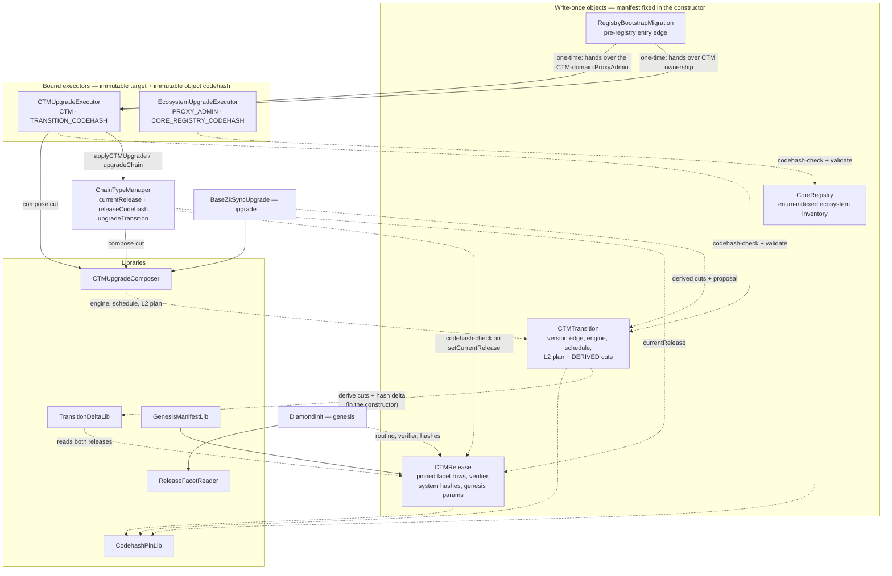
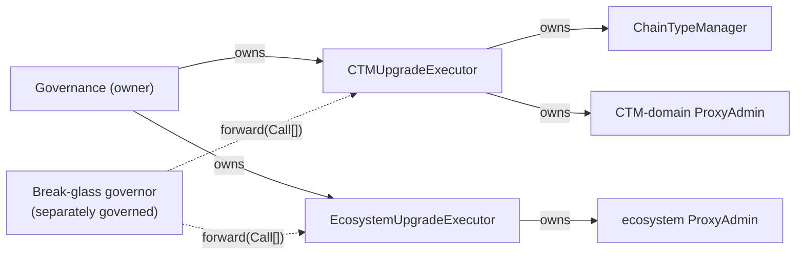
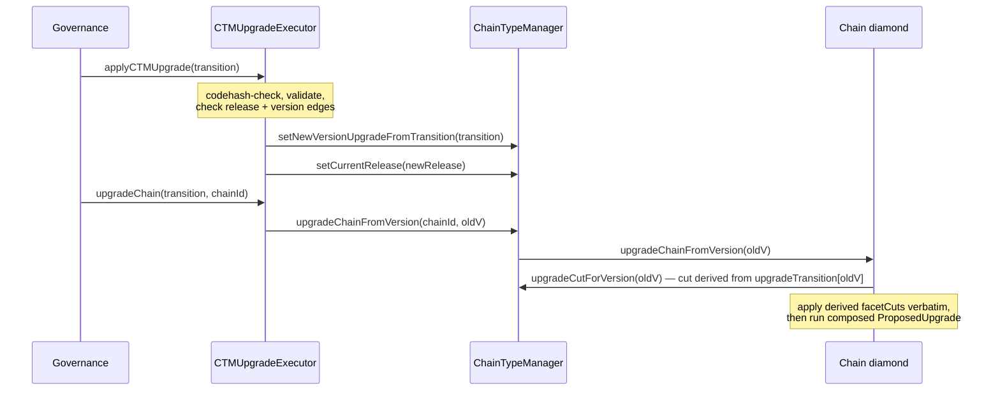

# Registry-Driven Protocol Upgrades

A protocol upgrade is a set of **write-once contracts** deployed ahead of time. Governance approves
addresses, not calldata; the contracts hold the data, validate it, and the executors apply it.

**Scope:** L1 + L2 era-contracts, upgrade tooling, governance proposal shape.

## Model

Two objects, deliberately separate:

|          | **Release**                                                                                                                                 | **Transition**                                                         |
| -------- | ------------------------------------------------------------------------------------------------------------------------------------------- | ---------------------------------------------------------------------- |
| Answers  | what a chain **is**                                                                                                                         | how release A **becomes** release B                                    |
| Contains | pinned facet set (routing self-described by the facets), `DiamondInit`, verifier, base-system hashes, genesis params, force-deployment data | version edge, upgrade engine, CTM-domain proxy rows, schedule, L2 plan |
| Version  | none — version-independent, reusable                                                                                                        | owns the `old -> new` version edge                                     |
| VM flag  | none — read from the pinned `DiamondInit.IS_ZKSYNC_OS`                                                                                      | —                                                                      |

A release is reusable chain state: everything a chain _runs_ belongs to it, including the verifier
(the chain stores it as `s.verifier`). What a release does **not** carry is anything about _when_ —
the version edge and the schedule are the transition's, and one release can serve several versions.

**A transition's facet cuts and hash changes are not authored.** They are derived from its
`(fromRelease, newRelease)` pair in the constructor and stored: a full reinstall — remove the
departing release's routing, install the target's (a same-release pair derives empty, so patches
stay schedule-only). No selector-level diffing: each release redeploys its facets anyway.
Governance reviews two releases plus the transition's own fields; the cuts are computed, not
written.

## Objects

All are storage-backed, built once from a manifest they take in the constructor, and commit
`manifestHash = keccak256(abi.encode(manifest))`.

| Contract                     | Holds                                                                                                                                                                                                                                                          |
| ---------------------------- | -------------------------------------------------------------------------------------------------------------------------------------------------------------------------------------------------------------------------------------------------------------- |
| `CTMRelease`                 | `diamondInit` + pin, `verifier` + pin, `GenesisFacet[]` (address, freezability, pin — routing is read from each pinned facet's own self-description), three base-system hashes, `fixedForceDeploymentsData`, genesis params + genesis-upgrade pin              |
| `CTMTransition`              | version edge, `fromRelease`, `newRelease`, `upgradeEngine` + pin, `proxyUpgrades` (the `CTMContract`-indexed CTM-domain inventory, incl. the CTM itself), deadline, `upgradeTimestamp`, `L2UpgradePlan`; **derived and stored:** final `Diamond.FacetCut[]` and base-system hash changes |
| `CoreRegistry`               | the `L1EcosystemContract`-indexed ecosystem inventory of `(proxy, expectedOldImpl, implNew + pin)` rows for the SHARED singletons (bridges, Bridgehub, MessageRoot)                                                                                          |
| `RegistryBootstrapMigration` | one edge from a pre-registry CTM into this model — see [Bootstrap](#bootstrap)                                                                                                                                                                                 |

### Enum-indexed proxy inventories

Proxy upgrades are not carried as anonymous row lists. Each manifest carries a **complete row
array indexed by the canonical contract enum** — the SAME enum that identifies the contract for
deployment, one enum per domain (`ContractIdentifiers.sol`) — whose length must be exactly the
enum's member count (`L1_ECOSYSTEM_CONTRACT_COUNT` / `CTM_CONTRACT_COUNT`, both DERIVED as
`type(...).max + 1`; the arrays are dynamic with a construction-time length check because solc
cannot fold `type(...).max` in static array-length position):

- `CoreRegistryManifest.proxyUpgrades` is indexed by `L1EcosystemContract` (L1Bridgehub,
  L1ChainAssetHandler, L1MessageRoot, L1Nullifier, L1AssetRouter, L1NativeTokenVault,
  L1InteropHandler, CTMDeploymentTracker, ChainRegistrationSender).
- `TransitionManifest.proxyUpgrades` and `BootstrapManifest.proxyUpgrades` are indexed by
  `CTMContract`. Only the members that are TUPPs under the CTM-domain ProxyAdmin
  (ChainTypeManager, ValidatorTimelock, BytecodesSupplier, PermissionlessValidator) can
  meaningfully participate — a row in a facet or verifier slot can never apply, because the
  bound admin does not administer it.

Slot `uint256(member)` IS that contract's row; a slot whose `implNew` is zero is the **explicit
"not upgraded" statement**. The point is audit legibility plus structural completeness: the
length check means a manifest cannot omit a slot, and the enum — being the same one deployment
uses — is the single naming scheme end to end. (The `ServerNotifier` has no slot: it sits under
its own chainAdmin-owned ProxyAdmin for operational upgrades outside this flow.)

The inventory shape exists only at the manifest boundary — the audited constructor calldata.
`ProxyUpgradeRowLib.toRows` flattens it into the `ProxyUpgradeRow[]` that `ecosystemRows()` /
`ctmProxyRows()` return and the executors apply, dropping the inert slots, so the eternal
executors never recompile when the inventory grows.

### Reinitializers: a fixed call, no data

A row never carries calldata — or data. Its `callInitializeUpgrade` BOOLEAN is the entire
reinitialization surface: when set, the apply performs `upgradeAndCall` with the FIXED,
argument-less `IProxyUpgradeInitializable.initializeUpgrade()` selector. Everything the
reinitializer needs lives in the new implementation's own audited code — constants, or
immutables on L1, both pinned by the row's `implNew` codehash. There is no runtime data channel
at all (and no discovery mechanism to serve one; the executors hold no state): a manifest
cannot route the init call to an arbitrary function, cannot smuggle arguments into it, and
there is nothing for the implementation to fetch — a forgotten or wrong reinitialization value
is a missing line in an audited contract diff, never a wrong byte in offchain-authored data.

Supporting libraries:

| Library              | Role                                                                                  |
| -------------------- | ------------------------------------------------------------------------------------- |
| `TransitionDeltaLib` | `deriveFacetCuts` / `deriveHashChanges` from a release pair                           |
| `ReleaseFacetReader` | `newChainInstallations(release)` — genesis cuts from a release's routing              |
| `CTMUpgradeComposer` | `buildUpgradeCutData`, `buildL2UpgradeTx`, `buildProposedUpgrade` from a transition   |
| `GenesisManifestLib` | `GenesisConfig` → genesis `ReleaseManifest`, capturing routing and pins at build time |
| `CodehashPinLib`     | `requirePin` (reverts) / `pinHolds` (bool)                                            |

## Contract map

Who holds what, who reads what. Solid = writes or drives; dashed = reads.

## Authority

Each executor is **bound at construction** to the contracts it governs and to the codehash of the
object type it accepts — both immutable.

| Executor                   | Bound to                                                                    | Entrypoints                                             |
| -------------------------- | --------------------------------------------------------------------------- | ------------------------------------------------------- |
| `CTMUpgradeExecutor`       | one `ChainTypeManager` + its own `ProxyAdmin`, the `CTMTransition` codehash | `applyCTMUpgrade`, `upgradeChain`, `acceptCTMOwnership` |
| `EcosystemUpgradeExecutor` | one `ProxyAdmin`, the `CoreRegistry` codehash                               | `applyL1Upgrade`                                        |

CTM authority and ecosystem authority are separate: each CTM is governed by its own executor and
upgrades on its own cadence.

`UpgradeExecutorBase` gives both two roles. `owner` (`Ownable2Step`) drives the fixed entrypoints,
whose inputs are write-once objects and whose invariants cannot be bypassed. `emergencyUpgradeBoard`
alone can `forward` raw calls, which **can** bypass every transition invariant. The separation is
realized by giving break-glass to a differently-governed holder; with one holder for both it is only
auditability.

## Provenance and pinning

Three mechanisms, applied everywhere:

**Type provenance by codehash.** Each object takes its whole manifest as a constructor argument, so
it has no initializer and no state-mutating function at all — write-once is structural, not a runtime
guard. Consumers therefore establish provenance by checking the object's `EXTCODEHASH` against the
audited one: executors hold `TRANSITION_CODEHASH` / `CORE_REGISTRY_CODEHASH` as immutables, and the
CTM holds `releaseCodehash` as state, checked in `setCurrentRelease`.

What this proves is that the address runs the audited, write-once code — not _which_ manifest it
holds. Nothing gates content on-chain, and nothing ever did: governance approving the address is what
gates content. Because the manifest lives in the initcode, a CREATE2 address also commits to it.

For this to hold, manifest data must live in **storage**, never in immutables: immutables are patched
into runtime code, which would give every instance a different codehash and make the check
impossible.

**Inline codehash pins.** Every executable address an object names carries its expected
`EXTCODEHASH` beside it — facets in their rows, `DiamondInit`, the verifier, the genesis upgrade, the
upgrade engine, each `implNew`. Pins are checked in the constructor and re-checked by `validate()`.
There is no detached, optional pin list. A pin holds only against an account that **has code**, so an
empty account can never satisfy one.

**Two validation surfaces.** `validate()` reverts and is used on every execution path;
`verifyAll()` returns `bool` and is for inspection and deployment tooling. Enforcement is never left
to an advisory predicate.

## Chain-type manager state

The CTM stores one release pointer and derives genesis data from it:

- `currentRelease` — the release every new chain is created at. `storedBatchZero()` and
  `l1GenesisUpgrade()` are views over `ICTMRelease(currentRelease).genesisParams()`.
- `releaseCodehash` — the provenance anchor every pinned release is checked against.
- `upgradeTransition[oldProtocolVersion]` — the transition committed for chains departing from that
  version, and the ONLY commitment for registry-driven edges: `upgradeCutForVersion` derives the cut
  from it on read (a chain is never handed cut bytes), and `protocolVersionDeadline` resolves the
  departing version's deadline from it (the current version is open-ended; there is no deadline
  setter — the schedule is part of the write-once transition governance approved).
- `upgradeCutHash` — DEPRECATED. Written only by the legacy cut-taking commit path; pre-v32 Admin
  facets crossing that edge verify the handed cut bytes against it. Transition commits leave it
  zero. The same legacy path is the only writer of the legacy deadline storage.

Nothing else about a chain's installed state is keyed by protocol version on the CTM. The verifier in
particular is not: a chain several versions behind resolves it from the release its own transition
names (`transition.newRelease()`), so a lagging chain is never affected by where `currentRelease` has
moved since.

When a release is pinned, the CTM validates VM identity against
`IDiamondInit(release.diamondInit()).IS_ZKSYNC_OS()` and applies its VM-specific genesis rules (Era
requires a nonzero repeated-storage index and nonzero base-system hashes; ZKsyncOS requires
`genesisBatchCommitment == 1`).

There is no per-version registry map. The upgrade cut itself carries the transition address as its
init calldata, so the committed cut and the source of the derived facet cuts are the same object.

## Flow: creating a chain

1. `L1Bridgehub.createNewChain` records base token and settlement layer, then calls
   `CTM.createNewChain(chainId, admin)`.
2. The CTM builds a genesis cut with **empty** `facetCuts`,
   `initAddress = currentRelease.diamondInit()`, empty `initCalldata`, and deploys the `DiamondProxy`.
3. `DiamondInit.initialize(chainId, admin)` is delegatecalled from the proxy constructor, so
   `msg.sender` is the CTM. It reads `currentRelease`, installs that release's self-described routing via
   `ReleaseFacetReader`, and takes the verifier and base-system hashes from the release.
4. The CTM runs `IAdmin.genesisUpgrade` with the release's `fixedForceDeploymentsData` and genesis
   upgrade address.

`chainId` and `admin` are the only per-chain inputs; everything else comes from the CTM and the
release it points at. Genesis force-deployment bytecodes are published out of band and referenced by
hash, so nothing large flows through `createNewChain`.

When a chain migrates between settlement layers, `forwardedBridgeBurn` forwards only
`(admin, protocolVersion)`; the destination CTM rebuilds the genesis cut from its **own**
`currentRelease`.

## Flow: upgrading

A proposal is a sequence of fixed-signature executor calls:

- **`EcosystemUpgradeExecutor.applyL1Upgrade(coreRegistry)`** walks the source-checked rows. A proxy
  already at `implNew` is skipped; a proxy at `expectedOldImpl` is upgraded; a proxy at anything else
  reverts. Replaying a stale registry therefore cannot downgrade a proxy a later upgrade moved on.

- **`CTMUpgradeExecutor.applyCTMUpgrade(transition)`** asserts both edges before any mutation:
  the **release edge** (`ctm.currentRelease() == transition.fromRelease()`) and the **version edge**
  (`ctm.protocolVersion() == transition.oldProtocolVersion()`). Because the call moves
  `currentRelease`, the release edge also rejects replays. It then commits the transition with
  `setNewVersionUpgradeFromTransition` — one argument, so the version edge, the schedule and the cut
  are read from the same object and cannot be passed inconsistently.

- **`CTMUpgradeExecutor.upgradeChain(transition, chainId)`** per chain. The owner may upgrade any
  chain at any time; a chain's **own admin** may upgrade **that** chain at any time — upgrading is
  the chain's decision, and the check is scoped per chain because `chainId` is an argument; anyone
  else only once the old-version deadline passes, at which point the upgrade is operationally
  mandatory and execution carries no discretionary inputs. Chain admins additionally retain their own
  direct path on the chain diamond.

**Where the cut is composed.** The cut is a pure function of the transition — an
`upgradeEngine.upgradeFromTransition(transition)` init over no facet cuts — and the CTM is the only
place that composes it: hashed at commit time (`setNewVersionUpgradeFromTransition`) and re-derived
on read (`upgradeCutForVersion`). It never travels in calldata at all: not in governance calls, and
not to the chain — the chain's Admin facet takes only the departing version and reads the cut from
its CTM, so no caller can substitute one. The chain diamond still treats the cut it reads as opaque
bytes and stays unaware of transitions.

On the chain, `BaseZkSyncUpgrade.upgradeFromTransition` validates the transition, applies
`transition.facetCuts()` verbatim, and runs the `ProposedUpgrade` composed from the same object.
There is no selector resolution and no re-diffing at execution time.

CTM binding is commitment-based: a chain accepts only the cut whose hash its own CTM committed, and
that commitment is written exclusively by the CTM-bound executor.

## What the derivation guarantees

For any representable release pair, the L1-side guarantee is that **the facet routing, verifier and
base-system hashes an existing chain ends up with are byte-for-byte what a fresh chain at
`newRelease` gets**. The upgrade path and the genesis path resolve to the same pinned release, so
they cannot drift. There is no second mechanism for any part of installed chain state.

The **L2 side is reviewed-and-pinned data, not proven**. L1 cannot verify L2 execution effects. The
`L2UpgradePlan` is shape-validated in the constructor — a plan whose data the composed transaction
would never execute is rejected — but what the delegate call _does_ on L2 is covered by review of the
pinned payload, not by an on-chain proof.

## Rules enforced at construction

**Release shape.** Nonempty facet array; every facet row has selectors; exactly one row per facet
address (`Diamond._addOneFunction` requires uniform freezability per facet); a selector appears in at
most one row.

**Version edge.** `newProtocolVersion > oldProtocolVersion`; both majors zero; the minor delta is
within `MAX_ALLOWED_MINOR_VERSION_DELTA`. These mirror the rules chains apply at execution, so a
transition cannot pin successfully and then strand every chain.

**Patches.** A patch is a same-release transition — the only patch representation. A SemVer patch
bump must reuse the departing release; a same-release transition's derived delta is empty by
construction and it must carry no L2 payload. `currentRelease` stays put, so genesis keeps resolving.
Because the verifier is part of a release, changing it is a change of installed state and therefore
needs a new release — a schedule-only patch cannot rotate the verifier.

**Schedule.** `oldProtocolVersionDeadline >= upgradeTimestamp`, so the old protocol is never disabled
before chains may upgrade.

**L2 plan.** `L2ComplexUpgrader` unconditionally ends with a delegatecall, so a nonempty plan
requires a delegate target; delegate calldata without a target, or factory deps without any L2 side,
are rejected as dead payload. The factory-dep count is capped at the same limit execution enforces.

**Base-system hashes.** Zero means "leave unchanged" in an upgrade, so a nonzero → zero change is not
representable and is rejected at derivation rather than stored as a silent no-op. The Era CTM
likewise rejects a release carrying a zero base-system hash — the same values `DiamondInit` requires
for new chains. The verifier follows the same zero-means-unchanged convention on the upgrade path,
which is how the genesis upgrade runs after `DiamondInit` has already installed it; a release itself
can never pin a zero verifier.

**Row sets.** Core-registry and bootstrap rows are real, unique edges: all fields nonzero, one row
per proxy. Duplicates would both pass the source check and the last would silently win, so the
reviewed edge and the executed edge could differ.

## Bootstrap

A pre-registry CTM has neither `currentRelease` nor `releaseCodehash`, and transitions never accept a
zero `fromRelease`. It must therefore cross into the model once, through one-time migration code —
never through an accommodation inside the transition model. Fresh CTMs pin both at genesis and need
no bootstrap.

`RegistryBootstrapMigration` expresses that crossing as a single pinned object. Its manifest carries
the CTM and its departing version, the `ProxyAdmin`, the source-checked implementation swaps (the
CTM's own implementation among them), the `releaseCodehash` anchor, the genesis `currentRelease`
(which carries the verifier), the version edge and deadline, the upgrade cut, and the two executors
that receive authority. Every address carries an inline pin.

Governance transfers CTM and `ProxyAdmin` ownership to it; `migrate()` performs the whole edge and
hands ownership to the bound executors in the same transaction. Authority is never parked: the object
acquires nothing it does not pass on before the call returns.

`validate()` runs on the execution path and requires that the migration already holds both
ownerships, that the CTM sits at the departing version, that every proxy is still at its
`expectedOldImpl`, that every pin holds, that the release runs the codehash being installed as the anchor,
and that **each executor is bound to the contract it is about to receive**. The edge is one-shot, so
an executor bound elsewhere would take ownership its fixed entrypoints cannot drive, leaving
break-glass as the only recovery.

Two properties that look like omissions but are not:

- `migrate()` is **permissionless**. The gate is the state, not the caller: nothing runs until
  governance has handed over both ownerships, which is the approval, and every value written
  afterwards is pinned.
- `upgradeCut` is **pinned data, not derived**. The departing version predates releases, so there is
  no `fromRelease` to diff against. Its `facetCuts` carry no per-facet pins — the one unpinned
  payload in the object.

CTM ownership is transferred, not forced: `migrate()` nominates the executor, and
`CTMUpgradeExecutor.acceptCTMOwnership()` — owner-gated — completes the handover.

The prepare side of this edge is `deploy-scripts/upgrade/v34/CTMUpgrade_v34.s.sol`: it rides the
default pipeline for implementation deploys and cut composition, then deploys the executor and
the migration (manifest pinned from the run's own outputs) and collapses the stage-1 CTM leg to
FOUR governance calls — nominate the CTM, hand over its ProxyAdmin, `migrate()`, and
`acceptCTMOwnership()`. The v31 upgrade surface (scripts, its anvil CI job, fork harness and
fixtures) is deleted; the pre-registry history lives on the release branches. The remaining
legacy machinery — `default-upgrade/`'s cut composition and the v32 scripts/tests that keep it
honest — goes with EVM-1644 once the bootstrap manifest generator is fully self-contained.

## Deployment determinism

Objects take their manifest as a constructor argument, so the manifest is part of the initcode and a
CREATE2 address commits to it. There is no separate salt to reproduce and no window in which a
deployed-but-uninitialized instance exists.

CREATE2 derivation is VM-specific, so off-chain address prediction must use the EVM or EraVM formula
for the deploying chain, with the exact creation code.

**Gateway.** EraVM has no constructors, so these objects cannot be constructed there. A Gateway CTM
therefore cannot deploy its own `CTMRelease` in-flow; the Gateway deployer takes a pre-deployed
release address instead, and the deployers carry TODOs describing what restoring in-flow deployment
needs: an EraVM-deployable release that takes its manifest through an atomic post-deployment
initialization.

Codehash checks depend on reproducible bytecode: pinned implementations are built with a
CBOR-metadata-free profile so hashes are byte-identical across platforms. For the same reason,
manifest data stays in storage rather than immutables — see [Provenance and pinning](#provenance-and-pinning).

## Planned: follow-up calls live in the upgrade impl (v35)

Per-proxy reinitializers are already code, not calldata (see "Reinitializers: a fixed call,
pinned data" above): the selector is fixed, and the parameters are pinned data the audited
implementation fetches and decodes itself. What remains inexpressible is CROSS-CONTRACT
follow-up wiring after a swap (`setAddresses`-style calls between contracts) — the other half
of the v31 incident shape.

The planned v35 model moves that into audited code too: a **default upgrade impl** that
performs the enumerated proxy swaps and nothing else, which a release with follow-up work
**inherits** — the subclass overrides a hook and makes the wiring calls as typed Solidity
(`abi.encodeCall`), pinned by codehash in the manifest like every other object. Auditors then
review the whole upgrade as a contract; a forgotten call is a missing line in an audited diff.
Tracked in Linear (v35 project).

## Related

- [Governance self-migration](./governance-self-migration.md) — how the authority root above
  upgrades itself.
