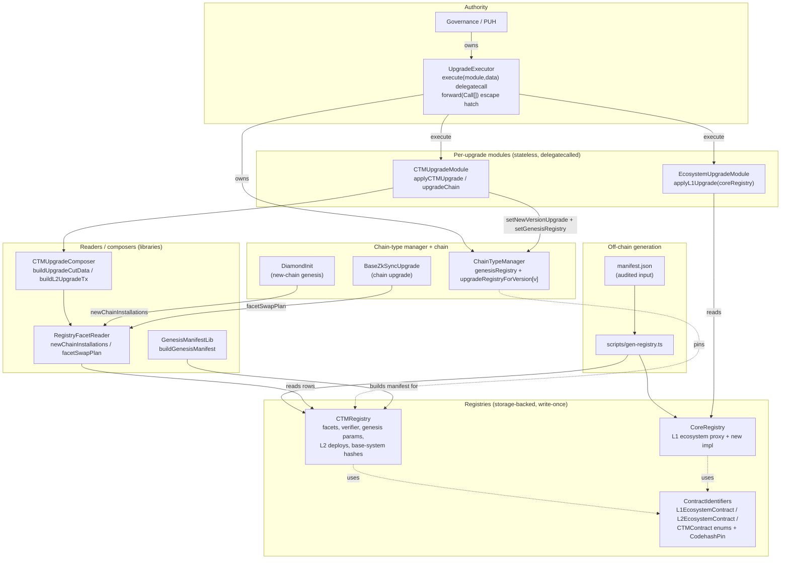

# Registry-Driven Protocol Upgrades

**Status:** Implemented for v32 (era-contracts PR #2270). v32 is the first registry-driven
upgrade; later phases (self-wiring L1 constructors, L2 registry) remain future work.
**Scope:** L1 + L2 era-contracts, upgrade tooling, governance proposal shape.

A protocol upgrade (and a fresh chain's genesis) is described entirely by an audited **registry**:
a storage-backed, write-once contract that pins every address, hash, facet and parameter the
upgrade needs. On-chain code reads the registry; governance only has to approve "point the system
at this registry". This doc describes the system as it exists in the tree.

## Contract map

## Contracts

| Contract                                      | Where                          | Role                                                                                                                                                                                                                                                                                                                                                                                                                  |
| --------------------------------------------- | ------------------------------ | --------------------------------------------------------------------------------------------------------------------------------------------------------------------------------------------------------------------------------------------------------------------------------------------------------------------------------------------------------------------------------------------------------------------- |
| `CTMRegistry`                                 | `contracts/upgrades/registry/` | Storage-backed, write-once registry of everything a chain-type-manager needs for one `(oldVersion, newVersion)` pair: facet rows + selectors, freezability, per-version addresses (`DiamondInit`, `DefaultUpgrade`, …), verifier, base system contract hashes, genesis params, force-deployments blob, L2 deployment rows, codehash pins. Era vs ZKsyncOS is a manifest flag (`isZKsyncOS`), not a separate contract. |
| `CoreRegistry`                                | `contracts/upgrades/registry/` | Same shape for L1 ecosystem contracts (`L1EcosystemContract` rows: proxy + new impl) + codehash pins.                                                                                                                                                                                                                                                                                                                 |
| `ContractIdentifiers.sol`                     | `contracts/upgrades/registry/` | The cross-version ABI: `L1EcosystemContract` (L1) / `L2EcosystemContract` (L2) / `CTMContract` / `ZKsyncOSUpgradeType` enums **and** the shared `CodehashPin` struct.                                                                                                                                                                                                                                                 |
| `ICTMRegistry` / `ICoreRegistry`              | `contracts/upgrades/registry/` | Read interfaces used by consumers (CTM, DiamondInit, composer, reader).                                                                                                                                                                                                                                                                                                                                               |
| `RegistryFacetReader`                         | `contracts/upgrades/registry/` | `newChainInstallations(registry)` (genesis facet cuts) and `facetSwapPlan(registry)` (`UpgradeFacetSwap[]` for an upgrade), derived from the registry's rows.                                                                                                                                                                                                                                                         |
| `GenesisManifestLib`                          | `contracts/upgrades/registry/` | `buildGenesisManifest(GenesisConfig)` → a `CTMRegistry` manifest for a freshly deployed chain-type manager's genesis registry.                                                                                                                                                                                                                                                                                        |
| `CTMUpgradeComposer`                          | `contracts/upgrades/registry/` | Pure composition from a registry: `buildUpgradeCutData`, `buildL2UpgradeTx`, `buildProposedUpgrade`.                                                                                                                                                                                                                                                                                                                  |
| `CTMUpgradeModule` / `EcosystemUpgradeModule` | `contracts/upgrades/registry/` | Stateless per-upgrade modules, delegatecalled by the executor: `applyCTMUpgrade(registry, oldDeadline, timestamp)` + `upgradeChain(...)`, and `applyL1Upgrade(coreRegistry)`.                                                                                                                                                                                                                                         |
| `UpgradeExecutor`                             | `contracts/governance/`        | Permanent `Ownable2Step` (owner = PUH) exposing `execute(module, data)` (delegatecall) + `forward(Call[])` (raw-call escape hatch). Holds the ownerships PUH used to hold.                                                                                                                                                                                                                                            |

Both registry flavours are **generated per environment** by `scripts/gen-registry.ts` from an
audited `manifest.json`, `initialize(manifest)`d exactly once, and commit
`manifestHash = keccak256(manifest)` so a governance proposal can reference exactly the reviewed
bytes. `verifyAll()` checks the pinned `CodehashPin`s (EXTCODEHASH) against the live deployment.

## Data model: the CTM stores pointers, the registry holds the data

`ChainTypeManagerBase` keeps only two registry pointers and derives all genesis/upgrade data by
reading them:

- **`genesisRegistry`** (single, current-version) — set by `setGenesisRegistry(address)`, emits
  `NewGenesisRegistry`. The source of everything a **new** chain needs.
- **`upgradeRegistryForVersion[protocolVersion]`** — set by `setNewVersionUpgrade(…, registry)`.
  The source of the facet-swap plan when an **existing** chain upgrades to that version.

There is no inline genesis data on the CTM: the `ChainCreationParams` struct, the `InitializeData`
init struct, and the `storedBatchZero` / `initialCutHash` / `l1GenesisUpgrade` /
`initialForceDeploymentHash` storage slots do not exist (their slots are retained as
`__DEPRECATED_` placeholders to preserve the upgradeable-proxy layout). `storedBatchZero()` and
`l1GenesisUpgrade()` are views that read `genesisRegistry.genesisParams(protocolVersion)`.

## Flow A — genesis (creating a new chain)

1. `L1Bridgehub.createNewChain(chainId, chainTypeManager, baseTokenAssetId, admin)` records the
   base-token asset id + settlement layer, then calls the CTM with the **minimal**
   `createNewChain(chainId, admin)`. The base token asset id and factory deps are _not_ forwarded
   — DiamondInit reads the asset id from the bridgehub; the genesis force-deployments live in the
   registry.
2. The CTM builds a genesis `DiamondCutData` with **empty** `facetCuts`, `initAddress =
genesisRegistry.ctmAddress(DiamondInit, protocolVersion)`, and empty `initCalldata`, and
   deploys the `DiamondProxy`.
3. `DiamondInit.initialize(chainId, admin)` — delegatecalled from the proxy constructor, so
   `msg.sender` is the CTM — reads the CTM's `genesisRegistry`, installs the facet set via
   `RegistryFacetReader.newChainInstallations` (each facet's selectors from its own
   `ISelfDescribingFacet.selectors()`, or a registry-pinned override), and reads the base system
   contract hashes from the registry.
4. The CTM runs the genesis upgrade (`IAdmin.genesisUpgrade`) using the registry's
   `fixedForceDeploymentsData` + `l1GenesisUpgrade()`. Genesis factory-dep **bytecodes** are
   published out-of-band (bytecodes supplier) and referenced by hash, so an empty `factoryDeps`
   is passed.

Chain migration between settlement layers: `forwardedBridgeBurn` forwards only
`(admin, protocolVersion)`; the destination CTM rebuilds the genesis cut from its **own** registry
in `forwardedBridgeMint` → `_deployNewChain(chainId, admin)`.

## Flow B — a registry-driven protocol upgrade

Governance (PUH) owns the permanent `UpgradeExecutor`, which owns the CTMs / ecosystem
`ProxyAdmin` / `ValidatorTimelock`. A per-upgrade proposal is a sequence of
`executor.execute(module, registryImpl)` calls:

- `EcosystemUpgradeModule.applyL1Upgrade(coreRegistry)` — L1 ecosystem implementation swaps, etc.,
  read from the `CoreRegistry`.
- `CTMUpgradeModule.applyCTMUpgrade(ctmRegistry, oldDeadline, timestamp)` — reads the CTM proxy +
  old/new protocol versions from the registry, composes the upgrade cut and L2 upgrade tx via
  `CTMUpgradeComposer`, then calls `setNewVersionUpgrade(cut, old, deadline, new, verifier,
ctmRegistry)` (which pins `upgradeRegistryForVersion[new] = ctmRegistry`) **and**
  `setGenesisRegistry(ctmRegistry)`, so chains created after the upgrade start at the new version.
- Per chain, `CTMUpgradeModule.upgradeChain(ctmRegistry, chainId, timestamp)`.

When a chain executes the upgrade, `BaseZkSyncUpgrade` reads `upgradeRegistryForVersion` (via the
CTM), `RegistryFacetReader.facetSwapPlan(registry)` produces the `UpgradeFacetSwap[]` (one entry
per changed facet: old→new address, freezability, selector lists), and `_upgradeFacets` performs
the `Diamond.diamondCut` (selectors resolved from `ISelfDescribingFacet.selectors()` or a
registry override).

**Legacy path.** `deploy-scripts/upgrade/default-upgrade/*` still targets _pre-v32_ CTMs and keeps
encoding the old `setChainCreationParams`; the struct + entrypoint live in
`ILegacyChainTypeManager` (not on the current CTM) so those scripts still compile. `CTMUpgrade_v32`
deploys its genesis `CTMRegistry` as part of the v32 deploy and overrides the governance call to
emit `setGenesisRegistry` instead of `setChainCreationParams`.

## Assumptions / invariants

- **The genesis registry is mandatory.** A CTM with `genesisRegistry == 0` cannot create chains;
  `setGenesisRegistry(0)` reverts `ZeroAddress`.
- **The enums are a cross-version ABI — append-only.** New variants go at the end; never reorder
  or delete.
- **Registry instances are write-once.** `initialize` reverts if already set; the committed
  `manifestHash` is what a proposal pins.
- **The facet set for a protocol version is uniform across all chains on a CTM** — the invariant
  the swap plan and `upgradeCutHash[version]` rely on.
- **VM-specific genesis validation** happens in `_setGenesisRegistry`, reading the registry's
  `genesisParams`: Era requires `genesisIndexRepeatedStorageChanges != 0`; ZKsyncOS requires
  `genesisBatchCommitment == bytes32(uint256(1))`.
- **Reproducible bytecode is load-bearing** for CREATE2 address prediction and every codehash
  pin — registries are built with a CBOR-metadata-free profile so hashes are byte-identical
  across platforms (this is also why `AllContractsHashes` is regenerated only on CI, never on
  macOS).
- **Nothing large flows through `createNewChain`.** Genesis force-deployment bytecodes are
  published out-of-band and referenced by hash; the bridgehub → CTM call carries only
  `(chainId, admin)`.
