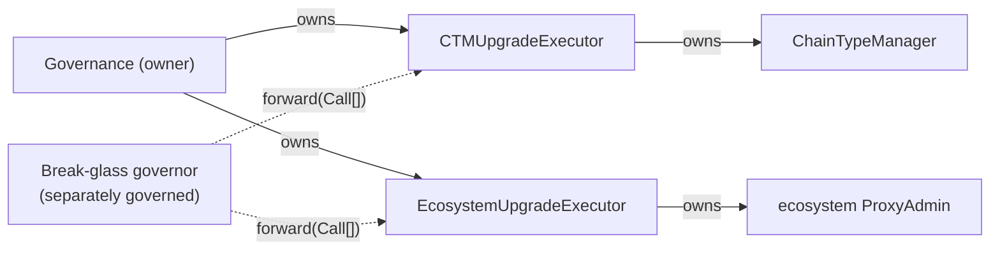
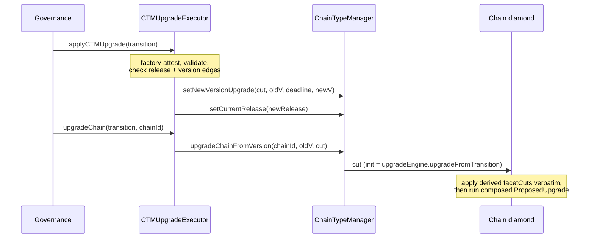

# Registry-Driven Protocol Upgrades

A protocol upgrade is a set of **write-once contracts** deployed ahead of time. Governance approves
addresses, not calldata; the contracts hold the data, validate it, and the executors apply it.

**Scope:** L1 + L2 era-contracts, upgrade tooling, governance proposal shape.

## Model

Two objects, deliberately separate:

|          | **Release**                                                                                       | **Transition**                                  |
| -------- | ------------------------------------------------------------------------------------------------- | ----------------------------------------------- |
| Answers  | what a chain **is**                                                                               | how release A **becomes** release B             |
| Contains | facet routing, `DiamondInit`, verifier, base-system hashes, genesis params, force-deployment data | version edge, upgrade engine, schedule, L2 plan |
| Version  | none — version-independent, reusable                                                              | owns the `old -> new` version edge              |
| VM flag  | none — read from the pinned `DiamondInit.IS_ZKSYNC_OS`                                            | —                                               |

A release is reusable chain state: everything a chain _runs_ belongs to it, including the verifier
(the chain stores it as `s.verifier`). What a release does **not** carry is anything about _when_ —
the version edge and the schedule are the transition's, and one release can serve several versions.

**A transition's facet cuts and hash changes are not authored.** They are derived from its
`(fromRelease, newRelease)` pair at initialization and stored. Governance reviews two releases plus
the transition's own fields; the delta between them is computed, not written.

## Objects

All are storage-backed, initialized exactly once from a manifest, and commit
`manifestHash = keccak256(abi.encode(manifest))`.

| Contract                     | Holds                                                                                                                                                                                                 |
| ---------------------------- | ----------------------------------------------------------------------------------------------------------------------------------------------------------------------------------------------------- |
| `CTMRelease`                 | `diamondInit` + pin, `verifier` + pin, `GenesisFacet[]` (address, freezability, explicit selectors, pin), three base-system hashes, `fixedForceDeploymentsData`, genesis params + genesis-upgrade pin |
| `CTMTransition`              | version edge, `fromRelease`, `newRelease`, `upgradeEngine` + pin, deadline, `upgradeTimestamp`, `L2UpgradePlan`; **derived and stored:** final `Diamond.FacetCut[]` and base-system hash changes      |
| `CoreRegistry`               | `EcosystemContractRow[]` — `(proxy, expectedOldImpl, implNew, implNewCodehash)`                                                                                                                       |
| `RegistryBootstrapMigration` | one edge from a pre-registry CTM into this model — see [Bootstrap](#bootstrap)                                                                                                                        |

Supporting libraries:

| Library              | Role                                                                                  |
| -------------------- | ------------------------------------------------------------------------------------- |
| `TransitionDeltaLib` | `deriveFacetCuts` / `deriveHashChanges` from a release pair                           |
| `ReleaseFacetReader` | `newChainInstallations(release)` — genesis cuts from a release's routing              |
| `CTMUpgradeComposer` | `buildUpgradeCutData`, `buildL2UpgradeTx`, `buildProposedUpgrade` from a transition   |
| `GenesisManifestLib` | `GenesisConfig` → genesis `ReleaseManifest`, capturing routing and pins at build time |
| `CodehashPinLib`     | `requirePin` (reverts) / `pinHolds` (bool)                                            |

## Authority

Each executor is **bound at construction** to the contracts it governs and to the factory whose
objects it accepts — both immutable.

| Executor                   | Bound to                                           | Entrypoints                                             |
| -------------------------- | -------------------------------------------------- | ------------------------------------------------------- |
| `CTMUpgradeExecutor`       | one `ChainTypeManager`, one `CTMTransitionFactory` | `applyCTMUpgrade`, `upgradeChain`, `acceptCTMOwnership` |
| `EcosystemUpgradeExecutor` | one `ProxyAdmin`, one `CoreRegistryFactory`        | `applyL1Upgrade`                                        |

CTM authority and ecosystem authority are separate: each CTM is governed by its own executor and
upgrades on its own cadence.

`UpgradeExecutorBase` gives both two roles. `owner` (`Ownable2Step`) drives the fixed entrypoints,
whose inputs are write-once objects and whose invariants cannot be bypassed. `breakGlassGovernor`
alone can `forward` raw calls, which **can** bypass every transition invariant. The separation is
realized by giving break-glass to a differently-governed holder; with one holder for both it is only
auditability.

## Provenance and pinning

Three mechanisms, applied everywhere:

**Factory attestation.** Each object type has one factory that deploys and initializes it in a single
transaction (`deployOrGetRelease` / `deployOrGetTransition` / `deployOrGetCoreRegistry` /
`deployOrGetMigration`), using CREATE2 with `salt = keccak256(abi.encode(manifest))`, and records
`manifestHash -> instance` in `deployedFor`. The address is therefore a commitment to the manifest
and is predictable before deployment, independent of factory nonce. Requesting an
already-deployed manifest returns the existing instance rather than reverting.

Executors reject objects their bound factory did not attest. Releases are attested by the CTM
itself: `releaseFactory` is CTM state, and `setCurrentRelease` rejects any release that factory did
not deploy. A transition carries no factory pointer, so there is nothing to spoof.

**Inline codehash pins.** Every executable address an object names carries its expected
`EXTCODEHASH` beside it — facets in their rows, `DiamondInit`, the verifier, the genesis upgrade, the
upgrade engine, each `implNew`. Pins are checked at initialization and re-checked by `validate()`.
There is no detached, optional pin list. A pin holds only against an account that **has code**, so an
empty account can never satisfy one.

**Two validation surfaces.** `validate()` reverts and is used on every execution path;
`verifyAll()` returns `bool` and is for inspection and deployment tooling. Enforcement is never left
to an advisory predicate.

## Chain-type manager state

The CTM stores one release pointer and derives genesis data from it:

- `currentRelease` — the release every new chain is created at. `storedBatchZero()` and
  `l1GenesisUpgrade()` are views over `ICTMRelease(currentRelease).genesisParams()`.
- `releaseFactory` — the provenance anchor every pinned release is checked against.

Nothing else about a chain's installed state is keyed by protocol version on the CTM. The verifier in
particular is not: a chain several versions behind resolves it from the release its own transition
names (`transition.newRelease()`), so a lagging chain is never affected by where `currentRelease` has
moved since.

When a release is pinned, the CTM validates VM identity against
`IDiamondInit(release.diamondInit()).IS_ZKSYNC_OS()` and applies its VM-specific genesis rules (Era
requires a nonzero repeated-storage index and nonzero base-system hashes; ZKsyncOS requires
`genesisBatchCommitment == 1`).

There is no per-version registry map. The upgrade cut itself carries the transition address as its
init calldata, so the committed cut and the source of the derived facet cuts are the same object.

## Flow: creating a chain

1. `L1Bridgehub.createNewChain` records base token and settlement layer, then calls
   `CTM.createNewChain(chainId, admin)`.
2. The CTM builds a genesis cut with **empty** `facetCuts`,
   `initAddress = currentRelease.diamondInit()`, empty `initCalldata`, and deploys the `DiamondProxy`.
3. `DiamondInit.initialize(chainId, admin)` is delegatecalled from the proxy constructor, so
   `msg.sender` is the CTM. It reads `currentRelease`, installs that release's explicit routing via
   `ReleaseFacetReader`, and takes the verifier and base-system hashes from the release.
4. The CTM runs `IAdmin.genesisUpgrade` with the release's `fixedForceDeploymentsData` and genesis
   upgrade address.

`chainId` and `admin` are the only per-chain inputs; everything else comes from the CTM and the
release it points at. Genesis force-deployment bytecodes are published out of band and referenced by
hash, so nothing large flows through `createNewChain`.

When a chain migrates between settlement layers, `forwardedBridgeBurn` forwards only
`(admin, protocolVersion)`; the destination CTM rebuilds the genesis cut from its **own**
`currentRelease`.

## Flow: upgrading

A proposal is a sequence of fixed-signature executor calls:

- **`EcosystemUpgradeExecutor.applyL1Upgrade(coreRegistry)`** walks the source-checked rows. A proxy
  already at `implNew` is skipped; a proxy at `expectedOldImpl` is upgraded; a proxy at anything else
  reverts. Replaying a stale registry therefore cannot downgrade a proxy a later upgrade moved on.

- **`CTMUpgradeExecutor.applyCTMUpgrade(transition)`** asserts both edges before any mutation:
  the **release edge** (`ctm.currentRelease() == transition.fromRelease()`) and the **version edge**
  (`ctm.protocolVersion() == transition.oldProtocolVersion()`). Because the call moves
  `currentRelease`, the release edge also rejects replays. Schedule comes from the transition, not
  from call arguments.

- **`CTMUpgradeExecutor.upgradeChain(transition, chainId)`** per chain. Owner-driven during the
  upgrade window; permissionless once the old-version deadline passes, at which point the upgrade is
  operationally mandatory and execution carries no discretionary inputs. Chain admins retain their
  own direct path on the chain diamond.

On the chain, `BaseZkSyncUpgrade.upgradeFromTransition` validates the transition, applies
`transition.facetCuts()` verbatim, and runs the `ProposedUpgrade` composed from the same object.
There is no selector resolution and no re-diffing at execution time.

CTM binding is commitment-based: a chain accepts only the cut whose hash its own CTM committed, and
that commitment is written exclusively by the CTM-bound executor.

## What the derivation guarantees

For any representable release pair, the L1-side guarantee is that **the facet routing, verifier and
base-system hashes an existing chain ends up with are byte-for-byte what a fresh chain at
`newRelease` gets**. The upgrade path and the genesis path resolve to the same pinned release, so
they cannot drift. There is no second mechanism for any part of installed chain state.

The **L2 side is reviewed-and-pinned data, not proven**. L1 cannot verify L2 execution effects. The
`L2UpgradePlan` is shape-validated at initialization — a plan whose data the composed transaction
would never execute is rejected — but what the delegate call _does_ on L2 is covered by review of the
pinned payload, not by an on-chain proof.

## Rules enforced at initialization

**Release shape.** Nonempty facet array; every facet row has selectors; exactly one row per facet
address (`Diamond._addOneFunction` requires uniform freezability per facet); a selector appears in at
most one row.

**Version edge.** `newProtocolVersion > oldProtocolVersion`; both majors zero; the minor delta is
within `MAX_ALLOWED_MINOR_VERSION_DELTA`. These mirror the rules chains apply at execution, so a
transition cannot pin successfully and then strand every chain.

**Patches.** A patch is a same-release transition — the only patch representation. A SemVer patch
bump must reuse the departing release; a same-release transition's derived delta is empty by
construction and it must carry no L2 payload. `currentRelease` stays put, so genesis keeps resolving.
Because the verifier is part of a release, changing it is a change of installed state and therefore
needs a new release — a schedule-only patch cannot rotate the verifier.

**Schedule.** `oldProtocolVersionDeadline >= upgradeTimestamp`, so the old protocol is never disabled
before chains may upgrade.

**L2 plan.** `L2ComplexUpgrader` unconditionally ends with a delegatecall, so a nonempty plan
requires a delegate target; delegate calldata without a target, or factory deps without any L2 side,
are rejected as dead payload. The factory-dep count is capped at the same limit execution enforces.

**Base-system hashes.** Zero means "leave unchanged" in an upgrade, so a nonzero → zero change is not
representable and is rejected at derivation rather than stored as a silent no-op. The Era CTM
likewise rejects a release carrying a zero base-system hash — the same values `DiamondInit` requires
for new chains. The verifier follows the same zero-means-unchanged convention on the upgrade path,
which is how the genesis upgrade runs after `DiamondInit` has already installed it; a release itself
can never pin a zero verifier.

**Row sets.** Core-registry and bootstrap rows are real, unique edges: all fields nonzero, one row
per proxy. Duplicates would both pass the source check and the last would silently win, so the
reviewed edge and the executed edge could differ.

## Bootstrap

A pre-registry CTM has neither `currentRelease` nor `releaseFactory`, and transitions never accept a
zero `fromRelease`. It must therefore cross into the model once, through one-time migration code —
never through an accommodation inside the transition model. Fresh CTMs pin both at genesis and need
no bootstrap.

`RegistryBootstrapMigration` expresses that crossing as a single pinned object. Its manifest carries
the CTM and its departing version, the `ProxyAdmin`, the source-checked implementation swaps (the
CTM's own implementation among them), the `releaseFactory` anchor, the genesis `currentRelease`
(which carries the verifier), the version edge and deadline, the upgrade cut, and the two executors
that receive authority. Every address carries an inline pin.

Governance transfers CTM and `ProxyAdmin` ownership to it; `migrate()` performs the whole edge and
hands ownership to the bound executors in the same transaction. Authority is never parked: the object
acquires nothing it does not pass on before the call returns.

`validate()` runs on the execution path and requires that the migration already holds both
ownerships, that the CTM sits at the departing version, that every proxy is still at its
`expectedOldImpl`, that every pin holds, that the release is attested by the factory being installed,
and that **each executor is bound to the contract it is about to receive**. The edge is one-shot, so
an executor bound elsewhere would take ownership its fixed entrypoints cannot drive, leaving
break-glass as the only recovery.

Two properties that look like omissions but are not:

- `migrate()` is **permissionless**. The gate is the state, not the caller: nothing runs until
  governance has handed over both ownerships, which is the approval, and every value written
  afterwards is pinned.
- `upgradeCut` is **pinned data, not derived**. The departing version predates releases, so there is
  no `fromRelease` to diff against. Its `facetCuts` carry no per-facet pins — the one unpinned
  payload in the object.

CTM ownership is transferred, not forced: `migrate()` nominates the executor, and
`CTMUpgradeExecutor.acceptCTMOwnership()` — owner-gated — completes the handover.

## Deployment determinism

Registry objects have unauthenticated one-shot initializers, so deploying and initializing in
separate transactions would leave a front-runnable instance. The factories do both in one
transaction. A same-manifest front-run merely does the caller's work; a different manifest has a
different salt and cannot displace the approved address.

CREATE2 derivation is VM-specific, so off-chain address prediction must use the EVM or EraVM formula
for the deploying chain, with the exact creation code.

On Gateway, the CTM deployer calls a directly deployed `CTMReleaseFactory`, since embedding release
creation code would exceed the EIP-3860 initcode cap. There is one factory per object type because
combining their embedded creation code exceeds EIP-170 on L1.

Codehash pins depend on reproducible bytecode: pinned implementations are built with a
CBOR-metadata-free profile so hashes are byte-identical across platforms.

## Related

- [Governance self-migration](./governance-self-migration.md) — how the authority root above
  upgrades itself.
