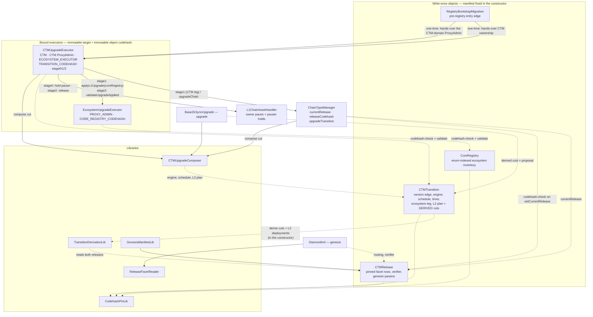
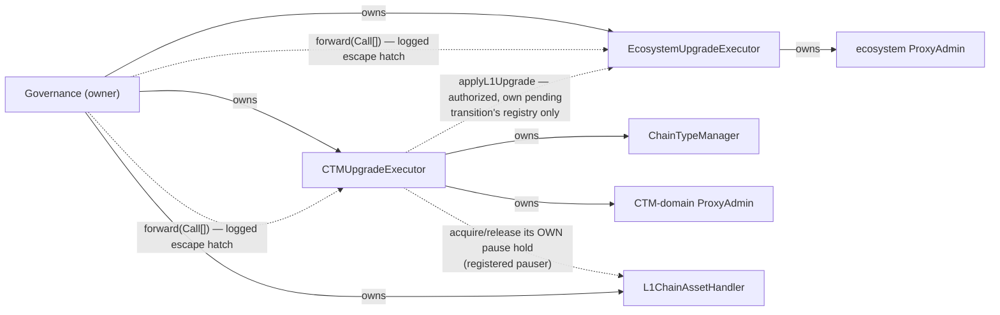
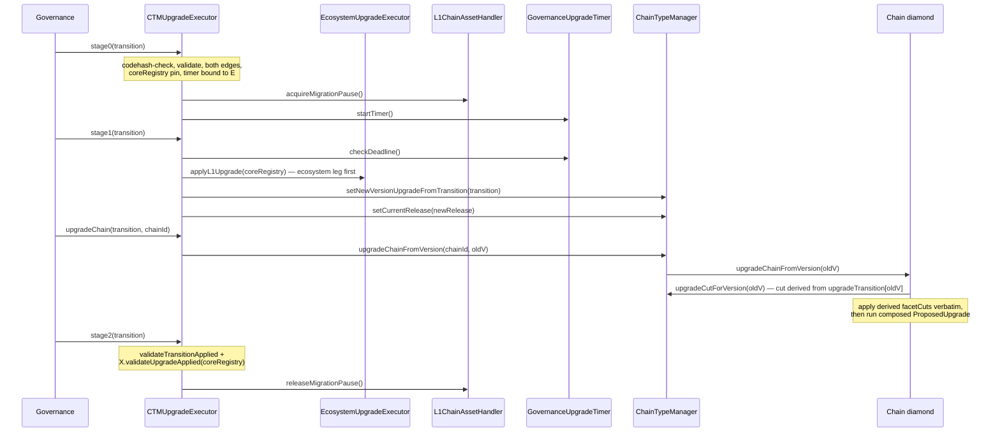

# Registry-Driven Protocol Upgrades

A protocol upgrade is a set of **write-once contracts** deployed ahead of time. Governance approves
the object addresses and their pinned contents; the contracts validate them and the executors apply
them. Declared external actions and governance recovery calls must also be reviewed explicitly.

**Scope:** L1 + L2 era-contracts, upgrade tooling, governance proposal shape.

## Review starting point

This document describes the current implementation on PR #2270. Read the
[objects](#objects), [authority](#authority), [upgrade flow](#flow-upgrading), and
[bootstrap](#bootstrap) sections in that order. The stage-by-stage specification and recovery
paths are in [the lifecycle document](upgrade-stage-lifecycle.md).

Implemented in this branch:

- Release/transition derivation, source-checked proxy inventories and inline codehash pins.
- The three-stage CTM executor, transition-pinned ecosystem participation and timer,
  independently held migration pauses, and ecosystem-executor replacement between upgrades.
- Explicit ProxyAdmin rows, including ServerNotifier. A separately administered row remains
  that administrator's responsibility unless the executor owns its ProxyAdmin.
- L2 delegate arguments composed by pinned code, and bootstrap payload composition using the
  same on-chain composer as recurring transitions.
- A recurring prepare path that emits the three executor calls and declares every external
  action, plus individual facet, verifier and validator-timelock upgrade tests.
- Owner-only abandonment of a stuck lifecycle. This clears the pending slot and releases the
  executor's hold; it does not roll back any upgrade already executed.
- Patch transitions that may change the release, validated by what the patch contains rather than
  by which release it names, with an identical-routing fast path so a non-facet change costs no cut.
- Prepare scripts that compose no payload: the committed cut is read from the object that composes
  it on-chain, and an upgrade deploys only the release members whose code it actually changes —
  refusing to replace any member the version did not declare as changed.

The central security question is whether the reviewed objects and declared external actions
account for every executable change. Review source/target edges, target identities, code pins,
initializers, delegate/composer code and ownership changes together. Include governance's
`forward`, abandonment and executor-replacement powers in that review. Stage 2 verifies the
applied L1 state, not completion on every L2 chain; publication checks do not establish the
safety of the published code.

See [remaining work](#remaining-review-and-script-retirement) for the boundary between the
implemented model and the work still required to retire scripts or support older deployments.

## Model

Two objects, deliberately separate:

|          | **Release**                                                                                                             | **Transition**                                                         |
| -------- | ----------------------------------------------------------------------------------------------------------------------- | ---------------------------------------------------------------------- |
| Answers  | what a chain **is**                                                                                                     | how release A **becomes** release B                                    |
| Contains | pinned facet set (routing self-described by the facets), `DiamondInit`, verifier, genesis params, force-deployment data | version edge, upgrade engine, CTM-domain proxy rows, schedule, L2 plan |
| Version  | none — version-independent, reusable                                                                                    | owns the `old -> new` version edge                                     |
| VM flag  | none — read from the pinned `DiamondInit.IS_ZKSYNC_OS`                                                                  | —                                                                      |

A release is reusable chain state: everything a chain _runs_ belongs to it, including the verifier
(the chain stores it as `s.verifier`). What a release does **not** carry is anything about _when_ —
the version edge and the schedule are the transition's, and one release can serve several versions.

**A transition's facet cuts and hash changes are not authored.** They are derived from its
`(fromRelease, newRelease)` pair in the constructor and stored: a full reinstall — remove the
departing release's routing, install the target's. Two shortcuts to an empty cut, both by value:
the same release on both edges, and two releases whose routing is byte-identical (what a release
change that touches no facet costs a chain — nothing). No selector-level diffing beyond that: each
release redeploys its facets anyway. Governance reviews two releases plus the transition's own
fields; the cuts are computed, not written.

## Objects

All are storage-backed, built once from a manifest they take in the constructor, and commit
`manifestHash = keccak256(abi.encode(manifest))`.

| Contract                     | Holds                                                                                                                                                                                                                                                                                                                                                                                                                                                       |
| ---------------------------- | ----------------------------------------------------------------------------------------------------------------------------------------------------------------------------------------------------------------------------------------------------------------------------------------------------------------------------------------------------------------------------------------------------------------------------------------------------------- |
| `CTMRelease`                 | `diamondInit` + pin, `verifier` + pin, `GenesisFacet[]` (address, freezability, pin — routing is read from each pinned facet's own self-description), `fixedForceDeploymentsData`, genesis params + genesis-upgrade pin, `l2BytecodeInfos` (the `L2EcosystemContract`-indexed L2 bytecode table)                                                                                                                                                            |
| `CTMTransition`              | version edge, `fromRelease`, `newRelease`, `upgradeEngine` + pin, `proxyUpgrades` (the `CTMContract`-indexed CTM-domain inventory, incl. the CTM itself), deadline, `upgradeTimestamp`, pinned `coreRegistry` and `upgradeTimer`, `AuthoredL2Plan` (delegate leg, pinned calldata composer, extra deployments, factory deps); **derived and stored:** final `Diamond.FacetCut[]` and the L2 force deployments (from the target release's L2 bytecode table) |
| `CoreRegistry`               | the `L1EcosystemContract`-indexed ecosystem inventory of `(proxy, expectedOldImpl, implNew + pin)` rows for the SHARED singletons (bridges, Bridgehub, MessageRoot)                                                                                                                                                                                                                                                                                         |
| `RegistryBootstrapMigration` | one edge from a pre-registry CTM into this model — see [Bootstrap](#bootstrap)                                                                                                                                                                                                                                                                                                                                                                              |

### Enum-indexed proxy inventories

Proxy upgrades are not carried as anonymous row lists. Each manifest carries a **complete row
array indexed by the canonical contract enum** — the SAME enum that identifies the contract for
deployment, one enum per domain (`ContractIdentifiers.sol`) — whose length must be exactly the
enum's member count (`L1_ECOSYSTEM_CONTRACT_COUNT` / `CTM_CONTRACT_COUNT`, both DERIVED as
`type(...).max + 1`; the arrays are dynamic with a construction-time length check because solc
cannot fold `type(...).max` in static array-length position):

- `CoreRegistryManifest.proxyUpgrades` is indexed by `L1EcosystemContract` (L1Bridgehub,
  L1ChainAssetHandler, L1MessageRoot, L1Nullifier, L1AssetRouter, L1NativeTokenVault,
  L1InteropHandler, CTMDeploymentTracker, ChainRegistrationSender).
- `TransitionManifest.proxyUpgrades` and `BootstrapManifest.proxyUpgrades` are indexed by
  `CTMContract`. Only the members that are TUPPs can meaningfully participate: those under the
  CTM-domain ProxyAdmin (ChainTypeManager, ValidatorTimelock, BytecodesSupplier,
  PermissionlessValidator) through the executor's bound admin, and the `ServerNotifier` through
  the row's own named admin (below) — a row in a facet or verifier slot can never apply.

Slot `uint256(member)` IS that contract's row; a slot whose `implNew` is zero is the **explicit
"not upgraded" statement**. The point is audit legibility plus structural completeness: the
length check means a manifest cannot omit a slot, and the enum — being the same one deployment
uses — is the single naming scheme end to end.

**A row names its admin.** `ProxyUpgradeRow.admin` is zero for the common case — the applying
executor's bound `ProxyAdmin` — and set for a proxy administered elsewhere: the `ServerNotifier`
sits under its own chainAdmin-owned ProxyAdmin, and a transparent proxy answers
`implementation()` only to its own admin, so nothing but that admin can even read the row's state.
Such a row is applied by the executor only if it OWNS the named admin; otherwise stage 1 leaves it
to that administrator (`ProxyRowLeftToAdministrator`) and stage 2 still requires it applied. The
reviewed description therefore names the action either way, and the two operating modes are
explicit on-chain state: hand the notifier's admin to the CTM executor and the row rides stage 1;
keep it with the ChainAdmin and the ChainAdmin's own upgrade call must land before stage 2. A row
under the bound admin that the executor does not own still reverts — a misbound executor is a
configuration error, not something to skip past.

The inventory shape exists only at the manifest boundary — the audited constructor calldata.
`ProxyUpgradeRowLib.toRows` flattens it into the `ProxyUpgradeRow[]` that `ecosystemRows()` /
`ctmProxyRows()` return and the executors apply, dropping the inert slots, so the eternal
executors never recompile when the inventory grows.

### Reinitializers: a fixed call, no data

A row never carries calldata — or data. Its `callInitializeUpgrade` BOOLEAN is the entire
reinitialization surface: when set, the apply performs `upgradeAndCall` with the FIXED,
argument-less `IProxyUpgradeInitializable.initializeUpgrade()` selector. Everything the
reinitializer needs lives in the new implementation's own audited code — constants, or
immutables on L1, both pinned by the row's `implNew` codehash. There is no runtime data channel
at all (and no discovery mechanism to serve one; the executors hold no state): a manifest
cannot route the init call to an arbitrary function, cannot smuggle arguments into it, and
there is nothing for the implementation to fetch — a forgotten or wrong reinitialization value
is a missing line in an audited contract diff, never a wrong byte in offchain-authored data.

Supporting libraries:

| Library                   | Role                                                                                  |
| ------------------------- | ------------------------------------------------------------------------------------- |
| `TransitionDerivationLib` | `deriveFacetCuts` / `deriveHashChanges` from a release pair                           |
| `ReleaseFacetReader`      | `newChainInstallations(release)` — genesis cuts from a release's routing              |
| `CTMUpgradeComposer`      | `buildUpgradeCutData`, `buildL2UpgradeTx`, `buildProposedUpgrade` from a transition   |
| `GenesisManifestLib`      | `GenesisConfig` → genesis `ReleaseManifest`, capturing routing and pins at build time |
| `CodehashPinLib`          | `requirePin` (reverts) / `pinHolds` (bool)                                            |

## Contract map

Who holds what, who reads what. Solid = writes or drives; dashed = reads.

## Authority

Each executor is **bound at construction** to the contracts it governs and to the codehash of the
object type it accepts. Its CTM / ProxyAdmin and object-type codehash bindings are immutable. The
CTM executor's ecosystem-executor binding is replaceable by its owner through
`setEcosystemExecutor`, only while no transition is pending and only for a successor naming the
same ecosystem ProxyAdmin. Governance must transfer that ProxyAdmin's ownership and authorize the
CTM executor on the successor; see [executor succession](upgrade-stage-lifecycle.md#executor-succession).

| Executor                   | Bound to                                                                                                    | Entrypoints                                                                                                                                                                                                                                                                                                                                                                                                                   |
| -------------------------- | ----------------------------------------------------------------------------------------------------------- | ----------------------------------------------------------------------------------------------------------------------------------------------------------------------------------------------------------------------------------------------------------------------------------------------------------------------------------------------------------------------------------------------------------------------------- |
| `CTMUpgradeExecutor`       | one `ChainTypeManager` + its own `ProxyAdmin`, the `EcosystemUpgradeExecutor`, the `CTMTransition` codehash | `stage0` / `stage1` / `stage2` (the upgrade lifecycle, [stage lifecycle](upgrade-stage-lifecycle.md)), `upgradeChain`, `acceptCTMOwnership`, `setProtocolVersionDeadline`, `validateTransitionApplied`, and the routine/recovery passthroughs (`freezeChain`, `unfreezeChain`, `revertBatches`, `setValidator`, `setPriorityTxMaxGasLimit`, `setPorterAvailability`, `deactivatePriorityMode`, `setValidatorTimelockPostV29`) |
| `EcosystemUpgradeExecutor` | one `ProxyAdmin`, the `CoreRegistry` codehash                                                               | `applyL1Upgrade` (owner, or an authorized CTM executor for its pending transition's registry), `validateUpgradeApplied`, `setCTMExecutorAuthorization`                                                                                                                                                                                                                                                                        |

CTM authority and ecosystem authority are separate: each CTM is governed by its own executor and
upgrades on its own cadence. The one bridge between them is narrow and explicit: the ecosystem
executor's owner AUTHORIZES a CTM executor (`setCTMExecutorAuthorization`), after which that
executor may call `applyL1Upgrade` — only for the `CoreRegistry` its pending transition names, so
the ecosystem leg of an upgrade runs inside the CTM executor's stage lifecycle without the CTM
executor gaining any standing authority over shared contracts. The other shared surface, the
`L1ChainAssetHandler` migration pause, is reached the same way: the owner registers the CTM
executor as an UPGRADE PAUSER, and a pauser can only acquire and release its own hold —
`migrationPaused()` is the owner's pause OR any hold, so one upgrade's completion can never lift a
pause another upgrade (or the owner) still requires.

`UpgradeExecutorBase` gives both ONE role. `owner` (`Ownable2Step`) drives the fixed entrypoints,
whose inputs are write-once objects and whose invariants cannot be bypassed, and the same owner can
`forward` raw calls — the escape hatch that keeps the authority the executor holds (CTM / ProxyAdmin
ownership) reachable for recovery and succession. Every forwarded call is logged.

An earlier design gated `forward` behind a separately governed "emergency board". That gate is not
implementable in the ZKsync governance model: the `EmergencyUpgradeBoard` does not call targets — it
submits through the `ProtocolUpgradeHandler`, which performs the calls, exactly as every routine
proposal does. Both routes reach the executor as the same `msg.sender`, so an on-chain distinction
between them does not exist, and a gate on the board's address would have left the hatch
permanently dead. What guards raw calls is therefore the owner's own process (the handler's
timelock and Security Council veto, or the emergency board's all-of quorum), and what the fixed
entrypoints guarantee is that the NORMAL path is object-driven — a bypass is an explicit,
event-logged raw call, never an implicit one.

### Authority matrix after bootstrap

Who can do what once the CTM domain is owned by `CTMUpgradeExecutor`. "Chain side" is the
`onlyAdmin` / `onlyAdminOrChainTypeManager` path on the chain's own Admin facet; `onlyChainTypeManager`
methods have no such path, which is why they are passthroughs.

| CTM owner method                                                                                                                                             | Through the executor                                                              | Chain side                              |
| ------------------------------------------------------------------------------------------------------------------------------------------------------------ | --------------------------------------------------------------------------------- | --------------------------------------- |
| `setNewVersionUpgradeFromTransition`, `setCurrentRelease`                                                                                                    | `stage1` (together, from the pending transition)                                  | —                                       |
| `upgradeChainFromVersion`                                                                                                                                    | `upgradeChain`                                                                    | —                                       |
| lifecycle bookkeeping (`pendingTransition`, the executor's own pause hold)                                                                                   | `abandonPendingTransition` — break-glass for a lifecycle that cannot complete     |
| `setProtocolVersionDeadline`                                                                                                                                 | passthrough                                                                       | —                                       |
| `freezeChain`, `unfreezeChain`, `setValidator`, `setPriorityTxMaxGasLimit`, `setPorterAvailability`, `deactivatePriorityMode`, `setValidatorTimelockPostV29` | passthrough                                                                       | — (`onlyChainTypeManager`)              |
| `revertBatches`                                                                                                                                              | passthrough                                                                       | validator (`revertBatchesSharedBridge`) |
| `changeFeeParams`, `setTokenMultiplier`                                                                                                                      | `forward` only                                                                    | chain admin                             |
| `setPendingAdmin`, `setServerNotifier`                                                                                                                       | `forward` only                                                                    | CTM admin (`onlyOwnerOrAdmin`)          |
| `executeUpgrade` (arbitrary cut), legacy `setNewVersionUpgrade` / `setUpgradeDiamondCut` / `setLegacyValidatorTimelock`                                      | `forward` only — deliberately: the bypass the object-driven path exists to remove | —                                       |
| `setReleaseCodehash`                                                                                                                                         | `forward` only — one-shot, installed by the bootstrap                             | —                                       |
| CTM / ProxyAdmin `transferOwnership` (executor succession)                                                                                                   | `forward` only                                                                    | —                                       |

## Provenance and pinning

Three mechanisms, applied everywhere:

**Type provenance by codehash.** Each object takes its whole manifest as a constructor argument, so
it has no initializer and no state-mutating function at all — write-once is structural, not a runtime
guard. Consumers therefore establish provenance by checking the object's `EXTCODEHASH` against the
audited one: executors hold `TRANSITION_CODEHASH` / `CORE_REGISTRY_CODEHASH` as immutables, and the
CTM holds `releaseCodehash` as state, checked in `setCurrentRelease`.

What this proves is that the address runs the audited, write-once code — not _which_ manifest it
holds. Nothing gates content on-chain, and nothing ever did: governance approving the address is what
gates content. Because the manifest lives in the initcode, a CREATE2 address also commits to it.

For this to hold, manifest data must live in **storage**, never in immutables: immutables are patched
into runtime code, which would give every instance a different codehash and make the check
impossible.

**Inline codehash pins.** Every executable address an object names carries its expected
`EXTCODEHASH` beside it — facets in their rows, `DiamondInit`, the verifier, the genesis upgrade, the
upgrade engine, each `implNew`. Pins are deliberately NOT checked in the constructor — the manifest
author supplies both halves of every pair, so that would prove only self-consistency — and are held
against live code by `validate()` on the paths that commit or apply an object.
There is no detached, optional pin list. A pin holds only against an account that **has code**, so an
empty account can never satisfy one.

**Two validation surfaces.** `validate()` reverts and runs where an object is committed or applied
(`applyCTMUpgrade`, `applyL1Upgrade`, `migrate()`, transition construction for both release edges);
`verifyAll()` returns `bool` and is for inspection and deployment tooling. Enforcement is never left
to an advisory predicate. Two paths deliberately skip `validate()` and say so in code: the per-chain
`upgradeChain` and the engine's `upgradeFromTransition` execute only the transition the CTM already
committed, whose pins cannot have moved (an `EXTCODEHASH` is fixed for a non-selfdestructible
contract), and re-checking them per chain on a permissionless path would cost ~19 code reads for no
new information.

**Post-state verification.** Pins prove the objects; a second, deeper layer proves the upgrade
LANDED, and stage 2 gates on it instead of composed per-target checks:

- `ProxyUpgradeRowLib.requireRowsApplied` — every row's proxy points at its pinned `implNew`, read
  live through the applying `ProxyAdmin` (the EIP-1967 state, not a paper trail).
- `EcosystemUpgradeExecutor.validateUpgradeApplied(registry)` and
  `CTMUpgradeExecutor.validateTransitionApplied(transition)` — the applied form of the two apply
  entrypoints (committed edge, version reached, rows applied).
- `RegistryBootstrapMigration.validateApplied()` — the whole bootstrap edge: executed, version,
  installed release + anchor pin, rows, and the CTM domain landed under the bound executor.
- `CTMRelease.verifyChainRouting(chain)` — a live diamond's loupe output set-equals the release's
  self-described routing: the on-chain form of the "upgrade path equals genesis path" guarantee,
  for per-chain post-upgrade checks and monitoring.

These describe ONE edge, not a standing invariant: a later upgrade legitimately moves proxies (and
`currentRelease`) on, after which the applied-checks revert by design.

## Chain-type manager state

The CTM stores one release pointer and derives genesis data from it:

- `currentRelease` — the release every new chain is created at. `storedBatchZero()` and
  `l1GenesisUpgrade()` are views over `ICTMRelease(currentRelease).genesisParams()`.
- `releaseCodehash` — the provenance anchor every pinned release is checked against.
- `upgradeTransition[oldProtocolVersion]` — the transition committed for chains departing from that
  version, and the ONLY commitment for registry-driven edges: `upgradeCutForVersion` derives the cut
  from it on read (a chain is never handed cut bytes), and `protocolVersionDeadline` resolves the
  departing version's deadline from it (the current version is open-ended). The transition's
  deadline is only the STARTING value: `setProtocolVersionDeadline` (owner; a fixed executor
  passthrough) keeps moving it afterwards — extended while chains lag, shortened to retire a
  version — and a stored value takes precedence over the transition's when set.
- `upgradeCutHash` — DEPRECATED. Written only by the legacy cut-taking commit path; pre-v32 Admin
  facets crossing that edge verify the handed cut bytes against it. Transition commits leave it
  zero. The same legacy path is the only writer of the legacy deadline storage.

Nothing else about a chain's installed state is keyed by protocol version on the CTM. The verifier in
particular is not: a chain several versions behind resolves it from the release its own transition
names (`transition.newRelease()`), so a lagging chain is never affected by where `currentRelease` has
moved since.

When a release is pinned, the CTM validates VM identity against
`IDiamondInit(release.diamondInit()).IS_ZKSYNC_OS()` (the repository is ZKsync-OS-only, so a release
pinning an EraVM `DiamondInit` is refused) and requires `genesisBatchCommitment == 1`.

There is no per-version registry map. The upgrade cut itself carries the transition address as its
init calldata, so the committed cut and the source of the derived facet cuts are the same object.

## Flow: creating a chain

1. `L1Bridgehub.createNewChain` records base token and settlement layer, then calls
   `CTM.createNewChain(chainId, admin)`.
2. The CTM builds a genesis cut with **empty** `facetCuts`,
   `initAddress = currentRelease.diamondInit()`, empty `initCalldata`, and deploys the `DiamondProxy`.
3. `DiamondInit.initialize(chainId, admin)` is delegatecalled from the proxy constructor, so
   `msg.sender` is the CTM. It reads `currentRelease`, installs that release's self-described routing via
   `ReleaseFacetReader`, and takes the verifier from the release.
4. The CTM runs `IAdmin.genesisUpgrade` with the release's `fixedForceDeploymentsData` and genesis
   upgrade address.

`chainId` and `admin` are the only per-chain inputs; everything else comes from the CTM and the
release it points at. Genesis force-deployment bytecodes are published out of band and referenced by
hash, so nothing large flows through `createNewChain`.

When a chain migrates between settlement layers, `forwardedBridgeBurn` forwards only
`(admin, protocolVersion)`; the destination CTM rebuilds the genesis cut from its **own**
`currentRelease`.

## Flow: upgrading

The three governance calls above are ALL a registry-driven prepare emits. `DefaultCoreUpgrade`
deploys the ecosystem implementations and their `CoreRegistry`; `DefaultCTMUpgrade` deploys the
release, the timer bound to the executor and the `CTMTransition`, and writes
`stage0/1/2(transition)`. Every other call a version script needs governance or an admin to make
is declared as an external action (phase, label, authority) and listed in the prepare output, and
protocol-ops refuses to merge a bundle whose calls are not all either an executor stage call or a
declared action. Governance therefore reads targets, code, initialization, ordering and authority
changes from the objects, and the artifact names whatever is left outside them (see
`docs/upgrade-stage-lifecycle.md` §4.7).

A proposal is three fixed-signature executor calls — the governance stages the prepare scripts
used to compose as calldata, moved into the executor ([stage lifecycle](upgrade-stage-lifecycle.md)).
One transition is mid-lifecycle at a time; each stage names it and is rejected for a different one,
out of order, or twice:

- **`CTMUpgradeExecutor.stage0(transition)`** — preparation. Everything rejectable is rejected
  BEFORE the transition is recorded: codehash and `validate()`, the **release edge**
  (`ctm.currentRelease() == transition.fromRelease()`) and the **version edge**
  (`ctm.protocolVersion() == transition.oldProtocolVersion()`), the named `coreRegistry`'s pin,
  this executor's authorization on the ecosystem executor, and that the transition's timer is bound
  to this executor. It then records the transition, takes the executor's HOLD on the migration pause
  (the CTM's version commit is only admissible while migrations are paused) and starts the timer.

- **`CTMUpgradeExecutor.stage1(transition)`** — execution, once the timer's deadline has passed.
  The ecosystem leg runs FIRST through `EcosystemUpgradeExecutor.applyL1Upgrade(coreRegistry)`
  (the order the merged bundle always had), which walks the source-checked rows: a proxy already at
  `implNew` is skipped, a proxy at `expectedOldImpl` is upgraded, anything else reverts — replaying a
  stale registry cannot downgrade a proxy a later upgrade moved on. Then the CTM leg: factory-dep
  publication, the CTM-domain rows, and the commit with `setNewVersionUpgradeFromTransition` — one
  argument, so the version edge, the schedule and the cut are read from the same object and cannot
  be passed inconsistently — followed by `setCurrentRelease`. Because it moves `currentRelease`,
  the release edge also rejects replays. Any failure reverts the whole stage.

- **`CTMUpgradeExecutor.stage2(transition)`** — completion. The applied-state checks for both legs
  (`validateTransitionApplied`, `validateUpgradeApplied`) run BEFORE the restoration: only then is
  the executor's pause hold released and the lifecycle slot cleared. Stage 2 attests that the L1
  edge is complete and the operational restriction is lifted — not that every chain has finished
  its own upgrade.

- **`CTMUpgradeExecutor.upgradeChain(transition, chainId)`** per chain. The owner may upgrade any
  chain at any time; a chain's **own admin** may upgrade **that** chain at any time — upgrading is
  the chain's decision, and the check is scoped per chain because `chainId` is an argument; anyone
  else only once the old-version deadline passes, at which point the upgrade is operationally
  mandatory and execution carries no discretionary inputs. Chain admins additionally retain their own
  direct path on the chain diamond.

**Where the cut is composed.** The cut is a pure function of the transition — an
`upgradeEngine.upgradeFromTransition(transition)` init over no facet cuts — and the CTM is the only
place that composes it: hashed at commit time (`setNewVersionUpgradeFromTransition`) and re-derived
on read (`upgradeCutForVersion`). It never travels in calldata at all: not in governance calls, and
not to the chain — the chain's Admin facet takes only the departing version and reads the cut from
its CTM, so no caller can substitute one. The chain diamond still treats the cut it reads as opaque
bytes and stays unaware of transitions.

On the chain, `BaseZkSyncUpgrade.upgradeFromTransition` validates the transition, applies
`transition.facetCuts()` verbatim, and runs the `ProposedUpgrade` composed from the same object.
There is no selector resolution and no re-diffing at execution time.

CTM binding is commitment-based: a chain accepts only the cut whose hash its own CTM committed, and
that commitment is written exclusively by the CTM-bound executor.

## What the derivation guarantees

For any representable release pair, the L1-side guarantee is that **the facet routing and verifier
an existing chain ends up with are byte-for-byte what a fresh chain at `newRelease` gets**. The upgrade path and the genesis path resolve to the same pinned release, so
they cannot drift. There is no second mechanism for any part of installed chain state.

The registry model has an **L2-side leg**: `L2EcosystemRegistry`, a ZKsync OS built-in at
`L2_ECOSYSTEM_REGISTRY_ADDR` holding the queryable on-chain copy of the ecosystem's
`FixedForceDeploymentsData`. It is written REGISTRY-FIRST by the genesis / upgrade initialization
with the verbatim bytes the release pins, so `dataHash()` on L2 equals
`keccak256(ICTMRelease.fixedForceDeploymentsData())` on L1 — a chain's ecosystem data verifies
transitively from the release pin. Lifecycle and write rules: `protocol-docs/chain-lifecycle.md`
("The L2 ecosystem registry").

The **L2 force deployments are derived too**: every nonempty row of the target release's
`l2BytecodeInfos` table becomes one force deployment of that descriptor at its member's fixed
address (`L2InventoryLib`), by the SAME function the deploy tooling uses to compose the bootstrap
L2 leg. Same philosophy as the facet delta — a full reinstall of the target release's set, empty
for a same-release pair. What stays **reviewed-and-pinned** is the authored remainder (`AuthoredL2Plan`): the delegate
target + calldata, extra deployments the table cannot express, and the factory-dep hashes. Its SHAPE
is mechanical, though, and `L2PlanValidationLib` enforces it at construction: an extra may only be an
`Unsafe` deployment at the address DERIVED from its own bytecode info (`keccak256(0x00…00 ‖ info)`), so
it cannot land on a fixed built-in or a table-derived target; the delegate must be one of those
extras, so the code the upgrade delegatecalls into is pinned by a bytecode hash the manifest carries;
and every bytecode any deployment installs must be among the factory dependencies. Publication is
live L1 state, so it is checked where the edge COMMITS — `applyCTMUpgrade` and the bootstrap's
`migrate()` refuse unless every factory dependency is published on the CTM's `BytecodesSupplier`.
What is _not_ proven is what the delegate does on L2: its bytecode hash names an auditable artifact,
not a behavior, and L1 cannot verify L2 execution effects.

## Rules enforced at construction

**Release shape.** Nonempty facet array; every facet row has selectors; exactly one row per facet
address (`Diamond._addOneFunction` requires uniform freezability per facet); a selector appears in at
most one row.

**Version edge.** `newProtocolVersion > oldProtocolVersion`; both majors zero; the minor delta is
within `MAX_ALLOWED_MINOR_VERSION_DELTA`. These mirror the rules chains apply at execution, so a
transition cannot pin successfully and then strand every chain.

**Patches.** A patch may name a NEW release. A release is the immutable snapshot of the intended
contracts, so replacing one of its L1 members — the verifier, a facet — is not by itself a change
of chain-visible L2 state, and should not force a minor bump. What a patch may not do is carry an
L2 upgrade: `BaseZkSyncUpgrade` refuses an L2 protocol upgrade transaction on a patch edge, and a
patch deliberately does NOT require an earlier L2 upgrade to be finalized first, so a pending one
must survive it untouched. The transition therefore validates what a patch CONTAINS rather than
which release it names: no L2 side (derived or authored), and the target release must carry over
the departing one's L2 description — the bytecode table, the force-deployment blob, the genesis
batch and the VM its pinned `DiamondInit` selects. An empty derived deployment list alone is not
enough: it only proves the two tables agree, and the rest of that description is never executed on
an existing chain, so a patch changing it would leave chains created afterwards describing a state
the patched chains never reached. A same-release patch remains valid and is then schedule-only.

A verifier rotation is therefore: deploy the verifier, publish release B copying release A except
that member, publish the `0.34.0 -> 0.34.1` transition naming `A -> B` with no L2 side, run the
normal lifecycle. No verifier override field on the transition — that would leave the release
describing one verifier while chains ran another. Allowing a patch to change releases keeps future
chain creation and every later upgrade resolving to the same intended state. Mechanical
permission is not a safety argument: a facet patch still needs the usual compatibility review of
storage layout, proof handling and L2 interaction.

**Schedule.** `oldProtocolVersionDeadline >= upgradeTimestamp`, so the old protocol is never disabled
before chains may upgrade.

**L2 plan.** Checked against the COMBINED plan (table-derived deployments plus authored extras).
`L2ComplexUpgrader` unconditionally ends with a delegatecall, so a nonempty combined plan requires
a delegate target; a delegate composer without a target, or factory deps without any L2 side, are
rejected as dead payload. The factory-dep count is capped at the same limit execution enforces. A
table row for a member with no fixed address fails the derivation itself. Extras must be `Unsafe`
deployments at their bytecode-derived address, the delegate must be one of them, and every installed
bytecode (implementation and proxy shell of each derived row, each extra) must be among the factory
dependencies (`L2PlanValidationLib`).

**Verifier.** Zero means "leave unchanged" on the upgrade path, which is how the genesis upgrade runs
after `DiamondInit` has already installed it; a release itself can never pin a zero verifier. ZKsync
OS chains have no base-system bytecodes: the EraVM bootloader/default-account/EVM-emulator hash slots
are deprecated (EVM-1643), so releases pin none and transitions derive no hash changes — the frozen
`ProposedUpgrade` words stay zero.

**Row sets.** Core-registry and bootstrap rows are real, unique edges: all fields nonzero, one row
per proxy. Duplicates would both pass the source check and the last would silently win, so the
reviewed edge and the executed edge could differ.

## Bootstrap

A pre-registry CTM has neither `currentRelease` nor `releaseCodehash`, and transitions never accept a
zero `fromRelease`. It must therefore cross into the model once, through one-time migration code —
never through an accommodation inside the transition model. Fresh CTMs pin both at genesis and need
no bootstrap.

`RegistryBootstrapMigration` expresses that crossing as a single pinned object. Its manifest carries
the CTM and its departing version, the `ProxyAdmin`, the source-checked implementation swaps (the
CTM's own implementation among them), the `releaseCodehash` anchor, the genesis `currentRelease`
(which carries the verifier), the version edge and deadline, the pinned engine and authored L2 plan, and the two executors
that receive authority. Every address carries an inline pin.

Governance transfers CTM and `ProxyAdmin` ownership to it; `migrate()` performs the whole edge and
hands ownership to the bound executors in the same transaction. Authority is never parked: the object
acquires nothing it does not pass on before the call returns.

`validate()` runs on the execution path and requires that the migration already holds both
ownerships, that the CTM sits at the departing version, that every proxy is still at its
`expectedOldImpl`, that every pin holds, that the release runs the codehash being installed as the anchor,
and that **each executor is bound to the contract it is about to receive**. The edge is one-shot, so
an executor bound elsewhere would take ownership its fixed entrypoints cannot drive, leaving
break-glass as the only recovery.

Two properties that look like omissions but are not:

- `migrate()` is **permissionless**. The gate is the state, not the caller: nothing runs until
  governance has handed over both ownerships, which is the approval, and every value written
  afterwards is pinned. The STAGE sequencing is enforced by the object too: the manifest pins the
  `GovernanceUpgradeTimer`, and `validate()` calls its `checkDeadline()` — so `migrate()` cannot
  run before stage 0 started the timer and the operational window passed, and the CTM's own
  version-edge commit refuses to run while chain migrations are unpaused.
- The committed cut carries **no facet cuts and no authored calldata**. The facet delta cannot be
  derived at construction (the departing version predates releases, so there is no `fromRelease` to
  diff against), so it is derived AT EXECUTION instead: the cut's init target is the bootstrap engine
  (`BootstrapUpgradeZKsyncOS`), which removes each chain's live routing read from its own diamond
  storage and installs the facet set of its immutable-pinned genesis release. The engine's
  `ProposedUpgrade` is COMPOSED on read (`upgradeCut()`) from the manifest's pinned inputs — the
  genesis release's table-derived L2 deployments plus the authored extras, the pinned delegate
  composer, the release's verifier — by the same `CTMUpgradeComposer` transitions use, and the
  plan is shape-checked at construction like a transition's (`L2PlanValidationLib`: every bytecode
  the L2 leg installs — each table row's implementation and proxy shell, each extra — must be among
  the factory dependencies, which `migrate()` requires published on the CTM's supplier). What
  governance reviews is the manifest; the v34 prepare asserts the on-chain composed cut equals the
  script-composed one byte for byte until EVM-1644 retires the script composition.

CTM ownership is transferred, not forced: `migrate()` nominates the executor and completes the
handover through `CTMUpgradeExecutor.acceptCTMOwnership()` in the same transaction. The accept is
permissionless-safe — it can only ever accept ownership of the bound CTM, and only after that
CTM's current owner nominated the executor.

The prepare side of this edge is `deploy-scripts/upgrade/v34/` (`CTMUpgrade_v34` +
`CoreUpgrade_v34`): it rides the default pipeline for implementation deploys and cut
composition, then deploys the executor and the migration (manifest pinned from the run's own
outputs) and collapses the stage-1 CTM leg to THREE governance calls — nominate the CTM, hand
over its ProxyAdmin, and `migrate()`. Its stage-2 CTM leg is the migration's `validateApplied()` plus
the two bootstrap-JOIN authorizations the recurring stage lifecycle needs and the executor cannot
grant itself: `L1ChainAssetHandler.setUpgradePauser(executor, true)` and
`EcosystemUpgradeExecutor.setCTMExecutorAuthorization(executor, true)` — explicit governance calls
whose targets are bound data (the CAH through the Bridgehub; the ecosystem executor from the core
prepare's own output, handed to the CTM prepare as `CTMUpgradeParams.ecosystemUpgradeExecutor` — the
CTM executor is constructed BOUND to it). `UpgradeTestv34_Local.t.sol`
drives the whole edge through this pipeline in-forge, including the chain crossing via the
legacy cut-taking leg (`LegacyTestAdminFacet`, the same dance the anvil bootstrap stage does). The v31 upgrade surface (scripts, its anvil CI job, fork harness and
fixtures) is deleted; the pre-registry history lives on the release branches. The remaining
legacy machinery — `default-upgrade/`'s cut composition and the v32 scripts/tests that keep it
honest — goes with EVM-1644 once the bootstrap manifest generator is fully self-contained.

## Deployment determinism

Objects take their manifest as a constructor argument, so the manifest is part of the initcode and a
CREATE2 address commits to it. There is no separate salt to reproduce and no window in which a
deployed-but-uninitialized instance exists.

CREATE2 derivation is VM-specific, so off-chain address prediction must use the EVM or EraVM formula
for the deploying chain, with the exact creation code.

**Gateway.** EraVM has no constructors, so these objects cannot be constructed there. A Gateway CTM
therefore cannot deploy its own `CTMRelease` in-flow; the Gateway deployer takes a pre-deployed
release address instead, and the deployers carry TODOs describing what restoring in-flow deployment
needs: an EraVM-deployable release that takes its manifest through an atomic post-deployment
initialization.

Codehash checks depend on reproducible bytecode: pinned implementations are built with a
CBOR-metadata-free profile so hashes are byte-identical across platforms. For the same reason,
manifest data stays in storage rather than immutables — see [Provenance and pinning](#provenance-and-pinning).

## Remaining review and script retirement

The detailed [script retirement plan](upgrade-script-retirement.md) specifies deletion batches,
on-chain replacements, dependencies and verification gates. **Batch 1 is implemented**: prepare
scripts compose no payload (the committed cut is read from the object that composes it on-chain),
the per-chain call selects the modern entrypoint before touching historical logs, the retired
genesis-cut output field is gone, and an upgrade deploys only the release members whose code it
actually changes. What remains, mapping onto batches 2-5 of that plan:

1. **Make the deployment inventory authoritative.** An inert upgrade row means "do not upgrade",
   not "this is the currently deployed contract", so the prepare still reconstructs current
   addresses from live introspection. A complete, discoverable current inventory per CTM and for
   the shared ecosystem would let executable rows be derived from a source/target pair instead.
2. **Complete fresh-deployment authority setup.** Fresh deployment pins a release but still uses
   the older ownership setup. Establish executors and their authorizations directly so its first
   recurring upgrade does not need the legacy bootstrap preparation machinery.
3. **Review cross-contract follow-up wiring.** A row has a fixed, argument-less reinitializer;
   arbitrary follow-up calls are not part of the row format. Calls outside the existing execution
   paths must remain declared external actions until an audited on-chain path accounts for
   their targets, order and authority. Declaring an action makes it visible; it does not execute
   it or grant permission.
4. **Collapse production preparation.** Once the inventory is authoritative, one reusable prepare
   client replaces the version-specific prepare hierarchy, with the pre-registry entry edge kept
   as a small named legacy adapter.
5. **Resolve deployed-schema compatibility.** A release/transition schema or canonical codehash
   change needs an explicit migration plan if older registry objects are already deployed.
   Regenerating current-source fixtures proves the new-flow test baseline, not an in-place
   migration from such a deployment.

Compilation, artifact loading, hashing, bytecode publication, simulation, signing and submission
remain off-chain tooling responsibilities. Bootstrap handovers and separately administered
contracts also retain explicit authorization steps. Removing scripts must preserve those
boundaries and the frozen bootstrap and recurring-prepare end-to-end tests.

## Related

- [Governance self-migration](./governance-self-migration.md) — how the authority root above
  upgrades itself.
