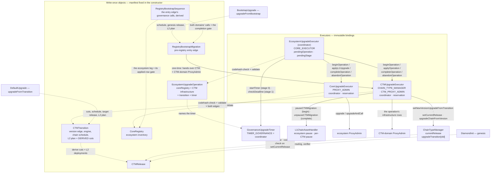
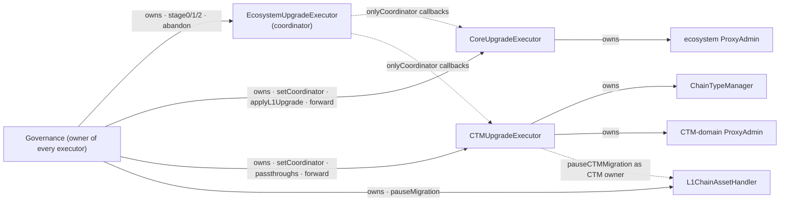

# Registry-Driven Protocol Upgrades

A protocol upgrade is a set of **write-once contracts** deployed ahead of time. Governance approves
the object addresses and the contents they commit to; the contracts validate them and the executors
apply them. What governance signs is three fixed-signature calls on one coordinator plus whatever the
prepare declared as an external action.

**Scope:** L1 + L2 era-contracts, upgrade tooling, governance proposal shape.

This is the architecture document. Two other documents complete it and are not restated here:

- [`protocol-docs/ecosystem-upgrade-coordination.md`](../protocol-docs/ecosystem-upgrade-coordination.md)
  is the **coordinator spec**: the stage semantics of `EcosystemUpgradeExecutor`, the operation
  commitment, the reservation protocol of the domain executors, abandonment and authorization.
- [`l1-contracts/deploy-scripts/upgrade/README.md`](../l1-contracts/deploy-scripts/upgrade/README.md)
  is the **runbook**: how a prepare is run, composed, verified, replayed and how chains cross.

[`upgrade-stage-lifecycle.md`](upgrade-stage-lifecycle.md) keeps the operational policies that
belong to neither: pause composition, the ServerNotifier row, the timer, coordinator succession.

Read in this order: [objects](#objects), [authority](#authority), [upgrading](#flow-upgrading),
[bootstrap](#bootstrap). The central security question is whether the reviewed objects and the
declared external actions account for every executable change: review source/target edges,
target identities, the deployed code at every named address, initializers, engine and composer
code and ownership changes together, and include governance's `forward`, abandonment and coordinator-replacement powers.
Stage 2 verifies the applied L1 state, not completion on every L2 chain.

## Model

Two objects, deliberately separate:

|          | **Release**                                                                                                               | **Transition**                                        |
| -------- | ------------------------------------------------------------------------------------------------------------------------- | ----------------------------------------------------- |
| Answers  | what a chain **is**                                                                                                       | how release A **becomes** release B                   |
| Contains | complete facet set (routing self-described by the facets), `DiamondInit`, verifier, genesis params, force-deployment data | version edge, upgrade engine, chain schedule, L2 plan |
| Version  | none — version-independent, reusable                                                                                      | owns the `old -> new` version edge                    |
| VM flag  | none — every release is a ZKsync OS release                                                                               | —                                                     |

A release is reusable chain state: everything a chain _runs_ belongs to it, including the verifier
(the chain stores it as `s.verifier`). What a release does **not** carry is anything about _when_ —
the version edge and the schedule are the transition's, and one release can serve several versions.

**A transition's facet cuts are not authored.** They are derived from its
`(fromRelease, newRelease)` pair in the constructor and stored: a full reinstall — remove the
departing release's routing, install the target's. Two shortcuts to an empty cut, both by value:
the same release on both edges, and two releases whose routing is byte-identical. Governance
reviews two releases plus the transition's own fields; the cuts are computed, not written.

A transition describes one CTM's chain-version edge and nothing else. Infrastructure changes and
the delay before governance may execute belong to the third object — the **operation**, named only
by the coordinator — which is also what makes them separable: replacing an ecosystem singleton
behind a CTM-domain proxy is an operation with no transition at all, and therefore costs no
chain-version edge. See
[the coordination document](../protocol-docs/ecosystem-upgrade-coordination.md).

## Objects

All are storage-backed, built once from a manifest they take in the constructor, and commit
`manifestHash = keccak256(abi.encode(manifest))`. The struct definitions and their field docs are
in `l1-contracts/contracts/upgrades/registry/RegistryTypes.sol`.

| Contract                     | Holds                                                                                                                                                                                                                                                                                                       |
| ---------------------------- | ----------------------------------------------------------------------------------------------------------------------------------------------------------------------------------------------------------------------------------------------------------------------------------------------------------- |
| `CTMRelease`                 | `diamondInit`, `verifier`, `GenesisFacet[]` (address + freezability), `fixedForceDeploymentsData`, genesis params incl. the genesis upgrade, `l2BytecodeInfos` (the `L2EcosystemContract`-indexed implementation table), one shared `l2SystemProxyBytecodeInfo` shell                                       |
| `CTMTransition`              | version edge, `fromRelease`, `newRelease`, `upgradeEngine`, `oldProtocolVersionDeadline`, `upgradeTimestamp`, `AuthoredL2Plan`; **derived and stored:** `Diamond.FacetCut[]` and the L2 force deployments                                                                                                   |
| `CoreRegistry`               | the `L1EcosystemContract`-indexed inventory of `(proxy, expectedOldImpl, implNew)` rows for the SHARED singletons (bridges, Bridgehub, MessageRoot, …)                                                                                                                                                      |
| `EcosystemUpgradeOperation`  | `{coreRegistry, ctmInfrastructure, transition, timer}` — three optional changes and the mandatory execution delay. `ctmInfrastructure` is the `CTMContract`-indexed CTM-domain inventory, incl. the CTM itself. Executors are bound on the coordinator; an operation carrying no change at all is rejected. |
| `RegistryBootstrapMigration` | one edge from a pre-registry CTM into this model — see [Bootstrap](#bootstrap)                                                                                                                                                                                                                              |

### Enum-indexed proxy inventories

Proxy upgrades are not carried as anonymous row lists. Each manifest carries a **complete row
array indexed by the canonical contract enum** — the SAME enum that identifies the contract for
deployment, one enum per domain (`ContractIdentifiers.sol`) — whose length must be exactly the
enum's member count (`L1_ECOSYSTEM_CONTRACT_COUNT` / `CTM_CONTRACT_COUNT`):

- `CoreRegistryManifest.proxyUpgrades` is indexed by `L1EcosystemContract`.
- `OperationManifest.ctmInfrastructure` and `BootstrapManifest.proxyUpgrades` are indexed by
  `CTMContract`. Only the TUPP members can participate: those under the CTM-domain ProxyAdmin
  (ChainTypeManager, ValidatorTimelock, BytecodesSupplier, PermissionlessValidator) through the
  executor's bound admin, and the `ServerNotifier` through the row's own named admin.

Slot `uint256(member)` IS that contract's row; a slot whose `implNew` is zero is the **"not
upgraded" statement**. The length check means every contract of the domain HAS a slot and none can
be smuggled in, and the enum — being the same one deployment uses — is the single naming scheme end
to end. `ProxyUpgradeRowLib.toRows` flattens the array into the `ProxyUpgradeRow[]` the executors
apply, dropping the inert slots, so the executors never recompile when the inventory grows.

**What the length check does not give you.** It guarantees the SLOTS exist, not that preparation
populated every intended change: an inert slot is the same bytes whether the upgrade deliberately
leaves the contract alone or whether nobody wrote its row builder. Nothing on-chain can tell those
apart — only the run that produced the deployments can. That is why preparation refuses an
implementation it deployed that no row installs and no version script named as deliberately
uninstalled (`_requireDeployedImplementationsInstalled` on both `DefaultCoreUpgrade` and
`DefaultCTMUpgrade`; `uninstalledCoreDeployments` / `uninstalledCTMDeployments` are the
declarations). A reviewer reading a manifest is reading recorded decisions, and still has to check
them against the release.

**A row names its admin.** `ProxyUpgradeRow.admin` is zero for the common case — the applying
executor's bound `ProxyAdmin` — and set for a proxy administered elsewhere. A transparent proxy
answers `implementation()` only to its own admin, so reads go through the named one. Such a row
is applied by the executor only if it OWNS the named admin; otherwise stage 1 leaves it to that
administrator (`ProxyRowLeftToAdministrator`) and stage 2 still requires it applied. A row under
the bound admin that the executor does not own still reverts — a misbound executor is a
configuration error, not something to skip past. The ServerNotifier is the one such row today;
its operating modes are in [the lifecycle document](upgrade-stage-lifecycle.md#servernotifier-a-row-under-a-foreign-admin).

### Reinitializers: a fixed call, no data

A row never carries calldata. Its `callInitializeUpgrade` BOOLEAN is the entire reinitialization
surface: when set, the apply performs `upgradeAndCall` with the FIXED, argument-less
`IProxyUpgradeInitializable.initializeUpgrade()` selector. Everything the reinitializer needs
lives in the new implementation's own audited code — constants, or immutables on L1, both settled
by the deployment governance reviewed. A manifest cannot route the init call to an arbitrary function or
smuggle arguments into it; a wrong reinitialization value is a missing line in an audited contract
diff, never a wrong byte in offchain-authored data.

### Supporting libraries

| Library                       | Role                                                                                                    |
| ----------------------------- | ------------------------------------------------------------------------------------------------------- |
| `TransitionDerivationLib`     | facet cuts and L2 deployments from a release pair                                                       |
| `ReleaseFacetReader`          | genesis installation from a release's self-described routing                                            |
| `CTMUpgradeComposer`          | the committed cut and the L2 protocol upgrade transaction, from a transition or the bootstrap migration |
| `L2InventoryLib`, `L2PlanLib` | changed L2 deployments; executable plan construction from bytecode infos                                |
| `ProxyUpgradeRowLib`          | `toRows`, `applyRows`, `requireRowsApplied` over the enum-indexed inventories                           |
| `ObjectAnchorLib`             | `requireCode` — a named object or member is deployed at all                                             |

There is no intermediate genesis-manifest type between a build and its `ReleaseManifest`:
`DeployCTMUtils.deployCurrentRelease` (and `deployAdditionalReleaseFacets`) assembles the
`GenesisFacet[]` directly as it deploys each facet, and the release's implementation table and its
one shared `l2SystemProxyBytecodeInfo` shell come from `SystemContractsProcessing`.

## Contract map

Who holds what, who reads what. Solid = writes or drives; dashed = reads.



## Authority



Three executors, one authority root. Governance owns all three; each domain executor holds one
piece of protocol authority and answers to exactly one coordinator, which it names explicitly
(`coordinator`, set by the owner). A shared owner is not authorization: each domain callback rejects callers other than its
configured coordinator.

| Executor                   | Bound to (immutable)                                                    | Entrypoints                                                                                                                                                                                                                                                                                                                                                                                                                          |
| -------------------------- | ----------------------------------------------------------------------- | ------------------------------------------------------------------------------------------------------------------------------------------------------------------------------------------------------------------------------------------------------------------------------------------------------------------------------------------------------------------------------------------------------------------------------------ |
| `EcosystemUpgradeExecutor` | `CORE_EXECUTOR`, the `EcosystemUpgradeOperation` codehash               | `stage0/1/2(operation)`, `abandonPendingOperation` (owner); `pendingOperation()`, `pendingStage()`                                                                                                                                                                                                                                                                                                                                   |
| `CoreUpgradeExecutor`      | the ecosystem `ProxyAdmin`, the `CoreRegistry` codehash                 | `beginOperation`, `completeOperation`, `abandonOperation` (coordinator); `applyL1Upgrade` (coordinator for the reserved registry, or the owner for any — bootstrap and recovery); `validateUpgradeApplied`; `setCoordinator` (owner, refused while reserved)                                                                                                                                                                         |
| `CTMUpgradeExecutor`       | one `ChainTypeManager` + its `ProxyAdmin`, the `CTMTransition` codehash | `beginOperation`, `applyOperation`, `completeOperation`, `abandonOperation` (coordinator); `validateTransitionApplied`, `validateOperationApplied`; `upgradeChain`; `acceptCTMOwnership`; `setCoordinator`, `setProtocolVersionDeadline` and the routine passthroughs (`freezeChain`, `unfreezeChain`, `revertBatches`, `setValidator`, `setPriorityTxMaxGasLimit`, `deactivatePriorityMode`, `setValidatorTimelockPostV29`) (owner) |

The coordinator owns no proxy administration and applies nothing itself: it orders the core and CTM changes,
holds the pending operation and its stage, starts and checks the timers, and drives the domain
callbacks. Each domain stores only its `activeOperation`; its registry, its infrastructure rows and its
transition are read from that operation rather than supplied or stored a second time. Domain callbacks enforce coordinator
authorization; only `beginOperation` names an operation, and every callback after it acts on the
reservation the executor already holds. How the stages compose these calls, what each stage checks
and what abandonment leaves behind is the
[coordinator spec](../protocol-docs/ecosystem-upgrade-coordination.md).

`UpgradeExecutorBase` gives every executor ONE role. `owner` (`Ownable2Step`) drives the fixed
entrypoints, whose inputs are write-once objects and whose invariants cannot be bypassed, and the
same owner can `forward` raw calls — the logged escape hatch that keeps the authority the executor
holds reachable for recovery and succession. The base contract's own comment records why the
hatch is owner-gated rather than gated on an emergency board.

### Authority matrix after bootstrap

Who can do what once the CTM domain is owned by `CTMUpgradeExecutor`. "Chain side" is the
`onlyAdmin` / `onlyAdminOrChainTypeManager` path on the chain's own Admin facet;
`onlyChainTypeManager` methods have no such path, which is why they are passthroughs.

| CTM owner method                                                                                                                    | Through the executors                                                                           | Chain side                              |
| ----------------------------------------------------------------------------------------------------------------------------------- | ----------------------------------------------------------------------------------------------- | --------------------------------------- |
| `setNewVersionUpgradeFromTransition`, `setCurrentRelease`                                                                           | the coordinator's `stage1` → `applyOperation` (together, from the reserved transition)          | —                                       |
| `upgradeChainFromVersion`                                                                                                           | `upgradeChain`                                                                                  | —                                       |
| lifecycle bookkeeping (pending operation, reservations)                                                                             | `abandonPendingOperation` on the coordinator — break-glass for a lifecycle that cannot complete |                                         |
| `pauseCTMMigration` / `unpauseCTMMigration` (as CTM owner)                                                                          | `beginOperation` / `completeOperation`; `forward` to unpause after an abandonment               | —                                       |
| `setProtocolVersionDeadline`                                                                                                        | passthrough                                                                                     | —                                       |
| `freezeChain`, `unfreezeChain`, `setValidator`, `setPriorityTxMaxGasLimit`, `deactivatePriorityMode`, `setValidatorTimelockPostV29` | passthrough                                                                                     | — (`onlyChainTypeManager`)              |
| `revertBatches`                                                                                                                     | passthrough                                                                                     | validator (`revertBatchesSharedBridge`) |
| `changeFeeParams`, `setTokenMultiplier`                                                                                             | `forward` only                                                                                  | chain admin                             |
| `setPendingAdmin`, `setServerNotifier`                                                                                              | `forward` only                                                                                  | CTM admin (`onlyOwnerOrAdmin`)          |
| `executeUpgrade` (arbitrary cut), legacy `setNewVersionUpgrade` / `setUpgradeDiamondCut` / `setLegacyValidatorTimelock`             | `forward` only — deliberately: the bypass the object-driven path exists to remove               | —                                       |
| CTM / ProxyAdmin `transferOwnership` (executor succession)                                                                          | `forward` only                                                                                  | —                                       |

## Provenance and validation

Object trust is established by REVIEW, not by a check the chain can make. Everything below follows
from one fact about the EVM: creation code can write arbitrary storage and then return whatever
runtime bytecode it likes. A contract that returns the audited runtime code therefore proves only
that it runs audited code — never that the audited CONSTRUCTOR produced the state that code reads.

That distinction is not academic for these objects. A `CTMTransition` DERIVES its facet cuts and L2
plan at construction and stores them; every chain applies those cuts verbatim through delegatecall.
A counterfeit built from adversarial creation code would answer `manifestHash()` with the approved
manifest, hash identically to the audited object, pass `validate()`, and still route
security-critical selectors wherever its author chose.

**There are no object-type codehash anchors.** An earlier iteration pinned one per object type
(`releaseCodehash` on the CTM; `TRANSITION_CODEHASH` / `CORE_REGISTRY_CODEHASH` /
`OPERATION_CODEHASH` on the executors). They were removed — all four, together — because they make
exactly the claim the paragraph above refutes, and three survivors would have gone on implying a
guarantee the fourth had just been admitted not to give. Objects consequently carry no fingerprint
of themselves and none of their members: a hash the manifest author supplies beside the address it
describes can only ever agree with itself.

**What establishes an object, then.** Governance approves the exact deployed objects, and the
review is a tool's output rather than an eyeball comparison of hashes. `protocol-ops ecosystem
verify-bootstrap` answers three questions for every object a package names, and treats
"unverifiable" as an error rather than a caveat:

1. **Was it PRODUCED by the reviewed code's constructor, from its reviewed arguments?** Every
   object is deployed through the deterministic CREATE2 factory (`0x4e59…4956C`, the same address
   on L1 and on ZKsync OS settlement layers), so
   `address == keccak256(0xff ++ factory ++ salt ++ keccak256(creationCode ++ abi.encode(args)))[12:]`.
   For a write-once object the arguments are the manifest it serves: the verifier reads it off the
   object, re-encodes it, and recomputes that address from the reviewed creation code. For the
   lifecycle objects — the coordinator, both domain executors, the timer — and the bootstrap
   sequence, the arguments are the REVIEWED binding values: the governance owner (the bootstrap
   manifest's `ctmExecutorOwner`, or the reviewer's `--expected-governance-owner`), the package's
   record of the core executor, the ecosystem `ProxyAdmin`, the timer delay and owner, the
   manifest's CTM, `ProxyAdmin` and coordinator, the prepare's `2 weeks`. Never the object's own
   getters: a genuine executor built for an attacker's owner answers every getter like the reviewed
   one, and only the reviewed owner tells them apart. A match proves the canonical constructor ran
   on those arguments, which covers the object's WHOLE state — immutables, storage, derived fields,
   and derived fields nobody has added yet. The creation-code BYTES come from the local build
   (`l1-contracts/out`), which is itself held against the committed `evmBytecodeHash`, so a
   doctored build directory cannot pass. The salt is per prepare leg (the core prepare's
   `[contracts] create2_factory_salt`, each CTM prepare's `[create2_factory_salts]` entry); the
   package records neither, so both are reviewer inputs and every object is tried under each.
2. **Does it run the reviewed code?** Live `EXTCODEHASH` against `AllContractsHashes.json` for the
   reviewed commit, for the objects without constructor-set immutables (the objects with them
   cannot hash to any artifact; question 1 is the whole of their identity). Code the commit does
   not produce is UNKNOWN and therefore a finding.
3. **Do the governance calls execute those objects, and nothing else?** For a recurring upgrade
   every stage call is `coordinator.stageN(operation)` or a declared external action. For the
   bootstrap edge every stage carries the run the construction-verified `RegistryBootstrapSequence`
   derives, contiguous and in order, and every other call must be a declared external action to a
   target OUTSIDE the edge's authorities: a call to the CTM, a `ProxyAdmin`, an executor, the timer
   or an object beyond the derived run — a `transferOwnership` nomination appended after the
   legitimate calls, say — is an error whether the package declares it or not. On chain,
   `RegistryBootstrapMigration.validateApplied()` refuses a pending nomination on every
   `Ownable2Step` authority the edge lands on or drives, for the same reason.

Its limits, stated so they are not mistaken for coverage: the salt is a package input, so an
attacker free to choose both a salt and a counterfeit deployment faces the standard ~2^80 CREATE2
address-collision bound rather than a 160-bit preimage; and the derivation binds an object to its
MANIFEST, never to what the manifest's members RUN. A genuine object built from a manifest naming
an attacker's facet verifies perfectly — which is why governance reviews the member addresses. Both
boundaries are pinned by `test/foundry/l1/upgrades/CounterfeitObject.t.sol`, which builds an actual
counterfeit from real initcode and asserts the derivation rejects it.

For this to hold, manifest data must live in **storage**, never in immutables: immutables are
patched into runtime code, which would make an object's runtime bytes depend on its manifest and
break question 2.

**Members are named by address.** Everything executable an object names — facets, `DiamondInit`,
the verifier, the genesis upgrade, the upgrade engine, the timer, the composer, each `implNew` — is
an ADDRESS, and what it runs is what governance reviewed before approving the object.

**What the chain still enforces.** Removing the anchors removed a check that did not hold; it
removed nothing that did. Every execution check stays, on every path:

- `ObjectAnchorLib.requireCode` on every object and every member an object names. Not bookkeeping:
  a call to a codeless address SUCCEEDS silently, and a codeless delegatecall target turns a
  chain's upgrade into a no-op that reports success.
- `validate()` on each object, where it is committed or applied (`stage0` on the coordinator,
  `beginOperation` on both domain executors, `applyL1Upgrade`, `applyOperation`, `migrate()`,
  transition construction for both release edges). Two paths deliberately skip it and say so in
  code: the per-chain `upgradeChain` and the engine's `upgradeFromTransition` execute only the
  transition the CTM already committed, whose members cannot have lost their code since.
- The source-checked edges: every proxy row departs from `expectedOldImpl`, a transition departs
  from the CTM's live `currentRelease` and its live `protocolVersion`, and the bootstrap refuses
  unless the live ecosystem is exactly the starting state its manifest names.
- Authority and bindings: the executors' bound CTM, ProxyAdmin, coordinator and owner, checked by
  value against the manifest before the domain is handed over.
- Lifecycle ordering and reservations: one operation at a time, stages in order, each domain
  answering only to its coordinator.

**Validation.** `validate()` reverts unless every contract an object names is deployed code. It
does NOT attest that the code is the reviewed code — that is governance's approval of the
addresses, established off-chain.

**Post-state verification.** A second layer proves the upgrade LANDED, and stage 2 gates on it:

- `ProxyUpgradeRowLib.requireRowsApplied` — every row's proxy points at its `implNew`, read live
  through the row's `ProxyAdmin`.
- `CoreUpgradeExecutor.validateUpgradeApplied(registry)` and
  `CTMUpgradeExecutor.validateOperationApplied(operation)` — the applied form of the two apply
  entrypoints (infrastructure rows applied, committed edge, version reached).
  `CTMUpgradeExecutor.validateTransitionApplied(transition)` is the narrower read over one
  committed edge alone. Stage 2 calls each domain’s
  `completeOperation`, which checks its own applied state before releasing its reservation and,
  for a CTM, its pause. A later domain’s failure rolls back all earlier completions; there is no
  duplicate coordinator validation pass — the coordinator calls neither view in stage 2, and both
  remain read-only surfaces for tooling and monitoring.
- `RegistryBootstrapMigration.validateApplied()` — the whole bootstrap edge, including that the
  CTM domain landed under the bound executor and the CTM's migrations are no longer paused.
- `CTMRelease.verifyChainRouting(chain)` — a live diamond's loupe output set-equals the release's
  self-described routing, for per-chain post-upgrade checks and monitoring.

These describe ONE edge, not a standing invariant: a later upgrade legitimately moves proxies (and
`currentRelease`) on, after which the applied-checks revert by design.

## Chain-type manager state

The CTM stores one release pointer and derives genesis data from it:

- `currentRelease` — the release every new chain is created at. `storedBatchZero()` and
  `l1GenesisUpgrade()` are views over `ICTMRelease(currentRelease).genesisParams()`.
- `upgradeTransition[oldProtocolVersion]` — the transition committed for chains departing from that
  version, and the ONLY commitment for registry-driven edges: `upgradeCutForVersion` derives the cut
  from it on read (a chain is never handed cut bytes), and `protocolVersionDeadline` resolves the
  departing version's deadline from it. The transition's deadline is only the STARTING value:
  `setProtocolVersionDeadline` (owner; an executor passthrough) keeps moving it afterwards, and a
  stored value takes precedence.
- `upgradeCutHash` — DEPRECATED. Written only by the legacy cut-taking commit path (which the
  bootstrap edge uses); transition commits leave it zero.

The version-edge commit refuses to run unless this CTM's migrations are paused
(`migrationPausedFor(ctm)`), which is why `beginOperation` pauses before `applyOperation` can
commit. Nothing else about a chain's installed state is keyed by protocol version on the CTM: a
chain several versions behind resolves its verifier from the release its own transition names
(`transition.newRelease()`), so a lagging chain is never affected by where `currentRelease` has
moved since.

When a release is installed, the CTM validates its genesis params: a non-zero genesis upgrade and
batch hash, and `genesisBatchCommitment == 1`.

## Flow: creating a chain

1. `L1Bridgehub.createNewChain` records base token and settlement layer, then calls
   `CTM.createNewChain(chainId, admin)`.
2. The CTM builds a genesis cut with **empty** `facetCuts`,
   `initAddress = currentRelease.diamondInit()`, empty `initCalldata`, and deploys the `DiamondProxy`.
3. `DiamondInit.initialize(chainId, admin)` is delegatecalled from the proxy constructor, so
   `msg.sender` is the CTM. It reads `currentRelease`, installs that release's self-described routing via
   `ReleaseFacetReader`, and takes the verifier from the release.
4. The CTM runs `IAdmin.genesisUpgrade`, which delegatecalls the release's genesis engine.
   The engine takes no arguments: it reads the chain context out of the storage `DiamondInit` just
   wrote and the force deployments out of the release its CTM points at, and composes the L2 genesis
   transaction from those. That transaction is the release's initialization edge — the same
   envelope a registry-driven upgrade commits, differing only in the call the `L2ComplexUpgrader`
   performs (`upgrade` into the L2 genesis upgrade, rather than an upgrade's deployment plan), and
   carrying the same per-chain `ZKChainSpecificForceDeploymentsData` an upgrade composes for that
   chain. `IL1GenesisUpgrade.genesisUpgradeTx` serves that composition for inspection, the way
   `IDefaultUpgrade.l2UpgradeTx` does for a transition.

`chainId` and `admin` are the only per-chain inputs; everything else comes from the CTM and the
release it points at. When a chain migrates between settlement layers, `forwardedBridgeBurn`
forwards only `(admin, protocolVersion)`; the destination CTM rebuilds the genesis cut from its
**own** `currentRelease`.

## Flow: upgrading

```mermaid
sequenceDiagram
    participant G as Governance
    participant X as EcosystemUpgradeExecutor
    participant CO as CoreUpgradeExecutor
    participant E as CTMUpgradeExecutor
    participant H as L1ChainAssetHandler
    participant T as GovernanceUpgradeTimer
    participant C as ChainTypeManager
    participant D as Chain diamond

    G->>X: stage0(operation)
    Note over X: domain callbacks enforce onlyCoordinator
    X->>CO: beginOperation(operation) — code present + validate
    X->>E: beginOperation(operation) — code present, validate, both edges
    E->>H: pauseCTMMigration(ctm)
    X->>T: startTimer() — the operation's timer; onlyTimerAdmin, so TIMER_GOVERNANCE must be X
    G->>X: stage1(operation)
    X->>T: checkDeadline()
    X->>CO: applyL1Upgrade(coreRegistry) — core leg first
    X->>E: applyOperation() — the reserved leg
    E->>C: infrastructure rows first, then the commit
    E->>C: setNewVersionUpgradeFromTransition(transition)
    E->>C: setCurrentRelease(newRelease)
    G->>E: upgradeChain(transition, chainId)
    E->>C: upgradeChainFromVersion(chainId, oldV)
    C->>D: upgradeChainFromVersion(oldV)
    D->>C: upgradeCutForVersion(oldV) — derived from upgradeTransition[oldV]
    Note over D: apply derived facetCuts verbatim,<br/>then version + target release's verifier + composed L2 tx
    G->>X: stage2(operation)
    X->>CO: completeOperation() — validates applied
    X->>E: completeOperation() — validates applied
    Note over X,E: Any later failure rolls back all completions
    E->>H: unpauseCTMMigration(ctm)
```

The three `stage0/1/2(operation)` calls are ALL a registry-driven upgrade emits; every other call
is a declared external action listed in the prepare output (see the runbook). One operation is
mid-lifecycle at a time and each stage names it; a different operation, an out-of-order stage or a
repeated stage is rejected. An operation applies its optional core change and then its CTM leg —
infrastructure rows, then the transition it may carry — atomically.
One CTM may still manage many chains. The stage-by-stage semantics are the
[coordinator spec](../protocol-docs/ecosystem-upgrade-coordination.md).

**`upgradeChain(transition, chainId)`** is the per-chain crossing. The executor's owner may
upgrade any chain at any time; a chain's **own admin** may upgrade **that** chain at any time
(scoped per chain because `chainId` is an argument); anyone else only once the old-version
deadline has passed, at which point the upgrade is operationally mandatory and execution carries
no discretionary inputs. The named transition must be the one the CTM committed for the departing
version. Chain admins additionally retain their own direct path on the chain diamond.

**Where the cut is composed.** The cut is a pure function of the transition — an
`upgradeEngine.upgradeFromTransition(transition)` init over no facet cuts — constructed by
`CTMUpgradeComposer.buildUpgradeCutData(ICTMTransition)`. Prepare and the CTM use this same
transition-only function; the bootstrap edge composes its cut the same way from its own object,
`buildBootstrapUpgradeCutData(IRegistryBootstrapMigration)`, served as the migration's
`upgradeCut()`. The CTM hashes it at commit time (`setNewVersionUpgradeFromTransition`)
and re-derives it on read (`upgradeCutForVersion`). It never travels in calldata: not in governance calls, and not to
the chain — the chain's Admin facet takes only the departing version and reads the cut from its
CTM. The chain diamond still treats the cut it reads as opaque bytes and stays unaware of
transitions.

On the chain, `DefaultUpgrade.upgradeFromTransition` applies `transition.facetCuts()` verbatim, then
runs the shared storage part (`BaseZkSyncUpgrade._upgrade`) with inputs read straight from the same
object: the version edge and schedule from the transition, the verifier of its TARGET release (never
the CTM's live `currentRelease()`), and the L2 protocol upgrade transaction composed from its L2
plan with the executing chain’s ID and Bridgehub. The delegate composer builds final
chain-specific calldata directly, in one pass; tooling reads that same transaction through
`ICTMTransition.l2UpgradeTx(bridgehub, chainId)`, which forwards to the per-release engine, and
`IRegistryBootstrapMigration.l2UpgradeTx(chainId)` for the bootstrap edge.
There is no intermediate proposal struct, selector resolution or re-diffing at execution time.

The transition's third derived read is for reviewers: `ICTMTransition.releaseDiff()` compares the two
pinned releases member by member — `diamondInit`, `verifier`, `genesisUpgrade`, the facet set, the L2
table, the shared L2 shell, the fixed force-deployments blob, the genesis batch — and returns a
`ReleaseDiff` of booleans. A verifier-only patch therefore reads as exactly one flag and an empty
`facetCuts()`: the whole edge from two calls, with no manifest diffing. Like the cuts it is derived
from the releases on every call and never stored.

## What the derivation guarantees

For any representable release pair, the L1-side guarantee is that **the facet routing and verifier
an existing chain ends up with are byte-for-byte what a fresh chain at `newRelease` gets**. The
upgrade path and the genesis path resolve to the same release, so they cannot drift. There
is no second mechanism for any part of installed chain state.

The **L2 force deployments are derived too**: only changed, nonempty target rows of the
`l2BytecodeInfos` table are deployed at their member’s fixed address (`L2InventoryLib`). The release
stores each implementation descriptor and one shared system-proxy shell; derivation joins them
into the executable descriptor. A changed shell also changes the corresponding target rows.
Unchanged rows are not reinstalled.

The reviewed input outside that table is `AuthoredL2Plan`: delegate bytecode info, extra bytecode
infos and a calldata composer. `L2PlanLib.build` constructs the delegate and extra
`Unsafe` deployments at bytecode-derived addresses, sets the delegate target, and collects and
deduplicates every installed bytecode’s observable hash into the factory dependencies. Those
addresses, deployment types and dependency hashes are not separately authored or cross-checked.
The CTM’s `BytecodesSupplier` must hold those dependencies published where the edge COMMITS
(`applyOperation` and `migrate()`). What is not proven is what the delegate does on L2: its
bytecode hash names an auditable artifact, not a behavior.

## Rules enforced at construction

**Release shape.** Nonempty facet array; every facet row has selectors; exactly one row per facet
address (`Diamond._addOneFunction` requires uniform freezability per facet); a selector appears in at
most one row.

**Version edge.** `newProtocolVersion > oldProtocolVersion`; both majors zero; the minor delta is
within `MAX_ALLOWED_MINOR_VERSION_DELTA`. These mirror the rules chains apply at execution, so a
transition cannot construct successfully and then strand every chain.

**Patches.** A patch may name a NEW release. A release is the immutable snapshot of the intended
contracts, so replacing one of its L1 members — the verifier, a facet — is not by itself a change
of chain-visible L2 state, and should not force a minor bump. What a patch may not do is carry an
L2 upgrade: `BaseZkSyncUpgrade` refuses an L2 protocol upgrade transaction on a patch edge, and a
patch deliberately does NOT require an earlier L2 upgrade to be finalized first, so a pending one
must survive it untouched. The transition therefore validates what a patch CONTAINS rather than
which release it names: no L2 side (derived or authored), and the target release must carry over
the departing one's L2 description — the implementation table and shared proxy shell, the
force-deployment blob, the genesis
batch and the VM its `DiamondInit` selects. A same-release patch remains valid and is then
schedule-only.

A verifier rotation is therefore: deploy the verifier, publish release B copying release A except
that member, publish the `0.34.0 -> 0.34.1` transition naming `A -> B` with no L2 side, run the
normal lifecycle. Mechanical permission is not a safety argument: a facet patch still needs the
usual compatibility review of storage layout, proof handling and L2 interaction.

**Schedule.** `oldProtocolVersionDeadline >= upgradeTimestamp`, so the old protocol is never disabled
before chains may upgrade. Both are the transition's, and both are chain-side: they are independent
of the operation's `timer`, which gates governance's own execution on L1 — see
[the coordination document](../protocol-docs/ecosystem-upgrade-coordination.md#the-delay-and-the-schedule-are-independent).

**L2 plan.** `L2PlanLib.build` checks the remaining input constraints: canonical bytecode-info
lengths, a delegate whenever deployments or a composer exist, and the execution limit on the
constructed factory-dependency count. Deployment addresses, types, delegate membership and
factory-dependency membership follow from construction rather than caller-supplied fields.

**Verifier.** Zero means "leave unchanged" on the upgrade path, which is how the genesis upgrade runs
after `DiamondInit` has already installed it; a release itself can never name a zero verifier. ZKsync
OS chains have no base-system bytecodes, so releases carry none, transitions derive no hash changes,
and the engines take no bytecode-hash inputs.

**Row sets.** Every participating row is a real, unique edge: all fields nonzero, one row per
proxy. A bootstrap manifest must carry at least one row.

**Operation.** At least one real change: a nonzero core registry, a nonempty CTM infrastructure row
set, or a nonzero transition — an all-inert inventory is not a change, so a container that upgrades
nothing is refused. The timer is mandatory. The coordinator binds one CTM executor, and reserves it
for every operation whether or not a transition rides along.
The [multi-CTM extension boundary](../protocol-docs/ecosystem-upgrade-coordination.md#future-multi-ctm-extension)
identifies the schema, coordinator and tooling changes needed to expand participation later.

## Bootstrap

A pre-registry CTM has no `currentRelease`, and transitions never accept a zero `fromRelease`. It
must therefore cross into the model once, through one-time migration code — never through an
accommodation inside the transition model. Fresh CTMs pin their release at genesis and need no
bootstrap.

`RegistryBootstrapMigration` expresses that crossing as a single write-once object. Its manifest names
the CTM and its departing version, the CTM-domain `ProxyAdmin`, the source-checked implementation
swaps (the CTM's own among them), the genesis `currentRelease`, the version edge and deadline, the
bootstrap engine and authored L2 plan, the timer, and the `CTMUpgradeExecutor` that receives the
domain together with the owner and the `coordinator` it must already answer to.

Governance nominates the migration as CTM owner and transfers the CTM-domain `ProxyAdmin` to it;
`migrate()` accepts the CTM, performs the whole edge and hands both to the bound executor in the
same transaction (the CTM through `CTMUpgradeExecutor.acceptCTMOwnership()`, which is
permissionless-safe: it accepts only the bound CTM and only after a nomination). Authority is
never parked.

`validate()` runs on the execution path and requires that the migration holds both ownerships,
that the timer's deadline has passed (so `migrate()` cannot run before stage 0 started it), that
the CTM sits at the departing version, that every proxy row is at its `expectedOldImpl` (or already
at `implNew` — how a row a foreign administrator applied first passes), that every contract the
manifest names is deployed code and every factory dependency is published, and that the executor is
**bound to what it is about to receive**: its `CHAIN_TYPE_MANAGER`, its `CTM_PROXY_ADMIN`, its
`coordinator()`, its `owner()` (with no pending owner). Ownership and the coordinator are storage
rather than settled by the reviewed deployment, so they are checked by value: the edge is one-shot,
and an executor whose ownership moved after deployment would receive the whole domain on behalf of
whoever owns it now.

Two properties that look like omissions but are not:

- `migrate()` is **permissionless**. The gate is the state, not the caller: nothing runs until
  governance has handed over both ownerships, which is the approval, and every value written
  afterwards comes from the approved manifest. The CTM's own version-edge commit additionally refuses to run while chain
  migrations are unpaused, which is the ecosystem pause governance holds across the edge.
- The committed cut carries **no facet cuts and no authored calldata**. The facet delta cannot be
  derived at construction (the departing version predates releases), so the cut's init target is
  the bootstrap engine (`BootstrapUpgrade`), which removes each chain's live routing read from its
  own diamond storage and installs the facet set of the genesis release the migration names. The
  init names the migration and nothing else (`upgradeFromBootstrap(migration)`); at execution the
  engine reads the version edge, the schedule, the target release and the L2 plan from it and
  composes the L2 transaction with the same `CTMUpgradeComposer` transitions use. The engine
  itself is version-independent and holds no release: a chain that crosses the edge after the CTM
  has moved on still lands on the release its own committed migration names. Chains crossing
  the edge run pre-v34 facets and take these bytes by hand (`upgradeCut()`), through the legacy
  cut-taking chain entrypoint; `upgradeTransition` stays zero for the departing version.

`validateApplied()` is the stage-2 gate: executed, version reached, release and anchor installed,
rows applied, the CTM domain landed under the executor, and the CTM's migrations unpaused again.

The bootstrap edge predates the coordinator lifecycle, so its stage bundles are declared external
actions rather than coordinator calls: the ecosystem side hands the ecosystem `ProxyAdmin` to the
freshly deployed `CoreUpgradeExecutor`, applies the `CoreRegistry` through it and binds it to the
coordinator (`setCoordinator`); the CTM side starts the timer, hands the CTM and its `ProxyAdmin`
to the migration and runs `migrate()`. The `CTMUpgradeExecutor` is constructed answering to the
coordinator, and the migration checks that binding, so the CTM domain needs no join call.

### The sequence is an object too

Those calls are not authored by the prepare scripts. `RegistryBootstrapSequence` is deployed over
the two objects the edge already has — the migration and the `CoreRegistry` — and DERIVES the whole
sequence: the coordinator (named by the manifest) names the `CoreUpgradeExecutor`, that executor
names the ecosystem `ProxyAdmin`, the manifest names the CTM, its `ProxyAdmin`, the bound CTM
executor and the timer, and the CTM names the chain asset handler through its Bridgehub. The only
input the edge does not already name is the registry, so the sequence pins it: stage 1 applies
exactly the address this object was constructed over, and a reviewer reads it off the derived
calls.

The prepare reads the calls off that object — label and authority included — and declares each one,
so governance reviews a sequence derived from the objects rather than one a script and the objects
have to agree on. It DESCRIBES, it never executes: ownership transfers run on the governance
caller's authority, and `Governance` issues ordinary calls, so routing them through a helper would
mean giving the contract that holds the ecosystem's authority a generic delegatecall.

Because the object derives both domains and only exists once the migration does, the CTM prepare
deploys it and declares the whole edge; the core prepare of this edge declares nothing, and the
merge — which orders the core prepare's calls ahead of the CTM's — therefore emits exactly the
object's sequence.

Stage 2 ends with `RegistryBootstrapSequence.validateApplied()`, which requires BOTH domains: the
migration's own `validateApplied()` and the core executor's applied-row check over the pinned
registry. Completion is structural rather than a bundle convention, so a package whose stage 2 does
not end in that gate is a package that does not match its object — which is why `protocol-ops`
reports its absence as an error rather than a warning.

Which calls ride which stage is the runbook's business; `UpgradeTestv34_Local.t.sol` and the anvil
pipeline drive the whole edge through the real prepares, and
`RegistryBootstrapSequence.t.sol` holds the derived sequence against the one the scripts authored
before it existed.

## Deployment determinism

Objects take their manifest as a constructor argument, so the manifest is part of the initcode and a
CREATE2 address commits to it. There is no separate salt to reproduce and no window in which a
deployed-but-uninitialized instance exists. Every prepare deployment rides the CREATE2 factory,
because the deployer Safe bundle replays factory transactions only.

The objects are built with a CBOR-metadata-free profile (`registry-deterministic`) so their
bytecode is byte-identical across platforms. That is what lets a reviewer's own build reproduce the
creation code a package's objects were deployed from, which is what the construction check in
`protocol-ops ecosystem verify-bootstrap` rests on.

**Gateway.** EraVM has no constructors, so these objects cannot be constructed there. A Gateway CTM
therefore cannot deploy its own `CTMRelease` in-flow and the registry model cannot bump it yet; the
Gateway deployer takes a pre-deployed release address instead (`GatewayCTMDeployerCTMBase`).

## Related

- [Ecosystem upgrade coordination](../protocol-docs/ecosystem-upgrade-coordination.md) — the
  coordinator spec.
- [Upgrade stage lifecycle](upgrade-stage-lifecycle.md) — pause composition, the ServerNotifier
  row, the timer, coordinator succession.
- [Upgrade scripts runbook](../l1-contracts/deploy-scripts/upgrade/README.md) — prepare, compose,
  verify, replay, chain crossing.
- [Script retirement plan](upgrade-script-retirement.md) — what tooling still decides, and the
  batches that move it on-chain.
- [Governance self-migration](governance-self-migration.md) — how the authority root above
  upgrades itself.
