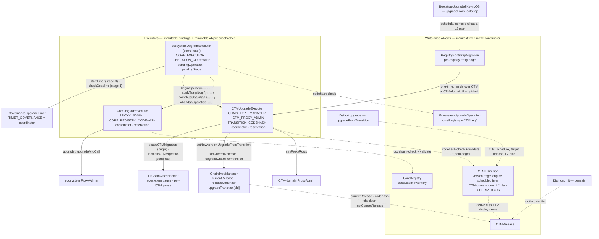
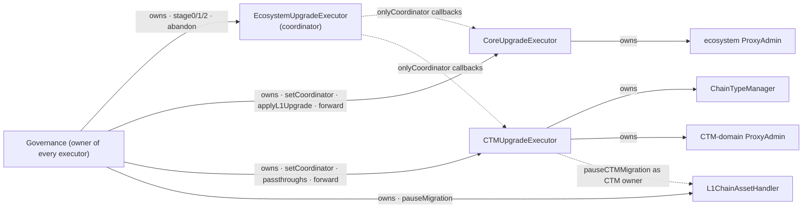

# Registry-Driven Protocol Upgrades

A protocol upgrade is a set of **write-once contracts** deployed ahead of time. Governance approves
the object addresses and their pinned contents; the contracts validate them and the executors apply
them. What governance signs is three fixed-signature calls on one coordinator plus whatever the
prepare declared as an external action.

**Scope:** L1 + L2 era-contracts, upgrade tooling, governance proposal shape.

This is the architecture document. Two other documents complete it and are not restated here:

- [`protocol-docs/ecosystem-upgrade-coordination.md`](../protocol-docs/ecosystem-upgrade-coordination.md)
  is the **coordinator spec**: the stage semantics of `EcosystemUpgradeExecutor`, the operation
  commitment, the reservation protocol of the domain executors, abandonment and authorization.
- [`l1-contracts/deploy-scripts/upgrade/README.md`](../l1-contracts/deploy-scripts/upgrade/README.md)
  is the **runbook**: how a prepare is run, composed, verified, replayed and how chains cross.

[`upgrade-stage-lifecycle.md`](upgrade-stage-lifecycle.md) keeps the operational policies that
belong to neither: pause composition, the ServerNotifier row, the timer, coordinator succession.

Read in this order: [objects](#objects), [authority](#authority), [upgrading](#flow-upgrading),
[bootstrap](#bootstrap). The central security question is whether the reviewed objects and the
declared external actions account for every executable change: review source/target edges,
target identities, code pins, initializers, engine and composer code and ownership changes
together, and include governance's `forward`, abandonment and coordinator-replacement powers.
Stage 2 verifies the applied L1 state, not completion on every L2 chain.

## Model

Two objects, deliberately separate:

|          | **Release**                                                                                                             | **Transition**                                                                |
| -------- | ----------------------------------------------------------------------------------------------------------------------- | ----------------------------------------------------------------------------- |
| Answers  | what a chain **is**                                                                                                     | how release A **becomes** release B                                           |
| Contains | pinned facet set (routing self-described by the facets), `DiamondInit`, verifier, genesis params, force-deployment data | version edge, upgrade engine, CTM-domain proxy rows, schedule, L2 plan, timer |
| Version  | none — version-independent, reusable                                                                                    | owns the `old -> new` version edge                                            |
| VM flag  | none — every release is a ZKsync OS release                                                                             | —                                                                             |

A release is reusable chain state: everything a chain _runs_ belongs to it, including the verifier
(the chain stores it as `s.verifier`). What a release does **not** carry is anything about _when_ —
the version edge and the schedule are the transition's, and one release can serve several versions.

**A transition's facet cuts are not authored.** They are derived from its
`(fromRelease, newRelease)` pair in the constructor and stored: a full reinstall — remove the
departing release's routing, install the target's. Two shortcuts to an empty cut, both by value:
the same release on both edges, and two releases whose routing is byte-identical. Governance
reviews two releases plus the transition's own fields; the cuts are computed, not written.

A transition describes one CTM's change and nothing about the ecosystem. Which CTM transitions
belong to one upgrade, and which ecosystem change they ride with, is a third object — the
**operation** — named only by the coordinator.

## Objects

All are storage-backed, built once from a manifest they take in the constructor, and commit
`manifestHash = keccak256(abi.encode(manifest))`. The struct definitions and their field docs are
in `l1-contracts/contracts/upgrades/registry/RegistryTypes.sol`.

| Contract                     | Holds                                                                                                                                                                                                                                                                                                      |
| ---------------------------- | ---------------------------------------------------------------------------------------------------------------------------------------------------------------------------------------------------------------------------------------------------------------------------------------------------------- |
| `CTMRelease`                 | `diamondInit` + pin, `verifier` + pin, `GenesisFacet[]` (address, freezability, pin), `fixedForceDeploymentsData`, genesis params + genesis-upgrade pin, `l2BytecodeInfos` (the `L2EcosystemContract`-indexed implementation table), one shared `l2SystemProxyBytecodeInfo` shell                          |
| `CTMTransition`              | version edge, `fromRelease`, `newRelease`, `upgradeEngine` + pin, `proxyUpgrades` (the `CTMContract`-indexed CTM-domain inventory, incl. the CTM itself), deadline, `upgradeTimestamp`, pinned `upgradeTimer`, `AuthoredL2Plan`; **derived and stored:** `Diamond.FacetCut[]` and the L2 force deployments |
| `CoreRegistry`               | the `L1EcosystemContract`-indexed inventory of `(proxy, expectedOldImpl, implNew + pin)` rows for the SHARED singletons (bridges, Bridgehub, MessageRoot, …)                                                                                                                                               |
| `EcosystemUpgradeOperation`  | `{coreRegistry, CTMLeg[] legs}` with `CTMLeg = {executor, transition}` — the participation of one upgrade. The ONLY place the core registry is named. Rejects an empty leg list and two legs on one CTM.                                                                                                   |
| `RegistryBootstrapMigration` | one edge from a pre-registry CTM into this model — see [Bootstrap](#bootstrap)                                                                                                                                                                                                                             |

### Enum-indexed proxy inventories

Proxy upgrades are not carried as anonymous row lists. Each manifest carries a **complete row
array indexed by the canonical contract enum** — the SAME enum that identifies the contract for
deployment, one enum per domain (`ContractIdentifiers.sol`) — whose length must be exactly the
enum's member count (`L1_ECOSYSTEM_CONTRACT_COUNT` / `CTM_CONTRACT_COUNT`):

- `CoreRegistryManifest.proxyUpgrades` is indexed by `L1EcosystemContract`.
- `TransitionManifest.proxyUpgrades` and `BootstrapManifest.proxyUpgrades` are indexed by
  `CTMContract`. Only the TUPP members can participate: those under the CTM-domain ProxyAdmin
  (ChainTypeManager, ValidatorTimelock, BytecodesSupplier, PermissionlessValidator) through the
  executor's bound admin, and the `ServerNotifier` through the row's own named admin.

Slot `uint256(member)` IS that contract's row; a slot whose `implNew` is zero is the **explicit
"not upgraded" statement**. The length check means a manifest cannot omit a slot, and the enum —
being the same one deployment uses — is the single naming scheme end to end.
`ProxyUpgradeRowLib.toRows` flattens the array into the `ProxyUpgradeRow[]` the executors apply,
dropping the inert slots, so the executors never recompile when the inventory grows.

**A row names its admin.** `ProxyUpgradeRow.admin` is zero for the common case — the applying
executor's bound `ProxyAdmin` — and set for a proxy administered elsewhere. A transparent proxy
answers `implementation()` only to its own admin, so reads go through the named one. Such a row
is applied by the executor only if it OWNS the named admin; otherwise stage 1 leaves it to that
administrator (`ProxyRowLeftToAdministrator`) and stage 2 still requires it applied. A row under
the bound admin that the executor does not own still reverts — a misbound executor is a
configuration error, not something to skip past. The ServerNotifier is the one such row today;
its operating modes are in [the lifecycle document](upgrade-stage-lifecycle.md#servernotifier-a-row-under-a-foreign-admin).

### Reinitializers: a fixed call, no data

A row never carries calldata. Its `callInitializeUpgrade` BOOLEAN is the entire reinitialization
surface: when set, the apply performs `upgradeAndCall` with the FIXED, argument-less
`IProxyUpgradeInitializable.initializeUpgrade()` selector. Everything the reinitializer needs
lives in the new implementation's own audited code — constants, or immutables on L1, both pinned
by the row's `implNew` codehash. A manifest cannot route the init call to an arbitrary function or
smuggle arguments into it; a wrong reinitialization value is a missing line in an audited contract
diff, never a wrong byte in offchain-authored data.

### Supporting libraries

| Library                       | Role                                                                                                    |
| ----------------------------- | ------------------------------------------------------------------------------------------------------- |
| `TransitionDerivationLib`     | facet cuts and L2 deployments from a release pair                                                       |
| `ReleaseFacetReader`          | genesis installation from a release's self-described routing                                            |
| `CTMUpgradeComposer`          | the committed cut and the L2 protocol upgrade transaction, from a transition or the bootstrap migration |
| `L2InventoryLib`, `L2PlanLib` | changed L2 deployments; executable plan construction from bytecode infos                                |
| `ProxyUpgradeRowLib`          | `toRows`, `applyRows`, `requireRowsApplied` over the enum-indexed inventories                           |
| `CodehashPinLib`              | `requirePin` (reverts) / `pinHolds` (bool)                                                              |

There is no intermediate genesis-manifest type between a build and its `ReleaseManifest`:
`DeployCTMUtils.deployCurrentRelease` (and `deployAdditionalReleaseFacets`) assembles the
`GenesisFacet[]` directly as it deploys each facet, and the release's implementation table and its
one shared `l2SystemProxyBytecodeInfo` shell come from `SystemContractsProcessing`.

## Contract map

Who holds what, who reads what. Solid = writes or drives; dashed = reads.



## Authority



Three executors, one authority root. Governance owns all three; each domain executor holds one
piece of protocol authority and answers to exactly one coordinator, which it names explicitly
(`coordinator`, set by the owner). A shared owner is not authorization: each domain callback rejects callers other than its
configured coordinator.

| Executor                   | Bound to (immutable)                                                    | Entrypoints                                                                                                                                                                                                                                                                                                                                                                                               |
| -------------------------- | ----------------------------------------------------------------------- | --------------------------------------------------------------------------------------------------------------------------------------------------------------------------------------------------------------------------------------------------------------------------------------------------------------------------------------------------------------------------------------------------------- |
| `EcosystemUpgradeExecutor` | `CORE_EXECUTOR`, the `EcosystemUpgradeOperation` codehash               | `stage0/1/2(operation)`, `abandonPendingOperation` (owner); `pendingOperation()`, `pendingStage()`                                                                                                                                                                                                                                                                                                        |
| `CoreUpgradeExecutor`      | the ecosystem `ProxyAdmin`, the `CoreRegistry` codehash                 | `beginOperation`, `completeOperation`, `abandonOperation` (coordinator); `applyL1Upgrade` (coordinator for the reserved registry, or the owner for any — bootstrap and recovery); `validateUpgradeApplied`; `setCoordinator` (owner, refused while reserved)                                                                                                                                              |
| `CTMUpgradeExecutor`       | one `ChainTypeManager` + its `ProxyAdmin`, the `CTMTransition` codehash | `beginOperation`, `applyTransition`, `completeOperation`, `abandonOperation` (coordinator); `validateTransitionApplied`; `upgradeChain`; `acceptCTMOwnership`; `setCoordinator`, `setProtocolVersionDeadline` and the routine passthroughs (`freezeChain`, `unfreezeChain`, `revertBatches`, `setValidator`, `setPriorityTxMaxGasLimit`, `deactivatePriorityMode`, `setValidatorTimelockPostV29`) (owner) |

The coordinator owns no proxy administration and applies nothing itself: it orders the legs,
holds the pending operation and its stage, starts and checks the timers, and drives the domain
callbacks. Each domain stores only its `activeOperation`; its registry or transition is read from that
operation rather than supplied or stored a second time. Domain callbacks enforce coordinator
authorization; only `beginOperation` names an operation, and every callback after it acts on the
reservation the executor already holds. How the stages compose these calls, what each stage checks
and what abandonment leaves behind is the
[coordinator spec](../protocol-docs/ecosystem-upgrade-coordination.md).

`UpgradeExecutorBase` gives every executor ONE role. `owner` (`Ownable2Step`) drives the fixed
entrypoints, whose inputs are write-once objects and whose invariants cannot be bypassed, and the
same owner can `forward` raw calls — the logged escape hatch that keeps the authority the executor
holds reachable for recovery and succession. The base contract's own comment records why the
hatch is owner-gated rather than gated on an emergency board.

### Authority matrix after bootstrap

Who can do what once the CTM domain is owned by `CTMUpgradeExecutor`. "Chain side" is the
`onlyAdmin` / `onlyAdminOrChainTypeManager` path on the chain's own Admin facet;
`onlyChainTypeManager` methods have no such path, which is why they are passthroughs.

| CTM owner method                                                                                                                    | Through the executors                                                                           | Chain side                              |
| ----------------------------------------------------------------------------------------------------------------------------------- | ----------------------------------------------------------------------------------------------- | --------------------------------------- |
| `setNewVersionUpgradeFromTransition`, `setCurrentRelease`                                                                           | the coordinator's `stage1` → `applyTransition` (together, from the reserved transition)         | —                                       |
| `upgradeChainFromVersion`                                                                                                           | `upgradeChain`                                                                                  | —                                       |
| lifecycle bookkeeping (pending operation, reservations)                                                                             | `abandonPendingOperation` on the coordinator — break-glass for a lifecycle that cannot complete |                                         |
| `pauseCTMMigration` / `unpauseCTMMigration` (as CTM owner)                                                                          | `beginOperation` / `completeOperation`; `forward` to unpause after an abandonment               | —                                       |
| `setProtocolVersionDeadline`                                                                                                        | passthrough                                                                                     | —                                       |
| `freezeChain`, `unfreezeChain`, `setValidator`, `setPriorityTxMaxGasLimit`, `deactivatePriorityMode`, `setValidatorTimelockPostV29` | passthrough                                                                                     | — (`onlyChainTypeManager`)              |
| `revertBatches`                                                                                                                     | passthrough                                                                                     | validator (`revertBatchesSharedBridge`) |
| `changeFeeParams`, `setTokenMultiplier`                                                                                             | `forward` only                                                                                  | chain admin                             |
| `setPendingAdmin`, `setServerNotifier`                                                                                              | `forward` only                                                                                  | CTM admin (`onlyOwnerOrAdmin`)          |
| `executeUpgrade` (arbitrary cut), legacy `setNewVersionUpgrade` / `setUpgradeDiamondCut` / `setLegacyValidatorTimelock`             | `forward` only — deliberately: the bypass the object-driven path exists to remove               | —                                       |
| `setReleaseCodehash`                                                                                                                | `forward` only — one-shot, installed by the bootstrap                                           | —                                       |
| CTM / ProxyAdmin `transferOwnership` (executor succession)                                                                          | `forward` only                                                                                  | —                                       |

## Provenance and pinning

Three mechanisms, applied everywhere:

**Type provenance by codehash.** Each object takes its whole manifest as a constructor argument, so
it has no initializer and no state-mutating function at all — write-once is structural, not a runtime
guard. Consumers establish provenance by checking the object's `EXTCODEHASH` against the audited
one: the executors hold `TRANSITION_CODEHASH` / `CORE_REGISTRY_CODEHASH` / `OPERATION_CODEHASH`
as immutables, and the CTM holds `releaseCodehash` as state, checked in `setCurrentRelease`.

What this proves is that the address runs the audited, write-once code — not _which_ manifest it
holds. Governance approving the address is what gates content. Because the manifest lives in the
initcode, a CREATE2 address also commits to it. For this to hold, manifest data must live in
**storage**, never in immutables: immutables are patched into runtime code, which would give every
instance a different codehash.

**Inline codehash pins.** Every executable address an object names carries its expected
`EXTCODEHASH` beside it — facets, `DiamondInit`, the verifier, the genesis upgrade, the upgrade
engine, the timer, the composer, each `implNew`. Pins are deliberately NOT checked in the
constructor — the manifest author supplies both halves of every pair, so that would prove only
self-consistency — and are held against live code by `validate()` on the paths that commit or
apply an object. A pin holds only against an account that **has code**.

**Two validation surfaces.** `validate()` reverts and runs where an object is committed or applied
(`beginOperation` on both domain executors, `applyL1Upgrade`, `applyTransition`, `migrate()`,
transition construction for both release edges); `verifyAll()` returns `bool` and is for
inspection and deployment tooling. Each object enumerates what it pins exactly once and both
surfaces walk that one list, so a pinned field cannot be enforced by one surface and missed by the
other. Two paths deliberately skip `validate()` and say so in code: the per-chain `upgradeChain`
and the engine's `upgradeFromTransition` execute only the transition the CTM already committed,
whose pins cannot have moved (an `EXTCODEHASH` is fixed for a non-selfdestructible contract).

**Post-state verification.** Pins prove the objects; a second layer proves the upgrade LANDED,
and stage 2 gates on it:

- `ProxyUpgradeRowLib.requireRowsApplied` — every row's proxy points at its pinned `implNew`, read
  live through the row's `ProxyAdmin`.
- `CoreUpgradeExecutor.validateUpgradeApplied(registry)` and
  `CTMUpgradeExecutor.validateTransitionApplied(transition)` — the applied form of the two apply
  entrypoints (committed edge, version reached, rows applied). Stage 2 calls each domain’s
  `completeOperation`, which checks its own applied state before releasing its reservation and,
  for a CTM, its pause. A later domain’s failure rolls back all earlier completions; there is no
  duplicate coordinator validation pass — the coordinator calls neither view in stage 2, and both
  remain read-only surfaces for tooling and monitoring.
- `RegistryBootstrapMigration.validateApplied()` — the whole bootstrap edge, including that the
  CTM domain landed under the bound executor and the CTM's migrations are no longer paused.
- `CTMRelease.verifyChainRouting(chain)` — a live diamond's loupe output set-equals the release's
  self-described routing, for per-chain post-upgrade checks and monitoring.

These describe ONE edge, not a standing invariant: a later upgrade legitimately moves proxies (and
`currentRelease`) on, after which the applied-checks revert by design.

## Chain-type manager state

The CTM stores one release pointer and derives genesis data from it:

- `currentRelease` — the release every new chain is created at. `storedBatchZero()` and
  `l1GenesisUpgrade()` are views over `ICTMRelease(currentRelease).genesisParams()`.
- `releaseCodehash` — the provenance anchor every pinned release is checked against.
- `upgradeTransition[oldProtocolVersion]` — the transition committed for chains departing from that
  version, and the ONLY commitment for registry-driven edges: `upgradeCutForVersion` derives the cut
  from it on read (a chain is never handed cut bytes), and `protocolVersionDeadline` resolves the
  departing version's deadline from it. The transition's deadline is only the STARTING value:
  `setProtocolVersionDeadline` (owner; an executor passthrough) keeps moving it afterwards, and a
  stored value takes precedence.
- `upgradeCutHash` — DEPRECATED. Written only by the legacy cut-taking commit path (which the
  bootstrap edge uses); transition commits leave it zero.

The version-edge commit refuses to run unless this CTM's migrations are paused
(`migrationPausedFor(ctm)`), which is why `beginOperation` pauses before `applyTransition` can
commit. Nothing else about a chain's installed state is keyed by protocol version on the CTM: a
chain several versions behind resolves its verifier from the release its own transition names
(`transition.newRelease()`), so a lagging chain is never affected by where `currentRelease` has
moved since.

When a release is pinned, the CTM validates its genesis params: a non-zero genesis upgrade and
batch hash, and `genesisBatchCommitment == 1`.

## Flow: creating a chain

1. `L1Bridgehub.createNewChain` records base token and settlement layer, then calls
   `CTM.createNewChain(chainId, admin)`.
2. The CTM builds a genesis cut with **empty** `facetCuts`,
   `initAddress = currentRelease.diamondInit()`, empty `initCalldata`, and deploys the `DiamondProxy`.
3. `DiamondInit.initialize(chainId, admin)` is delegatecalled from the proxy constructor, so
   `msg.sender` is the CTM. It reads `currentRelease`, installs that release's self-described routing via
   `ReleaseFacetReader`, and takes the verifier from the release.
4. The CTM runs `IAdmin.genesisUpgrade` with the release's `fixedForceDeploymentsData` and genesis
   upgrade address.

`chainId` and `admin` are the only per-chain inputs; everything else comes from the CTM and the
release it points at. When a chain migrates between settlement layers, `forwardedBridgeBurn`
forwards only `(admin, protocolVersion)`; the destination CTM rebuilds the genesis cut from its
**own** `currentRelease`.

## Flow: upgrading

```mermaid
sequenceDiagram
    participant G as Governance
    participant X as EcosystemUpgradeExecutor
    participant CO as CoreUpgradeExecutor
    participant E as CTMUpgradeExecutor
    participant H as L1ChainAssetHandler
    participant T as GovernanceUpgradeTimer
    participant C as ChainTypeManager
    participant D as Chain diamond

    G->>X: stage0(operation)
    Note over X: OPERATION_CODEHASH; domain callbacks enforce onlyCoordinator
    X->>CO: beginOperation(operation) — pin + validate
    X->>E: beginOperation(operation) — pin, validate, both edges
    E->>H: pauseCTMMigration(ctm)
    X->>T: startTimer() — once per distinct timer; TIMER_GOVERNANCE must be X
    G->>X: stage1(operation)
    X->>T: checkDeadline()
    X->>CO: applyL1Upgrade(coreRegistry) — core leg first
    X->>E: applyTransition() — the reserved leg
    E->>C: setNewVersionUpgradeFromTransition(transition)
    E->>C: setCurrentRelease(newRelease)
    G->>E: upgradeChain(transition, chainId)
    E->>C: upgradeChainFromVersion(chainId, oldV)
    C->>D: upgradeChainFromVersion(oldV)
    D->>C: upgradeCutForVersion(oldV) — derived from upgradeTransition[oldV]
    Note over D: apply derived facetCuts verbatim,<br/>then version + target release's verifier + composed L2 tx
    G->>X: stage2(operation)
    X->>CO: completeOperation() — validates applied
    X->>E: completeOperation() — validates applied
    Note over X,E: Any later failure rolls back all completions
    E->>H: unpauseCTMMigration(ctm)
```

The three `stage0/1/2(operation)` calls are ALL a registry-driven upgrade emits; every other call
is a declared external action listed in the prepare output (see the runbook). One operation is
mid-lifecycle at a time and each stage names it; a different operation, an out-of-order stage or a
repeated stage is rejected. An operation with several CTM legs applies the core leg once and then
each CTM leg in committed order, atomically. The stage-by-stage semantics are the
[coordinator spec](../protocol-docs/ecosystem-upgrade-coordination.md).

**`upgradeChain(transition, chainId)`** is the per-chain crossing. The executor's owner may
upgrade any chain at any time; a chain's **own admin** may upgrade **that** chain at any time
(scoped per chain because `chainId` is an argument); anyone else only once the old-version
deadline has passed, at which point the upgrade is operationally mandatory and execution carries
no discretionary inputs. The named transition must be the one the CTM committed for the departing
version. Chain admins additionally retain their own direct path on the chain diamond.

**Where the cut is composed.** The cut is a pure function of the transition — an
`upgradeEngine.upgradeFromTransition(transition)` init over no facet cuts — constructed by
`CTMUpgradeComposer.buildUpgradeCutData(ICTMTransition)`. Prepare and the CTM use this same
transition-only function; the bootstrap edge composes its cut the same way from its own object,
`buildBootstrapUpgradeCutData(IRegistryBootstrapMigration)`, served as the migration's
`upgradeCut()`. The CTM hashes it at commit time (`setNewVersionUpgradeFromTransition`)
and re-derives it on read (`upgradeCutForVersion`). It never travels in calldata: not in governance calls, and not to
the chain — the chain's Admin facet takes only the departing version and reads the cut from its
CTM. The chain diamond still treats the cut it reads as opaque bytes and stays unaware of
transitions.

On the chain, `DefaultUpgrade.upgradeFromTransition` applies `transition.facetCuts()` verbatim, then
runs the shared storage part (`BaseZkSyncUpgrade._upgrade`) with inputs read straight from the same
object: the version edge and schedule from the transition, the verifier of its TARGET release (never
the CTM's live `currentRelease()`), and the L2 protocol upgrade transaction composed from its L2
plan with the executing chain’s ID and Bridgehub. The pinned delegate composer builds final
chain-specific calldata directly, in one pass; tooling reads that same transaction through
`ICTMTransition.l2UpgradeTx(bridgehub, chainId)`, which forwards to the per-release engine, and
`IRegistryBootstrapMigration.l2UpgradeTx(chainId)` for the bootstrap edge.
There is no intermediate proposal struct, selector resolution or re-diffing at execution time.

## What the derivation guarantees

For any representable release pair, the L1-side guarantee is that **the facet routing and verifier
an existing chain ends up with are byte-for-byte what a fresh chain at `newRelease` gets**. The
upgrade path and the genesis path resolve to the same pinned release, so they cannot drift. There
is no second mechanism for any part of installed chain state.

The **L2 force deployments are derived too**: only changed, nonempty target rows of the
`l2BytecodeInfos` table are deployed at their member’s fixed address (`L2InventoryLib`). The release
stores each implementation descriptor and one shared system-proxy shell; derivation joins them
into the executable descriptor. A changed shell also changes the corresponding target rows.
Unchanged rows are not reinstalled.

The reviewed input outside that table is `AuthoredL2Plan`: delegate bytecode info, extra bytecode
infos and a pinned calldata composer. `L2PlanLib.build` constructs the delegate and extra
`Unsafe` deployments at bytecode-derived addresses, sets the delegate target, and collects and
deduplicates every installed bytecode’s observable hash into the factory dependencies. Those
addresses, deployment types and dependency hashes are not separately authored or cross-checked.
The CTM’s `BytecodesSupplier` must hold those dependencies published where the edge COMMITS
(`applyTransition` and `migrate()`). What is not proven is what the delegate does on L2: its
bytecode hash names an auditable artifact, not a behavior.

## Rules enforced at construction

**Release shape.** Nonempty facet array; every facet row has selectors; exactly one row per facet
address (`Diamond._addOneFunction` requires uniform freezability per facet); a selector appears in at
most one row.

**Version edge.** `newProtocolVersion > oldProtocolVersion`; both majors zero; the minor delta is
within `MAX_ALLOWED_MINOR_VERSION_DELTA`. These mirror the rules chains apply at execution, so a
transition cannot pin successfully and then strand every chain.

**Patches.** A patch may name a NEW release. A release is the immutable snapshot of the intended
contracts, so replacing one of its L1 members — the verifier, a facet — is not by itself a change
of chain-visible L2 state, and should not force a minor bump. What a patch may not do is carry an
L2 upgrade: `BaseZkSyncUpgrade` refuses an L2 protocol upgrade transaction on a patch edge, and a
patch deliberately does NOT require an earlier L2 upgrade to be finalized first, so a pending one
must survive it untouched. The transition therefore validates what a patch CONTAINS rather than
which release it names: no L2 side (derived or authored), and the target release must carry over
the departing one's L2 description — the implementation table and shared proxy shell, the
force-deployment blob, the genesis
batch and the VM its pinned `DiamondInit` selects. A same-release patch remains valid and is then
schedule-only.

A verifier rotation is therefore: deploy the verifier, publish release B copying release A except
that member, publish the `0.34.0 -> 0.34.1` transition naming `A -> B` with no L2 side, run the
normal lifecycle. Mechanical permission is not a safety argument: a facet patch still needs the
usual compatibility review of storage layout, proof handling and L2 interaction.

**Schedule.** `oldProtocolVersionDeadline >= upgradeTimestamp`, so the old protocol is never disabled
before chains may upgrade.

**L2 plan.** `L2PlanLib.build` checks the remaining input constraints: canonical bytecode-info
lengths, a delegate whenever deployments or a composer exist, and the execution limit on the
constructed factory-dependency count. Deployment addresses, types, delegate membership and
factory-dependency membership follow from construction rather than caller-supplied fields.

**Verifier.** Zero means "leave unchanged" on the upgrade path, which is how the genesis upgrade runs
after `DiamondInit` has already installed it; a release itself can never pin a zero verifier. ZKsync
OS chains have no base-system bytecodes, so releases pin none, transitions derive no hash changes,
and the engines take no bytecode-hash inputs.

**Row sets.** Every participating row is a real, unique edge: all fields nonzero, one row per
proxy. A bootstrap manifest must carry at least one row.

**Operation.** At least one CTM leg, no zero addresses, no two legs on one CTM (resolved through
each executor's `CHAIN_TYPE_MANAGER`). A core-only change rides a schedule-only transition on one
CTM, so it cannot bypass that CTM's pause and timer.

## Bootstrap

A pre-registry CTM has neither `currentRelease` nor `releaseCodehash`, and transitions never accept a
zero `fromRelease`. It must therefore cross into the model once, through one-time migration code —
never through an accommodation inside the transition model. Fresh CTMs pin both at genesis and need
no bootstrap.

`RegistryBootstrapMigration` expresses that crossing as a single pinned object. Its manifest names
the CTM and its departing version, the CTM-domain `ProxyAdmin`, the source-checked implementation
swaps (the CTM's own among them), the genesis `currentRelease` whose codehash doubles as the
`releaseCodehash` anchor, the version edge and deadline, the pinned bootstrap engine and authored
L2 plan, the pinned timer, and the `CTMUpgradeExecutor` that receives the domain together with
the owner and the `coordinator` it must already answer to. Every address carries an inline pin.

Governance nominates the migration as CTM owner and transfers the CTM-domain `ProxyAdmin` to it;
`migrate()` accepts the CTM, performs the whole edge and hands both to the bound executor in the
same transaction (the CTM through `CTMUpgradeExecutor.acceptCTMOwnership()`, which is
permissionless-safe: it accepts only the bound CTM and only after a nomination). Authority is
never parked.

`validate()` runs on the execution path and requires that the migration holds both ownerships,
that the pinned timer's deadline has passed (so `migrate()` cannot run before stage 0 started it),
that the CTM sits at the departing version, that every proxy row is at its `expectedOldImpl` (or
already at `implNew` — how a row a foreign administrator applied first passes), that every pin
holds and every factory dependency is published, and that the executor is **bound to what it is
about to receive**: its `CHAIN_TYPE_MANAGER`, its `CTM_PROXY_ADMIN`, its `coordinator()`, its
`owner()` (with no pending owner). Ownership and the coordinator are storage, outside the
executor's codehash pin, so they are checked by value: the edge is one-shot, and an executor whose
ownership moved after deployment would receive the whole domain on behalf of whoever owns it now.

Two properties that look like omissions but are not:

- `migrate()` is **permissionless**. The gate is the state, not the caller: nothing runs until
  governance has handed over both ownerships, which is the approval, and every value written
  afterwards is pinned. The CTM's own version-edge commit additionally refuses to run while chain
  migrations are unpaused, which is the ecosystem pause governance holds across the edge.
- The committed cut carries **no facet cuts and no authored calldata**. The facet delta cannot be
  derived at construction (the departing version predates releases), so the cut's init target is
  the bootstrap engine (`BootstrapUpgradeZKsyncOS`), which removes each chain's live routing read
  from its own diamond storage and installs the facet set of the genesis release it pins as an
  immutable. The init names the migration and nothing else (`upgradeFromBootstrap(migration)`);
  at execution the engine reads the version edge, the schedule and the L2 plan from it and
  composes the L2 transaction with the same `CTMUpgradeComposer` transitions use. Chains crossing
  the edge run pre-v34 facets and take these bytes by hand (`upgradeCut()`), through the legacy
  cut-taking chain entrypoint; `upgradeTransition` stays zero for the departing version.

`validateApplied()` is the stage-2 gate: executed, version reached, release and anchor installed,
rows applied, the CTM domain landed under the executor, and the CTM's migrations unpaused again.

The bootstrap edge predates the coordinator lifecycle, so its stage bundles are declared external
actions rather than coordinator calls: the ecosystem side hands the ecosystem `ProxyAdmin` to the
freshly deployed `CoreUpgradeExecutor`, applies the `CoreRegistry` through it and binds it to the
coordinator (`setCoordinator`); the CTM side starts the timer, hands the CTM and its `ProxyAdmin`
to the migration and runs `migrate()`. The `CTMUpgradeExecutor` is constructed answering to the
coordinator, and the migration checks that binding, so the CTM domain needs no join call. Which
calls ride which stage is the runbook's business; `UpgradeTestv34_Local.t.sol` and the anvil
pipeline drive the whole edge through the real prepares.

## Deployment determinism

Objects take their manifest as a constructor argument, so the manifest is part of the initcode and a
CREATE2 address commits to it. There is no separate salt to reproduce and no window in which a
deployed-but-uninitialized instance exists. Every prepare deployment rides the CREATE2 factory,
because the deployer Safe bundle replays factory transactions only.

The object codehashes the executors pin are taken from the same build artifact the objects are
deployed from (`BytecodeUtils.getDeployedBytecodeHash` / `readBytecodeL1`); a pin read from one
artifact and an object deployed from another can differ in CBOR metadata. Pinned implementations
are built with a CBOR-metadata-free profile (`registry-deterministic`) so hashes are byte-identical
across platforms.

**Gateway.** EraVM has no constructors, so these objects cannot be constructed there. A Gateway CTM
therefore cannot deploy its own `CTMRelease` in-flow and the registry model cannot bump it yet; the
Gateway deployer takes a pre-deployed release address instead (`GatewayCTMDeployerCTMBase`).

## Related

- [Ecosystem upgrade coordination](../protocol-docs/ecosystem-upgrade-coordination.md) — the
  coordinator spec.
- [Upgrade stage lifecycle](upgrade-stage-lifecycle.md) — pause composition, the ServerNotifier
  row, the timer, coordinator succession.
- [Upgrade scripts runbook](../l1-contracts/deploy-scripts/upgrade/README.md) — prepare, compose,
  verify, replay, chain crossing.
- [Script retirement plan](upgrade-script-retirement.md) — what tooling still decides, and the
  batches that move it on-chain.
- [Governance self-migration](governance-self-migration.md) — how the authority root above
  upgrades itself.
