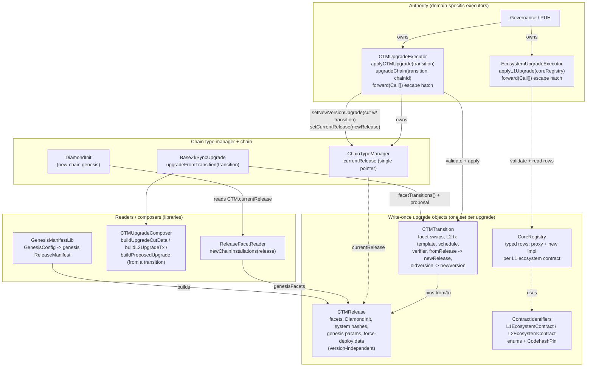

# Registry-Driven Protocol Upgrades

**Status:** Implemented for v32 (era-contracts PR #2270). v32 is the first registry-driven
release; the on-chain executor path drives upgrades from v33 onward (v32 itself ships through the
legacy governance-calldata pipeline, see "Legacy path" below).
**Scope:** L1 + L2 era-contracts, upgrade tooling, governance proposal shape.

The model separates two concepts that earlier drafts conflated:

- a **release** — what a chain at a protocol version _is_: the complete installed state
  (facets, `DiamondInit`, base-system hashes, genesis parameters, force-deployment descriptor).
  A release is **version-independent** reusable chain state: a verifier-only patch reuses the
  same release.
- a **transition** — how release A _becomes_ release B: the explicit facet swaps, the L2 upgrade
  transaction template, the schedule, the verifier, and both edges pinned —
  `fromRelease -> newRelease` **and** `oldProtocolVersion -> newProtocolVersion`.

Both are storage-backed, **write-once** contracts generated per upgrade, initialized exactly once
from an audited manifest, committing `manifestHash = keccak256(manifest)`. On-chain code reads
them; governance only approves "apply this pinned transition".

## Contract map

## Contracts

| Contract                                           | Where                          | Role                                                                                                                                                                                                                                                                                                                                         |
| -------------------------------------------------- | ------------------------------ | -------------------------------------------------------------------------------------------------------------------------------------------------------------------------------------------------------------------------------------------------------------------------------------------------------------------------------------------- |
| `CTMRelease`                                       | `contracts/upgrades/registry/` | Write-once description of one release: `isZKsyncOS`, `DiamondInit`, complete `GenesisFacet[]` (address, freezability, selectors), base-system hashes, `fixedForceDeploymentsData`, genesis params, codehash pins. **No protocol version, no verifier** — those are transition concerns.                                                      |
| `CTMTransition`                                    | `contracts/upgrades/registry/` | Write-once description of one hop: both edges (`fromRelease -> newRelease`, `oldProtocolVersion -> newProtocolVersion`), verifier, `DefaultUpgrade` address, schedule (`upgradeTimestamp`, `oldProtocolVersionDeadline`), `UpgradeFacetSwap[]`, L2 deployments + delegate + factory-dep hashes, base-system hash **changes**, codehash pins. |
| `CoreRegistry`                                     | `contracts/upgrades/registry/` | Write-once L1 ecosystem rows — one call (`ecosystemRows()`) returns complete typed `EcosystemContractRow[]` (key, proxy, new impl); no per-key lookups.                                                                                                                                                                                      |
| `ContractIdentifiers.sol`                          | `contracts/upgrades/registry/` | The cross-version ABI: `L1EcosystemContract` / `L2EcosystemContract` / `ZKsyncOSUpgradeType` enums **and** the shared `CodehashPin` struct.                                                                                                                                                                                                  |
| `ICTMRelease` / `ICTMTransition` / `ICoreRegistry` | `contracts/upgrades/registry/` | Read interfaces used by consumers (CTM, DiamondInit, `BaseZkSyncUpgrade`, composer, executors).                                                                                                                                                                                                                                              |
| `ReleaseFacetReader`                               | `contracts/upgrades/registry/` | `newChainInstallations(release)` — genesis facet cuts from the release's `GenesisFacet[]` (empty selector list ⇒ the facet's own `ISelfDescribingFacet.selectors()`).                                                                                                                                                                        |
| `GenesisManifestLib`                               | `contracts/upgrades/registry/` | `buildGenesisManifest(GenesisConfig)` → the genesis `ReleaseManifest` a freshly deployed CTM is pointed at (used by `DeployCTMUtils` and the gateway CTM deployer).                                                                                                                                                                          |
| `CTMUpgradeComposer`                               | `contracts/upgrades/registry/` | Pure composition **from a transition**: `buildUpgradeCutData`, `buildL2UpgradeTx`, `buildProposedUpgrade`.                                                                                                                                                                                                                                   |
| `CTMUpgradeExecutor`                               | `contracts/upgrades/registry/` | Domain-specific executor owning a CTM. Fixed logic: `applyCTMUpgrade(transition)` and `upgradeChain(transition, chainId)`. No generic delegatecall surface.                                                                                                                                                                                  |
| `EcosystemUpgradeExecutor`                         | `contracts/upgrades/registry/` | Domain-specific executor owning the ecosystem `ProxyAdmin`. Fixed logic: `applyL1Upgrade(coreRegistry)` re-points every pinned proxy.                                                                                                                                                                                                        |
| `UpgradeExecutorBase`                              | `contracts/governance/`        | Shared base of both executors: `Ownable2Step` (owner = PUH) + `forward(Call[])`, the raw-call emergency escape hatch. CTM authority and ecosystem authority are deliberately separate — each scope can be governed and upgraded on its own cadence.                                                                                          |

**Validation API.** `validate()` **reverts** (`RegistryCodehashMismatch`, uninitialized, …) and is
called on every execution path — executor entrypoints, transition initialization (which validates
both its releases), `upgradeFromTransition`. `verifyAll()` returns `bool` for inspection and
deployment tooling. Enforcement is never left to an advisory predicate.

## Data model: the CTM stores one pointer

`ChainTypeManagerBase` keeps a single release pointer and derives all genesis data by reading it:

- **`currentRelease`** — the release every new chain is created at. Set at CTM initialization and
  moved by `setCurrentRelease` (owner-only; the executor calls it inside `applyCTMUpgrade`).
  `storedBatchZero()` / `l1GenesisUpgrade()` are views over
  `ICTMRelease(currentRelease).genesisParams()`.

There is no per-version registry map: the upgrade cut itself carries the transition address
(`DefaultUpgrade.upgradeFromTransition(transition)` as init calldata), so the committed cut and
the facet-swap source are the _same object_ — the registry identity cannot be carried twice. The
old `genesisRegistry` / `upgradeRegistryForVersion` / inline-genesis slots are retained only as
`__DEPRECATED_` placeholders for the upgradeable-proxy layout.

## Flow A — genesis (creating a new chain)

1. `L1Bridgehub.createNewChain(chainId, chainTypeManager, baseTokenAssetId, admin)` records the
   base-token asset id + settlement layer, then calls the CTM with the **minimal**
   `createNewChain(chainId, admin)`.
2. The CTM builds a genesis `DiamondCutData` with **empty** `facetCuts`,
   `initAddress = currentRelease.diamondInit()`, empty `initCalldata`, and deploys the
   `DiamondProxy`.
3. `DiamondInit.initialize(chainId, admin)` — delegatecalled from the proxy constructor, so
   `msg.sender` is the CTM — reads the CTM's `currentRelease`, installs the facet set via
   `ReleaseFacetReader.newChainInstallations`, and reads the base system contract hashes from the
   release.
4. The CTM runs the genesis upgrade (`IAdmin.genesisUpgrade`) using the release's
   `fixedForceDeploymentsData` + genesis-upgrade address. Genesis factory-dep **bytecodes** are
   published out-of-band (bytecodes supplier) and referenced by hash.

Chain migration between settlement layers: `forwardedBridgeBurn` forwards only
`(admin, protocolVersion)`; the destination CTM rebuilds the genesis cut from its **own**
`currentRelease` in `forwardedBridgeMint` → `_deployNewChain(chainId, admin)`.

## Flow B — a registry-driven protocol upgrade

Governance (PUH) owns the two domain executors, which own the CTM and the ecosystem `ProxyAdmin`
respectively. A per-upgrade proposal is a sequence of fixed-signature executor calls:

- `EcosystemUpgradeExecutor.applyL1Upgrade(coreRegistry)` — `validate()`s the registry, then
  points every pinned ecosystem proxy at its new implementation (idempotent: rows whose live
  implementation already matches are skipped).
- `CTMUpgradeExecutor.applyCTMUpgrade(transition)` — `validate()`s the transition, then asserts
  **both edges independently, before any mutation**:
  - release edge: `ctm.currentRelease() == transition.fromRelease()` — rejects execution from the
    wrong release and (since the call moves `currentRelease`) replays;
  - version edge: `ctm.protocolVersion() == transition.oldProtocolVersion()`.
    It then calls `setNewVersionUpgrade(cut, oldV, deadline, newV, verifier)` — where the cut's
    init is `DefaultUpgrade.upgradeFromTransition(transition)` — and
    `setCurrentRelease(transition.newRelease())`, so chains created after the upgrade start at the
    new release. Schedule (timestamp, deadline) comes from the transition, not call arguments.
- Per chain, `CTMUpgradeExecutor.upgradeChain(transition, chainId)` — recomposes the same cut
  (checked against the committed `upgradeCutHash`).

When a chain executes the upgrade, `BaseZkSyncUpgrade.upgradeFromTransition` validates the
transition, checks it targets this chain's CTM, applies `transition.facetTransitions()`
(`UpgradeFacetSwap[]`: old→new address, freezability; selectors from each facet's
`ISelfDescribingFacet.selectors()`, or the pinned per-swap list as the bootstrap override for
pre-v32 facets), then runs the transition-composed `ProposedUpgrade` — one object sources both
the facet changes and the proposal.

**Bootstrap (migration into this architecture).** A zero `fromRelease` is migration-only
semantics: it matches only a pre-registry CTM whose `currentRelease` is still unset (the
v31 → v32 hop). Because every applied transition pins a non-zero release, a zero-`fromRelease`
transition can never apply again afterwards — zero has no permanent meaning.

**Patches.** There is exactly ONE patch representation: a same-release transition. (The old
side-door — `ChainTypeManagerBase.createNewPatchUpgrade` + `DefaultUpgrade.patchUpgrade`, which
accepted an arbitrary delegatecalled upgrade contract outside the transition model — is
removed.) Two invariants are enforced at transition initialization: a SemVer patch bump must
reuse the departing release (`PatchMustReuseRelease`), and any same-release transition is
verifier/schedule-only — no facet swaps, L2 deployments, delegate call, factory deps, or
base-system hash changes (`SameReleaseTransitionHasPayload`). A patch keeps `currentRelease` at
the same release, so genesis for new chains keeps resolving by identity. Transitions also
refuse to exist with `newProtocolVersion <= oldProtocolVersion` (`ProtocolVersionTooSmall`) —
the same rule chains enforce at execution and the CTM enforces in `setNewVersionUpgrade`, so an
unexecutable version schedule can never be committed at any layer.

**Convergence (transitions are proven edges, not independent descriptions).** A transition
carries its own facet swaps and hash changes (consumed by existing chains), while new chains
install straight from the target release. `TransitionConvergenceLib` closes the gap between the
two at transition initialization: replaying the swaps over `fromRelease`'s routing must
reproduce `newRelease`'s routing selector-for-selector (including freezability), and the
applied base-system hash changes must reconcile with the release's complete pinned values. A
transition that would install anything a fresh chain at `newRelease` never runs refuses to
exist. The pre-registry migration hop (`fromRelease == 0`) is the one exception — no release
object describes the pre-v32 chain state — and is covered by manual migration audit.

**Atomic deployment.** The registry objects have unauthenticated one-shot initializers, so
deploying and initializing in separate transactions would open a first-caller-wins window.
`CTMReleaseFactory` / `CTMTransitionFactory` / `CoreRegistryFactory` (one factory per type —
combined they would exceed the EIP-170 size limit) deploy + initialize an object within a
single transaction, so no uninitialized instance is ever observable on-chain; `DeployCTMUtils`
uses the release factory for the genesis release.

**Legacy path.** `deploy-scripts/upgrade/default-upgrade/*` still targets _pre-v32_ CTMs and keeps
encoding the old `setChainCreationParams`; the struct + entrypoint live in
`ILegacyChainTypeManager` (not on the current CTM) so those scripts still compile.
`CTMUpgrade_v32` deploys the genesis release as part of the v32 deploy and emits
`setCurrentRelease` in the governance calldata — v32 itself ships through this legacy pipeline;
the executor path above is how v33+ ships.

## Manifest tooling

The local-environment manifest (`scripts/registry-manifests/v32-local.json`) is emitted and
consumed by the anvil registry-driven upgrade runner
(`test/anvil-interop/run-registry-driven-upgrade-test.ts`): `REGEN_REGISTRIES=1` rebuilds it from
a live deployment (emit), the CI default replays it and fails on any drift (consume). Production
release/transition instances for a real upgrade are deployed by the upgrade-prepare pipeline
(`CTMUpgrade_v32` for v32).

## Assumptions / invariants

- **`currentRelease` is mandatory.** A CTM with `currentRelease == 0` cannot create chains;
  `setCurrentRelease(0)` reverts `ZeroAddress`. (Zero appears only as a transition's
  `fromRelease` during migration — see Bootstrap above.)
- **Releases and transitions are pinned deployed contracts, write-once.** `initialize` reverts if
  already set; the committed `manifestHash` is what a proposal pins; the addresses referenced by
  governance are implementation addresses, never proxies.
- **Validation reverts on execution paths.** `validate()` everywhere on-chain; `verifyAll()` is
  tooling-only.
- **The enums are a cross-version ABI — append-only.** New variants go at the end; never reorder
  or delete.
- **The facet set for a protocol version is uniform across all chains on a CTM** — the invariant
  the swap plan and `upgradeCutHash[version]` rely on.
- **VM-specific genesis validation** happens when the release is set, reading its
  `genesisParams()`: Era requires `genesisIndexRepeatedStorageChanges != 0`; ZKsyncOS requires
  `genesisBatchCommitment == bytes32(uint256(1))`.
- **Reproducible bytecode is load-bearing** for CREATE2 address prediction and every codehash
  pin — pinned implementations are built with a CBOR-metadata-free profile so hashes are
  byte-identical across platforms (this is also why `AllContractsHashes` is regenerated only on
  CI, never on macOS).
- **Nothing large flows through `createNewChain`.** Genesis force-deployment bytecodes are
  published out-of-band and referenced by hash; the bridgehub → CTM call carries only
  `(chainId, admin)`.
