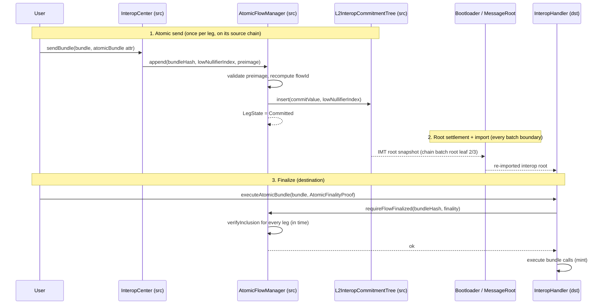

# The atomic flow: lifecycle and the flow manager

This page follows one atomic flow from send to finalize (or timeout), and documents the
`AtomicFlowManager` — the L2 built-in at `0x10014` that orchestrates every step and holds each leg's
state. The proof mechanics invoked in steps 3–4 live in {protocol-docs/atomicity/proofs.md}; the refund
in {protocol-docs/atomicity/recovery.md}; the interop-side send/execute wiring in
{protocol-docs/interop.md#atomic-bundles}.

## Data structures

All defined in `atomic-interop/IAtomicInterop.sol` unless noted.

| Type                  | Purpose                                                                                                                                                                                                                                                  |
| --------------------- | -------------------------------------------------------------------------------------------------------------------------------------------------------------------------------------------------------------------------------------------------------- |
| `AtomicFlowPreimage`  | The hashed field set that defines a flow: `deadline` (a settlement-layer timestamp), `settlementLayerChainId`, `legBundleHashes[]`, `legSourceChainIds[]`.                                                                                               |
| `AtomicFlow`          | `{ flowId, preimage }`. `flowId` is always recomputed from `preimage` and matched before use, so it is a convenience field, never a trust anchor.                                                                                                        |
| `ImtProof`            | One IMT proof against a source chain's commitment tree — used for both inclusion (finality) and non-inclusion (timeout). See below and proofs.md.                                                                                                        |
| `AtomicFinalityProof` | `{ flow, proofs[] }` — the flow definition plus one inclusion proof per leg, in `legBundleHashes` order. The whole thing a destination needs to execute.                                                                                                 |
| `LegState`            | Per-`(flowId, bundleHash)` source-leg lifecycle: `Unset -> Committed -> Revertable -> Reverted`.                                                                                                                                                         |
| `AtomicSend`          | Out-of-band send metadata (`common/Messaging.sol` / the interop layer): the `AtomicFlowPreimage` plus `lowNullifierIndex`, carried in the `atomicBundle` ERC-7786 attribute. Never enters the bundle, so `bundleHash` stays independent of the preimage. |

### `legBundleHashes` vs `legSourceChainIds`

`legBundleHashes` is **strictly ascending** — it is the canonical, deduplicated set of legs, and its
ordering is what makes `flowId` canonical (any permutation would hash differently). `legSourceChainIds`
is **positional**: entry `i` is the source chain of leg `i`, aligned 1:1 with `legBundleHashes`. It may
repeat and need not be sorted, so only its length is validated. It is deliberately _not_ a set: if it
were, a sibling chain present in the set could authorize a wrong-chain refund (see the source-chain
binding in {protocol-docs/atomicity/recovery.md} and proofs.md).

### `ImtProof`, briefly

`ImtProof` carries two nested authentications: `settlementProof` proves the claimed `chainImtRoot` is a
specific chain's batch begin/end IMT leaf inside an imported interop root, and `imtProof` proves the
leaf under `chainImtRoot`. The batch's `l1Timestamp` is **not** a struct field — it would be spoofable;
it is re-derived from `settlementProof` (it is folded into the chain batch leaf). `provesAgainstBeginRoot`
is a bool (not a raw leaf index) selecting the timeout branch, so authentication can never be aimed at
the logs/multichain leaves. Full mechanics in {protocol-docs/atomicity/proofs.md}.

## Lifecycle

### 1. Atomic send (append)

The source burn flows through the normal `initiateIndirectCall` / `L2AssetRouter` path; instead of
publishing the bundle to L1, `InteropCenter` calls `AtomicFlowManager.append(bundleHash,
lowNullifierIndex, preimage)`. `append`:

1. **Recomputes and validates `flowId`** from the preimage (`_validateAndComputeFlowId`): `legBundleHashes`
   strictly ascending, `legSourceChainIds` length matching.
2. **Requires L1 settlement** (`_checkSettlementLayerIsL1`) — this release anchors proofs only on the L1
   message root (see {protocol-docs/atomicity/security.md#trust-assumptions}).
3. **Requires the committing bundle to be one of the legs**, declared with **this** chain as its source
   (`legSourceChainIds[legIndex] == block.chainid`). A wrong or stale preimage — e.g. an off-chain
   bundle-hash prediction invalidated by an encoding change — reverts the whole send, burn included,
   rather than committing a leg under a `flowId` that could neither finalize nor be refunded.
4. **Requires every _other_ leg to declare a Bridgehub-registered source chain**
   (`L2_BRIDGEHUB.baseTokenAssetId(chainId) != 0`). Registration guarantees MessageRoot presence,
   without which the leg could never be proven committed _or_ absent and the flow would be stranded (see
   {protocol-docs/atomicity/security.md#timeout-protocol-preconditions}). This also rejects L1 as a
   declared leg source (L1 is never a registered interop chain).
5. **Marks the leg `Committed`** (effects before interaction) and **inserts** `commitValue(flowId,
bundleHash)` into this chain's `L2InteropCommitmentTree`, emitting `FlowCommitted`.

### 2. Root settlement + import

Covered by the interop-root channel — see {protocol-docs/atomicity/imt.md#the-root-is-read-from-storage-never-published}
and {protocol-docs/message-root.md#interop-root-import-and-the-batch-execution-double-check}. Nothing
atomic-specific happens here; the same channel carries all interop roots.

### 3. Finalize — `requireFlowFinalized`

`InteropHandler.executeAtomicBundle(bundle, finality)` calls `requireFlowFinalized(executingBundleHash,
finality)`, which:

- re-checks `flowId` and L1 settlement;
- requires exactly one proof per leg (`ManagerProofCountMismatch`);
- for **every** leg, checks the proof's `sourceChainId` equals the declared `legSourceChainIds[i]` and
  runs `AtomicInteropProof.verifyInclusion` against the leg's `commitValue`, the flow `deadline`, and the
  settlement layer;
- requires the executing bundle to be one of the legs (`ManagerExecutingBundleNotInFlow`).

If all legs are proven committed in time, the handler executes the bundle's calls (the destination
mint). The per-proof source-chain check is defense-in-depth here (inclusion self-binds via the
chain-specific `commitValue`) but load-bearing on the refund path. `verifyAtomicBundle` is a mint-free
variant that runs the same gate and only records verification; `receiveMessage` can route to either.

### 4. Timeout / refund

If a leg never commits in time, `authorizeRefund` takes one absence proof and flips this chain's
`Committed` legs to `Revertable`; `claimRefund` then reverses each burn. Detailed in
{protocol-docs/atomicity/recovery.md}; the absence-proof conditions in
{protocol-docs/atomicity/proofs.md#timeout}.

## The `AtomicFlowManager`

The manager is the only stateful atomic contract. Its state is a single mapping
`_state[flowId][bundleHash] => LegState`; it holds no funds and no configuration beyond the L1 chain id
recorded at `initL2`.

### Entry points

| Function                                          | Caller           | Effect                                                                                    |
| ------------------------------------------------- | ---------------- | ----------------------------------------------------------------------------------------- |
| `append(bundleHash, lowNullifierIndex, preimage)` | `InteropCenter`  | Validate + commit a leg (step 1). `Unset -> Committed`.                                   |
| `requireFlowFinalized(bundleHash, finality)`      | `InteropHandler` | `view`. Prove every leg committed in time (step 3). No state change.                      |
| `authorizeRefund(flow, missingLegIndex, absence)` | anyone           | Prove a leg absent past the deadline; flip this chain's `Committed` legs `-> Revertable`. |
| `claimRefund(flowId, bundle)`                     | anyone           | Reverse a `Revertable` leg's burn; `-> Reverted`. See recovery.md.                        |
| `legState(flowId, bundleHash)`                    | anyone           | `view` accessor.                                                                          |

`append` and `requireFlowFinalized` are gated to the canonical `InteropCenter` / `InteropHandler`
addresses (`onlyInteropCenter` / `onlyInteropHandler`). `authorizeRefund` and `claimRefund` are
permissionless — they are pure proof-and-effect functions; anyone may push a timed-out flow forward,
and neither can do anything a proof does not authorize.

### `LegState` machine

`Unset -> Committed` at send. On the happy path `Committed` is terminal in the manager — destination
execution is tracked by the `InteropHandler`'s own `bundleStatus`, exactly as for a normal interop
bundle, not here. On timeout, `Committed -> Revertable` (`authorizeRefund`) `-> Reverted` (`claimRefund`).
`claimRefund` requires `Revertable` and flips to `Reverted` **before** any external call (CEI), so a
reentrant claim hits the state check and cannot double-refund; the manager needs no reentrancy guard
because it never holds funds.

### `flowId` canonicalization is shared

`_validateAndComputeFlowId` is called by **both** `append` (send) and `_checkFlowId` (finalize/refund),
so the canonical shape (`flowId = keccak256(abi.encode(preimage))`, ascending leg hashes, aligned source
ids) cannot drift between the path that commits a leg and the path that later spends the proof. Any
mismatch reverts (`ManagerFlowIdMismatch`, `ManagerBundleHashesNotSorted`,
`ManagerLegSourceChainIdsLengthMismatch`).
