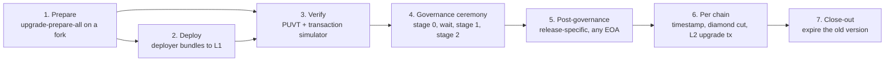

# Upgrading an ecosystem

This document describes the pipeline that takes an existing ecosystem from one protocol release to
the next: the artifacts a release consists of, the phases in which they are deployed, verified,
approved and applied, who signs each phase, and how a release's scripts are structured. The
on-chain upgrade mechanism itself (how the CTM publishes a version and how a chain applies it) is
specified in {protocol-docs/system/contracts/chain_management/upgrade_process.md}; the one-time
migrations of the current release are listed in
{protocol-docs/chain-lifecycle.md#upgrading-an-existing-ecosystem-onto-this-release}. Deploying an
ecosystem from scratch is covered by {protocol-docs/ecosystem-deployment.md}.

The pipeline is the same whichever organization runs the ecosystem, but today the tooling does not
yet cover a private ecosystem end to end:

- `ecosystem verify-upgrade --env` accepts only `stage`, `testnet` and `mainnet`, so the
  verification tool cannot run for a private environment;
- the `protocol_ops` commands that resolve the L1 network from its chain id (`ctm init`,
  `ecosystem init`, and `upgrade-prepare-all` without `--env`) refuse any L1 other than mainnet,
  Sepolia, Holesky or a local Anvil;
- the governance stages are executed differently by a legacy `Governance` and by a
  `ProtocolUpgradeHandler` (see "The governance ceremony").

## What a release changes

A protocol release is the combination of:

- **new L1 implementations** for the eight core proxies (Bridgehub, nullifier, asset router,
  native token vault, message root, CTM deployment tracker, chain asset handler, chain
  registration sender) and for the CTM-side proxies (`ChainTypeManager`, `ValidatorTimelock`,
  `BytecodesSupplier`, `PermissionlessValidator`), refreshed on every release;
- **a new chain version**: the diamond facets, the verifier, the per-chain upgrade contract, and
  the L2 upgrade transaction that force-deploys the new L2 built-ins and runs the L2 upgrade
  contract on every chain;
- **new chain creation parameters**, so that chains created after the upgrade come up directly on
  the new version with the same genesis as the upgraded ones;
- **release-specific one-time work**: new proxies, wiring calls, storage migrations, and
  post-governance steps that a from-scratch deployment gets for free.

The invariant behind all of it is that an upgraded ecosystem and a freshly deployed one end up in
the same state; the release-specific work is exactly the difference between the two. The
genesis-versus-upgrade consistency rules are spelled out in
`docs/ai-review/docs/genesis-and-upgrades.md`.

## Roles

| Role                 | Who                                                                                                                                           | Signs                                                                                      |
| -------------------- | --------------------------------------------------------------------------------------------------------------------------------------------- | ------------------------------------------------------------------------------------------ |
| Deployer             | any funded EOA                                                                                                                                | the CREATE2 deployments and bytecode publication                                           |
| Post-governance      | any funded EOA (not necessarily the deployer)                                                                                                 | release-specific post-governance steps such as `stage3`                                    |
| Ecosystem governance | the owner of the core proxies, the CTMs and the `ProxyAdmin` (`ProtocolUpgradeHandler` on the public ecosystems, `Governance` on a fresh one) | governance stages 0, 1 and 2                                                               |
| CTM admin            | the CTM's `ChainAdmin`                                                                                                                        | operational CTM-side calls emitted by the prepare (for example the `ServerNotifier` proxy) |
| Chain admin          | each chain's `ChainAdmin`                                                                                                                     | the chain's upgrade timestamp and diamond cut                                              |
| Chain operator       | the node                                                                                                                                      | nothing on L1; executes the L2 upgrade transaction in the next batch                       |

Deployments by the deployer are inert: a CREATE2-deployed implementation changes nothing until a
governance call points a proxy at it. Nothing the deployer does needs review beyond provenance
(which is what the verification phase checks); everything governance does is the reviewed
calldata.

## Artifacts and inputs

| Path                                                              | Role                                                                                                                                                                                           |
| ----------------------------------------------------------------- | ---------------------------------------------------------------------------------------------------------------------------------------------------------------------------------------------- |
| the release branch's build artifacts                              | built with the default Foundry profile (`yarn da build:foundry && yarn sc build:foundry && yarn l1 build:foundry`); the deployed bytecode                                                      |
| `AllContractsHashes.json`                                         | the registry of every contract's bytecode hashes; verification identifies deployments by it, so it must be regenerated with the release                                                        |
| `SystemConfig.json`                                               | the system and fee constants (batch overhead, pubdata and L1 transaction gas parameters) the scripts read                                                                                      |
| `configs/genesis/<vm>/latest.json`                                | the target protocol version and the chain creation parameters (genesis root, initial contracts) of the release                                                                                 |
| `l1-contracts/upgrade-envs/permanent-values/<env>.toml`           | the environment's fact sheet: L1 chain id, Bridgehub, CTMs (with VM type), governance kind, testnet-verifier flag, ZK token asset id, legacy gateway history; independent of the release       |
| `l1-contracts/upgrade-envs/<release>/<env>.toml`                  | the release × environment input: owner, Era chain id, governance timer delay, `[legacy_gateway] chain_id`, `pre_v32_introspection`, CREATE2 salts; `protocol_ops --env <env>` reads both files |
| `l1-contracts/upgrade-envs/<release>/output/<env>/ecosystem.toml` | **the artifact**: every new address plus the hex-encoded governance calls of stages 0, 1 and 2; what reviewers diff and what every downstream tool reads                                       |
| `…/output/<env>/transactions.txt`                                 | the L1 transaction hashes of the deployer's broadcast, appended on every run; verification reconstructs the deployment provenance from it                                                      |
| `…/output/<env>/extra-verification-logs.txt`                      | one `forge verify-contract` line per deployed contract, constructor arguments included                                                                                                         |
| `…/output/<env>/sim-inputs/`, `…/simulator/`                      | the transaction-simulator inputs and scenarios                                                                                                                                                 |
| `…/output/<env>/chain-upgrades/<chain-id>/`                       | the per-chain bundles                                                                                                                                                                          |
| `…/output/<env>/prepare/`                                         | git-ignored: the per-run Safe bundles and `manifest.json` the prepare emits                                                                                                                    |

Everything else (CTM addresses, bytecodes supplier, DA manager, chain admins, verifier, and the old
protocol version, which the CTM script reads from the CTM) is read from L1 at run time rather than
configured; `docs/ai-review/docs/protocol-ops.md` explains why the
tooling is built that way.

## The pipeline

| Phase              | `protocol_ops` command                                                                                  | Signer               | Touches the real L1 |
| ------------------ | ------------------------------------------------------------------------------------------------------- | -------------------- | ------------------- |
| 1. Prepare         | `ecosystem upgrade-prepare-all`                                                                         | none (fork)          | no                  |
| 2. Deploy          | `ecosystem upgrade-broadcast`                                                                           | deployer, CTM admin  | yes                 |
| 3. Verify          | `ecosystem verify-upgrade`, `ecosystem governance-toml-to-simulator`, `ecosystem manifest-to-simulator` | none                 | no                  |
| 4. Governance      | `ecosystem upgrade-governance` or the governance's own proposal flow                                    | ecosystem governance | yes                 |
| 5. Post-governance | release-specific, e.g. `ecosystem stage3` (emits a bundle)                                              | any EOA              | yes                 |
| 6. Per chain       | `chain set-upgrade-timestamp`, `chain upgrade` (emit bundles)                                           | each chain admin     | yes                 |
| 7. Close-out       | `ChainTypeManager.setProtocolVersionDeadline`                                                           | ecosystem governance | yes                 |

Only `upgrade-broadcast` sends transactions. The verify commands only read; every other
`protocol_ops` command in the table runs on an Anvil fork and writes Safe bundles, and a phase
touches L1 when its signer executes those bundles (with `upgrade-broadcast`, `dev execute-safe`,
or the signer's multisig).

The `generate-upgrade-calldata-*`, `execute-deployer-safe-bundles` and `generate-chain-*-calldata`
workflows under `.github/workflows/` still drive the previous `protocol_ops` CLI (`--ecosystem`,
`--chain <name>`, `--governance-toml-out`, `--new-protocol-version`, none of which exist any more)
and have to be updated before they can run these phases; until then the commands are run by hand.

`l1-contracts/test/anvil-interop/regen-upgrade-calldata.sh <env>` chains phases 1 and 3 (prepare,
rehearse the bundles on the fork, run the verifier) into one command; the
`regenerate-upgrade-calldata` skill under `.claude/skills/` is the step-by-step runbook, and
`l1-contracts/upgrade-envs/v0.33.0-atomic-interop/output/testnet/README.md` is a complete worked
example of one environment's rollout.

### 1. Prepare

`protocol_ops ecosystem upgrade-prepare-all --env <env> --l1-rpc-url <l1> --deployer-address <EOA>`
forks `<l1>` (without `--l1-rpc-url` it forks `http://localhost:8545`; `--env` does not fill it)
and runs, on that fork, the release's core script once (`CoreUpgrade_v<N>.noGovernancePrepare`)
and its CTM script once per ZKsync OS CTM (`CTMUpgrade_v<N>.noGovernancePrepare`; v33 skips EraVM
CTMs). The bundles and `manifest.json` go to `output/<env>/prepare/` (override with `--out`, which
names the bundle directory itself; `ecosystem.toml` is written to its parent). Together they:

1. deploy every new implementation through CREATE2, using the salts of the release input;
2. publish the new L2 bytecodes to the `BytecodesSupplier`, and build the L2 upgrade transaction
   (force deployments of the L2 built-ins plus the delegate call to the L2 upgrade contract) and
   the diamond cut that carries it;
3. compute the new chain creation parameters from the genesis config;
4. serialize the governance calls of the three stages, per script, and merge them into
   `ecosystem.toml`;
5. record every broadcast into Safe bundles, one per consecutive run of transactions by the same
   signer, with `manifest.json` listing them in execution order.

Two properties of the prepare decide whether the rest of the pipeline can work:

- **The build must be the default Foundry profile.** Verification identifies each deployment by
  hashing its init code against `AllContractsHashes.json`, which is generated under that profile;
  a metadata-stripped build never matches and verifies nothing. The price is that the CREATE2
  addresses embed path-dependent metadata, so a prepare re-run from another checkout yields
  different but equally valid addresses. The artifact is verified by its contents and by the
  transactions in `transactions.txt`, never by diffing addresses against one's own run.
- **Salts and the deployer are part of the result.** CREATE2 returns the previously deployed
  contract for a repeated `(salt, init code)` pair, so the salts in the release input are rotated
  before every regeneration. The deployer address is the `from` of the bundles it signs (and part
  of their file names), so the prepare is run with the EOA that will broadcast; it does not appear
  in any deployed contract's init code.

An ecosystem whose upgrade already executed cannot be re-prepared at the chain tip: the CTM script
refuses a CTM that is already on the new protocol version, the governance timer is already armed,
and the CREATE2 targets are occupied. Pin the fork to a block before the ceremony instead.
`upgrade-prepare-all` has no fork-block flag: pin it with `FORK_BLOCK` in
`regen-upgrade-calldata.sh`, or pass an Anvil fork already pinned to that block as `--l1-rpc-url`.

### 2. Deploy

`protocol_ops ecosystem upgrade-broadcast --manifest <out>/prepare/manifest-deployer-only.json
--key <deployer>=<key> --l1-rpc-url <l1> --out <out>/sepolia-deploy-executed.json`, with `<out>`
the release's `output/<env>/` directory, sends the deployer's bundles to the real L1, one transaction at a time, confirming each, and appends every
mined hash to `<out>/transactions.txt` (only when `--out` is given; without it `verify-upgrade`
finds no deployments). It needs a `--key` for every signer in the manifest and refuses to send
anything otherwise, so the manifest is first filtered down to the deployer's bundles; the CTM
admin's bundle is handed to its signer, and the governance stages are calldata in
`ecosystem.toml`, not bundles. The testnet README shows the filtering step.

A re-run is not fully idempotent: it skips CREATE2 deployments whose target already has code and
transactions that revert with one of a few known "already done" selectors, and the hashes are
written per bundle, so a bundle interrupted half-way loses the hashes of the transactions it had
already mined. Recover those from the explorer before re-running.

Then the deployed contracts are source-verified on the explorer with the `forge verify-contract`
lines of `extra-verification-logs.txt`, adding the `--chain` and explorer API key they leave out.

### 3. Verify

Three independent checks, all read-only:

- **The Protocol Upgrade Verification Tool** (`protocol_ops ecosystem verify-upgrade --env <env>
--ecosystem-toml … --l1-rpc-url … --zk-governance-commit <hash>`) fetches every transaction in
  `transactions.txt`, identifies each CREATE2 deployment through `AllContractsHashes.json`,
  checks constructor arguments, and compares the calls of each governance stage against the
  sequence the release's scripts are expected to assemble, including the `setNewVersionUpgrade`
  arguments, the verifier, and that the CTM's stored default upgrade is the generic one. The
  expectations live in `protocol-ops/src/upgrade_verification/versions/v<N>/` and are part of the
  release.
- **The transaction simulator** (`matter-labs/transaction-simulator`) replays the governance
  ceremony and the per-chain bundles against a fork of the L1 tip, with the wall-clock advance the
  governance timer needs. `ecosystem governance-toml-to-simulator` and `ecosystem
manifest-to-simulator` emit its scenarios. Because the fork starts from the tip, everything the
  deployer signs must already be on L1 (phase 2) and must not be in the scenario; the scenario
  carries only what the ecosystem's other signers will execute.
- **Review of `ecosystem.toml`** against the previous artifact and the release notes: the new
  addresses, the decoded stage calls, and the version numbers.

### 4. The governance ceremony

The calls the scripts assemble, with the release-specific hooks marked:

- **Stage 0.** `L1ChainAssetHandler.pauseMigration()`; per CTM, `GovernanceUpgradeTimer.startTimer()`;
  then the release's stage-0 additions.
- **Stage 1.** `pauseMigration()` again (re-asserted because the emergency execution path clears
  it); `ProxyAdmin.upgrade` for each of the eight core proxies; the release's core-side wiring
  (for example `setL1InteropHandler` on the nullifier and asset router in v33); then per CTM:
  `GovernanceUpgradeTimer.checkDeadline()`, `UpgradeStageValidator.checkMigrationsPaused()`, the
  four CTM-side proxy upgrades, `ChainTypeManager.setDefaultUpgrade`, `setChainCreationParams`,
  `setNewVersionUpgrade(cut, oldVersion, oldVersionDeadline, newVersion, verifier)` and the
  release's CTM-side additions (the DA-validator whitelisting hook, `prepareDAValidatorCall`, is
  currently empty).
- **Stage 2.** The release's stage-2 additions; `unpauseMigration()`; per CTM,
  `UpgradeStageValidator.checkProtocolUpgradePresence()` and `checkMigrationsUnpaused()`.

Migrations are paused for the whole window so that no chain changes settlement layer while the
two halves of the protocol disagree. The timer, armed in stage 0 and checked in stage 1, enforces
a minimum delay (`governance_upgrade_timer_initial_delay` in the release input) between the two
stages; stage 1 reverts until it has elapsed. Stages 0 and 1 are therefore two separate
ceremonies, and `ecosystem upgrade-governance`, which replays all three stages on one fork and
emits them as one bundle, only works where that delay is zero. Where it is not, the simulator
scenario is the rehearsal and the governance executes the stages from `ecosystem.toml` directly.

How the calls are executed depends on the governance:

- a fresh ecosystem's `Governance` schedules and executes them as one operation
  (`AdminFunctions.governanceExecuteCalls`);
- the public ecosystems' `ProtocolUpgradeHandler` executes them as a proposal approved by the
  Security Council and Guardians, or through the emergency upgrade board;
  `l1-contracts/deploy-scripts/upgrade/EmergencyStageUpgradeCalldata.s.sol` emits the per-stage
  emergency calldata for the stage environment.

`setNewVersionUpgrade` is the call that changes the protocol: from then on every chain of the CTM
that is on exactly the old version may take the cut (a chain on any other version cannot), and
every chain created afterwards starts on the new version.

### 5. Release-specific post-governance steps

Some releases need work after governance and before the chains move, signed by any EOA because it
carries no privilege. In v33 that is `protocol_ops ecosystem stage3 --env <env> --l1-rpc-url <l1> --sender <EOA>`,
whose bundle, once that EOA executes it, populates `L1NativeTokenVault.bridgedOut` for every
L1-native asset in the vault's `bridgedTokens` list. Legacy tokens missing from that list must be
backfilled into it first with the vault's permissionless `addLegacyTokenToBridgedTokensList(token)`,
otherwise their pre-upgrade escrow stays unwithdrawable (see
{protocol-docs/bridging.md#populating-bridgedout-during-an-in-place-upgrade}). Such steps are
described in the release's output README and, being broadcasts rather than calldata, are not
covered by the verifier.

### 6. Per chain

Each chain takes the cut through its own `ChainAdmin`. The order below is the ZKsync OS one (v33
upgrades ZKsync OS chains only), and it matters because scheduling the upgrade is the point of no
return for the node. Both `chain` commands below only write a bundle
(`ChainAdmin.multicall`, signed by the `ChainAdmin` owner); each step happens when that bundle is
executed on L1, and the timestamp bundle must be executed before the cut bundle. With `--env`,
`chain upgrade` writes its bundle to `output/<env>/chain-upgrades/<id>/` by default; `chain
set-upgrade-timestamp` and `chain record-priority-op-lower-bound` write one only when `--out` is
given, and produce no bundle otherwise.

1. **Check the cut's preconditions first.** The cut reverts unless they hold on the chain: the
   chain is on exactly the old version, every committed batch has been executed (the release
   installs a new verifier, and batches awaiting proof under the old one would stop being
   provable; this is the one step 3 waits for), the previous upgrade transaction has been
   consumed, and whatever the release adds. For v33, `V32UpgradeZKsyncOS` checks three things: the
   base-token total supply backfill of v31 has happened (`baseTokenHasTotalSupply`), a priority-op
   lower bound has been recorded
   (`protocol_ops chain record-priority-op-lower-bound`, in its own earlier transaction), and the
   priority queue has been drained past that bound.
2. `protocol_ops chain set-upgrade-timestamp --env <env> --chain-id <id> --upgrade-timestamp <ts>
--l1-rpc-url <l1> --out <dir>` prepares the call to `ServerNotifier.setUpgradeTimestamp`, keyed on the chain's current version; `1` means
   "immediately" (0 is rejected). On this event the node injects the L2 upgrade transaction into
   its next block (block N) and holds every later batch until the chain's L1 version moves, so the
   cut's preconditions must already hold: if the cut then reverts, the chain is stuck. Run after
   the cut, the call reverts (`CutDataForProtocolVersionNotAvailable`), since no cut is published
   from the new version.
3. `tools/upgrade-readiness-checker` waits until the node has the upgrade transaction in block N
   and block N-1 is finalized, that is, every batch before the upgrade has been executed on L1. This
   is the signal that the L1 cut can be sent now, not that the upgrade is done.
4. `protocol_ops chain upgrade --env <env> --chain-id <id> --l1-rpc-url <l1>` emits a single `ChainAdmin.multicall`
   with `upgradeChainFromVersion(chainAddress, oldVersion, cut)` and, when `--da-mode` is given,
   the DA validator pair and pubdata content the chain runs after the upgrade, in the same
   transaction so that the chain never commits a batch under a DA setup its new version does not
   settle.
5. The batch carrying the upgrade transaction is committed and executed under the new version: the
   built-ins are force-deployed and the L2 upgrade contract initializes them. The chain is on the
   new version for good once that batch has been executed on L1.

`protocol_ops` checks only two of the preconditions explicitly: `chain set-upgrade-timestamp`
refuses a v31 chain whose priority-op lower bound has not been recorded and drained, and `chain
upgrade` refuses to leave a validium-priced chain in an unrecommended DA state. Everything else is
covered only by the fork replay when the bundle is prepared, which reflects the chain's state at
that moment. The per-chain preconditions and the DA choices are worked through in
`l1-contracts/upgrade-envs/v0.33.0-atomic-interop/output/testnet/chain-upgrades/README.md`.

### 7. Close-out

The cut is published with no deadline on the old version. Once every chain has upgraded,
governance can expire the old version with `ChainTypeManager.setProtocolVersionDeadline(oldVersion,
timestamp)` (calling `setNewVersionUpgrade` again reverts with `OutdatedProtocolVersion`, since the
CTM is no longer on the old version), after which a chain still on it cannot commit batches until
it upgrades. The committed artifacts (`ecosystem.toml`, `transactions.txt`, the scenarios, the
per-chain bundles) stay in the release's `output/<env>/` directory as the record of the rollout, and `permanent-values/<env>.toml` is
updated with any address the release moved.

## Authoring a release

The scripts under `l1-contracts/deploy-scripts/upgrade/` are split into what every release does
and what one release adds:

- `default-upgrade/DefaultCoreUpgrade.s.sol` refreshes all core implementations and assembles the
  three stages of core calls. A release overrides `deployVersionSpecificEcosystemContractsL1` for
  a proxy that did not exist before it and `prepareVersionSpecificStage{0,1,2}GovernanceCallsL1`
  for its wiring.
- `default-upgrade/DefaultCTMUpgrade.s.sol` (with `CTMUpgradeBase` and `DefaultL2UpgradeStrategy`)
  refreshes the CTM-side implementations, deploys the stage validator and the governance timer,
  builds the force deployments, the L2 upgrade transaction and the diamond cut, and assembles the
  CTM stages. A release overrides `deployUsedUpgradeContract` (its per-chain upgrade contract),
  `getAdditionalUniversalForceDeployments` and `getAdditionalFactoryDependencyContracts` (its new
  L2 built-ins), `getZKsyncOSL2UpgradeTargetAndData` (its L2 upgrade contract and calldata), and,
  where it needs them, `encodePostUpgradeCalldata` and the CTM stage hooks (`CTMUpgrade_v33`
  overrides neither).
- `AdminFunctions.s.sol` drives the per-chain cut in `protocol_ops`;
  `default-upgrade/DefaultChainUpgrade.s.sol` is only used by tests.
- `v<N>/CoreUpgrade_v<N>.s.sol` and `v<N>/CTMUpgrade_v<N>.s.sol` are the release's overrides, plus
  any one-off script the release needs (`v33/RecordPriorityOpLowerBound.s.sol`).
- `SystemContractsProcessing.s.sol` is the list of L2 built-ins a release force-deploys or
  neutralizes.

The on-chain side of a release lives in `l1-contracts/contracts/upgrades/` (the per-chain upgrade
contracts: `DefaultUpgrade` and `DefaultUpgradeZKsyncOS` for releases without one-time work, a
one-shot contract otherwise, all on `BaseZkSyncUpgrade`) and `l1-contracts/contracts/l2-upgrades/`
(`L2ComplexUpgrader`, which executes the L2 upgrade transaction, and the release's L2 upgrade
contract). The one-shot contracts are named after the version they were introduced for, not the
release number: v33 uses `V32UpgradeZKsyncOS` and `L2V32Upgrade`.

The CTM should keep the generic contract as its `defaultUpgrade` even when the release ships a
one-shot one, because verifier-only upgrades reuse it later and a one-shot contract's
preconditions only hold while a chain crosses that one release. This is not automatic: by default
the CTM stores whatever `deployUsedUpgradeContract` returns, so a release with a one-shot contract
must also deploy a generic one and assign it to `ctmStoredDefaultUpgrade`, as `CTMUpgrade_v33`
does.

A release also adds: its `upgrade-envs/<release>/` directory (inputs per environment; the
`UPGRADE_ENV_DIR` constant in `protocol-ops/src/common/env_config.rs` and the release's script
paths and env directory in `protocol-ops/src/common/forge/scripts/mod.rs` move to it), the
verifier expectations under `protocol-ops/src/upgrade_verification/versions/v<N>/`, a regenerated
genesis config and `AllContractsHashes.json`, and its entry in the anvil-interop upgrade test
(`l1-contracts/test/anvil-interop/docs/upgrade-test-runner.md`), which runs the release's scripts
(through `*ForTests` subclasses) end to end against the previous release's chain-state snapshots
on pull requests that touch the relevant paths.

## Emergency and verifier-only upgrades

- **Verifier-only.** `ChainTypeManager.createNewVerifierOnlyUpgrade` publishes a version that
  changes no facets: the cut runs the stored `defaultUpgrade`, which picks the new verifier up
  from the CTM. Beyond deploying the verifier, the governance call must run with migrations paused
  (`pauseMigration` before, `unpauseMigration` after) and from the CTM's current version (same
  major version, minor delta within the allowed limit, non-zero `defaultUpgrade`); chains still
  apply it through their `ChainAdmin`, but not with the per-chain steps above: the cut carries no L2
  upgrade transaction (it runs `upgradeVerifierOnly`), so there is no upgrade batch to wait for and
  `upgrade-readiness-checker`, which decodes a full `ProposedUpgrade`, cannot be used. On ZKsync OS the
  cut reverts (`NotAllBatchesExecuted`) unless every committed batch has been executed on L1.
- **Emergency.** Governance can freeze a chain (`freezeChain`, `unfreezeChain`) and execute a cut
  for it outside the normal proposal path (`ChainTypeManager.executeUpgrade(chainId, cut)`). The
  one-off scripts in `l1-contracts/deploy-scripts/upgrade/` (`EmergencyValidatorTimelockRestore.s.sol`,
  `VerifyStage1Pause.s.sol`, `VerifyEmergencyApproveHash.s.sol`) are examples of a different kind:
  emergency-upgrade-board proposals for the stage `ProtocolUpgradeHandler` and their fork checks.
