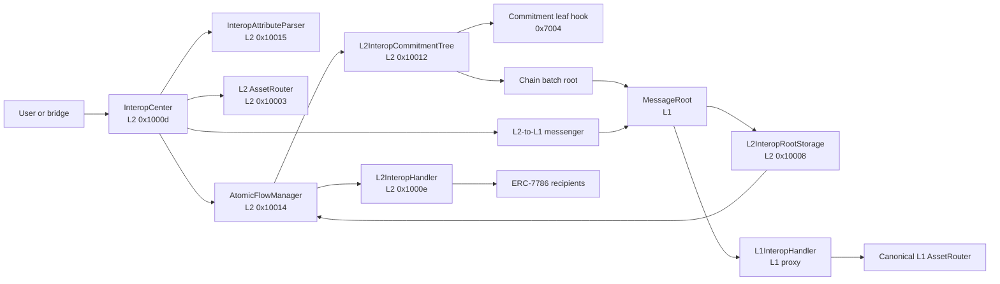

# Interop architecture

This page is the architecture-level replacement for the ported `zksync-era` interop pages. It keeps
their complete subject area—messages, calls, bundles, execution, fees, proof transport, bridging,
retries, cancellation, and atomicity—while describing the contracts that exist in this release. The
normative field-by-field behavior remains in {protocol-docs/interop.md}; the atomic proof and recovery
arguments remain in {protocol-docs/atomicity/README.md}.

## System map

The arrows show protocol dependencies, not synchronous calls. Settlement and dependency-root import
separate source-chain commitment from destination execution.

| Component                 | Layer | Responsibility                                                                 |
| ------------------------- | ----- | ------------------------------------------------------------------------------ |
| `InteropCenter`           | L2    | Parses sends, builds/funds bundles, emits events, and dispatches each route.   |
| `InteropAttributeParser`  | L2    | Decodes the seven supported ERC-7786 attributes outside the center's bytecode. |
| `L2AssetRouter`           | L2    | Produces indirect asset-transfer calls and implements timeout recovery.        |
| `AtomicFlowManager`       | L2    | Commits, finalizes, and authorizes recovery for atomic L2 -> L2 legs.          |
| `L2InteropCommitmentTree` | L2    | Stores the append-only indexed tree of flow-bound commit values.               |
| `L2InteropRootStorage`    | L2    | Stores bootloader-imported settlement roots and timestamps.                    |
| `L2InteropHandler`        | L2    | Verifies atomic finality and executes or unbundles L2 -> L2 bundles.           |
| `L1InteropHandler`        | L1    | Proves and finalizes restricted L2 -> L1 withdrawal bundles.                   |
| `MessageRoot`             | L1    | Aggregates per-chain batch roots and authenticates imported dependencies.      |
| `BaseTokenHolder` / NTV   | L2    | Account for destination call value and cross-base-token movement.              |

## Protocol layers

The old documentation described four levels: message, call, bundle, and trigger-driven interop
transaction. Three concepts remain, with different wire and execution rules:

1. **Transport commitment.** For L2 -> L2 this is a flow-bound value in the source IMT. For L2 -> L1
   it is `BUNDLE_IDENTIFIER || abi.encode(bundle)` in the L2-to-L1 message tree. There is no standalone
   public `InteropMessage` object in the application API.
2. **Call.** `InteropCall` identifies the source sender, destination recipient, value, calldata, and
   version. The destination handler always invokes the recipient's ERC-7786 `receiveMessage`; it does
   not deploy an aliased or shadow account.
3. **Bundle.** `InteropBundle` groups calls for one destination and commits to source/destination chain
   IDs, destination base-token asset ID, sender-scoped salt, and permissions. Full execution is
   transaction-atomic. Verification followed by unbundling permits per-call execution/cancellation.

The fourth historical level—`InteropTrigger` plus a special account transaction—was removed. Relayers
submit proofs directly to the appropriate handler. The reserved `InteropCall.shadowAccount` field is
always `false` and exists only to preserve the established bundle encoding.

## Source architecture

### Entry points and address encoding

`sendMessage` is the ERC-7786 single-call interface and supports L2 -> L2 only. `sendBundle` accepts
multiple call starters and is also the only entry point for the restricted L2 -> L1 withdrawal route.
Destinations and permissions use ERC-7930 EVM addresses:

- the bundle destination encodes a chain with an empty address field;
- each call starter encodes an address with an empty chain-reference field;
- permission attributes encode both chain and address, with chain ID zero as a wildcard.

This separates the one destination shared by a bundle from its individual recipients. A parsed zero
recipient is rejected before funds can be collected for an unexecutable call.

### Direct and indirect calls

A direct call preserves the supplied recipient and payload and records the original sender as
`InteropCall.from`. It may carry destination base-token value.

An indirect call first invokes the call starter on the source chain. Only the canonical L2 asset router
is currently allowed. The router burns or locks the asset and returns the actual destination call;
therefore the final call's `from` is the router. Indirect calls cannot carry `interopCallValue`, because
timeout recovery could return that native value only to the router rather than to the payer. Token
amount and beneficiary data instead travel in the router-produced `finalizeDeposit` payload.

### Funding and base tokens

Bundle construction distinguishes destination call value from source-side value passed to an indirect
starter. `msg.value` must equal the exact source requirement:

- same base-token asset: destination call value is burned through `BaseTokenHolder`, alongside indirect
  starter value and any dynamic fee;
- different base-token assets: destination call value is deposited through the asset router, while
  `msg.value` contains only indirect starter value and any dynamic fee;
- L2 -> L1 withdrawal: the withdrawn amount is represented by router calldata, not call value.

The destination base-token asset ID is committed in the bundle and rechecked by the destination
handler. This prevents a bundle assembled for one base-token context from executing in another.

### Hash preview and dispatch

Atomic metadata contains the bundle hashes it governs, so L2 -> L2 senders first call
`previewMessageHash` or `previewBundleHash` through `eth_call`. The quoter runs real bundle assembly,
including indirect burns, and deliberately reverts with the hash so every state change rolls back.
The real send repeats the bundle-affecting inputs and adds the flow preimage plus IMT insertion hint.

The final dispatch is a strict route split:

- atomic L2 -> L2: append the commit value through `AtomicFlowManager`; do not publish the bundle as an
  L2-to-L1 message;
- non-atomic L2 -> L1: publish the prefixed bundle through the messenger; do not append to the atomic
  tree.

No L1 -> L2 or L1-initiated interop send exists. Bridgehub priority transactions remain the separate
L1 -> L2 deposit/deployment mechanism documented in {protocol-docs/bridging.md} and
{protocol-docs/chain-lifecycle.md}.

## Settlement and proof transport

Every chain has a chain-batch-root tree inside the settlement-layer `MessageRoot`. A ZKsync OS batch
root commits to its L2-to-L1 logs and its atomic IMT begin/end roots. Updating a chain tree updates the
shared aggregate root and records a timestamped `historicalRoot`.

The destination server obtains the necessary Merkle paths and supplies dependency roots to its
bootloader. The bootloader is the only writer to `L2InteropRootStorage`. Imported roots do not become
trusted merely because the destination operator supplied them: when that destination batch executes,
`ExecutorFacet` compares every imported root and timestamp against settlement-layer history and checks
the committed rolling hash.

Proof service availability is a liveness concern, not a safety exception. Any party with the settled
data may reconstruct proofs. Atomic IMT leaves are additionally recorded as mandatory L2-to-L1 logs so
the commitment tree remains reconstructible from L1 even if a source operator withholds its state.

The current route-specific proofs are detailed in [forms of finality](./forms_of_finality.md). Public
pre-commit/parallel-building finality and dependency sets between mutually building batches are not
implemented.

### Timing, privacy, and liveness

There is no protocol promise of instant delivery. L2 -> L2 execution waits for each source leg's batch
root to settle, for an aggregate root to be imported on the destination, and for someone to submit the
finality proof. L2 -> L1 execution waits for the withdrawal message to become provable on L1. Root
updates are snapshots rather than mutable proof targets: a proof names the block or batch whose root it
uses, so later roots do not invalidate it.

Atomic `deadline` is a settlement-layer timestamp that separates finality from timeout; it is not a
general message expiration field. A finalized bundle remains executable subject to its destination
status and permissions. An L2 -> L1 withdrawal likewise has no trigger-style expiration.

Interop provides no confidentiality. Send calldata, `InteropBundleSent`, and the data needed to
reconstruct commitment/proof paths expose the bundle contents. The sender-scoped salt provides
uniqueness, not secrecy. Applications needing private intent or execution must layer it above this
protocol.

## Destination architecture

### Sender identity

Recipients do not infer origin from EVM `msg.sender`, which is the local handler. The handler calls
`IERC7786Recipient.receiveMessage(receiveId, sender, payload)`, where `sender` is the ERC-7930 encoding
of the call's source chain and `InteropCall.from`. Applications authenticate that value.

This replaces account aliasing. No `CREATE2` shadow account is deployed and the destination contract
does not grant authority to a derived EVM address.

### Execution and gas

The transaction submitter pays destination execution gas. The protocol does not create a second
paymaster bundle or trigger transaction. A permissionless bundle can be submitted by any relayer;
`executionAddress` can restrict that role to a specific address/chain. Incentives or destination
paymaster arrangements are application-level concerns outside the bundle protocol.

The handler validates permission and status, marks the bundle/calls before external interaction, and
then invokes recipients. Full-bundle execution is atomic at the destination transaction level: an
out-of-gas condition or recipient revert rolls the transaction, including the status changes, back.
Another submitter may retry with sufficient gas while the bundle remains executable.

### Verification, unbundling, and cancellation

Verification proves the route-specific commitment and records `Verified` without moving funds. An
authorized unbundler may then provide one desired status per call:

- `Executed` runs an unprocessed call;
- `Cancelled` permanently skips a call that has not executed;
- `Unprocessed` leaves it for a later unbundle operation.

`Unbundled` is not terminal for the whole bundle; subsequent unbundle calls may process remaining
calls. Per-call state prevents execution replay. Cancellation is a destination processing decision and
does not by itself reverse source-chain burns. Atomic timeout recovery is a separate source-side path
and becomes available only when a flow fails finality.

### Cross-chain executor/unbundler rescue

The default unbundler is the source-chain sender. For L2 -> L2, a contract that cannot call the
destination handler directly can send another atomic bundle targeting the handler's own
`receiveMessage` with an encoded execute/verify/unbundle request. The handler authenticates the
wrapped cross-chain sender before self-dispatch.

The current restricted L2 -> L1 route cannot carry an arbitrary rescue call. A withdrawal sender that
needs L1 unbundling must set an explicit L1 or wildcard `unbundlerAddress` when sending.

## Fees

Interop charges per call, not per bundle byte or destination gas unit:

- dynamic mode collects the operator-set `interopProtocolFee` in the source base token;
- fixed mode pulls the protocol-defined `ZK_INTEROP_FEE` in bridged ZK ERC-20;
- L2 -> L1 withdrawals pay neither interop fee.

Fees accrue to `block.coinbase` in pull balances. The coinbase later claims to a chosen receiver. This
keeps an untrusted or non-payable coinbase from blocking a send. Destination transaction gas remains
the submitter's responsibility and is not prepaid by these protocol fees.

## Asset bridging and third-party assets

The interop protocol is asset-agnostic after the indirect starter produces a call. The L2 asset router
selects a registered handler by asset ID; the handler owns burn/mint or lock/unlock semantics. The NTV
provides the native standardized path, while custom handlers can represent third-party assets without
changing bundle encoding.

Native integration matters for timeout: the canonical router implements `recoverAtomicCall`, recognizes
the historical `finalizeDeposit` payload, and asks the relevant handler to restore the original caller.
Rotating handlers or changing historical calldata recognition can strand in-flight recovery, so the
constraints in {protocol-docs/atomicity/security.md} and {protocol-docs/bridging.md} are part of the
architecture, not optional bridge behavior.

## Atomicity and failure paths

Every L2 -> L2 bundle belongs to an atomic flow of at most eight legs. A flow binds the ordered bundle
hashes, their source chains, a deadline, the L1 settlement layer, and a version. Every destination
proves all legs committed before the deadline. If one leg is absent after the deadline, committed
source legs become recoverable.

This replaces both ported atomicity proposals:

- there is no L1 atomic coordinator, escrow, or freeze contract;
- there is no Gateway-DA simulation protocol or locked-state execution mode;
- contracts do not execute tentatively and later commit/abort destination state;
- atomicity gates whether destination execution or source recovery is permitted; it does not force
  every destination transaction to be submitted.

Recovery reverses recognized source-side burns best-effort. It is not compensation for a destination
call that was permitted and then failed, and it is not available after the flow finalized. Full proof,
soundness, liveness, and recovery limitations are documented in {protocol-docs/atomicity/README.md}.

## Deployment and platform scope

Interop built-ins are force-deployed and initialized through the ZKsync OS genesis/upgrade process.
They use fixed L2 addresses and do not use constructors or immutables. `L1InteropHandler` is the
exception: it is an L1 proxy whose implementation has immutable references to `MessageRoot` and the
canonical L1 asset router.

The protocol requires ZKsync OS bootloader support for timestamped dependency-root import and batch
commitments to atomic IMT roots. EraVM chains do not support this release's interop path. Atomic flows
are L1-settlement-only, and every participating chain must support protocol version v33 or newer.
