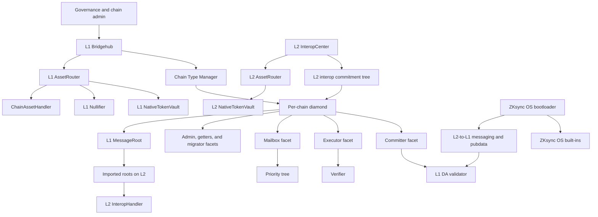

# ZKsync contracts system architecture

This is the entry point for the complete architecture implemented by `era-contracts`. It covers the
L1 coordination contracts, chain diamonds, asset bridges, settlement and data availability,
cross-chain messaging, consensus registry, and the ZKsync OS
execution environment. The focused documents linked below remain the source of truth for their
individual flows.

The first commit that introduced this directory is an unedited port of the architecture sources from
`zksync-era`'s `kl/interop-docs` branch. Later commits update and consolidate that material against the
contracts in this release. [The porting map](./porting-map.md) accounts for the original sections,
including documents that described designs which were never deployed or have since been replaced.

## System map

Arrows represent control, verification, or committed-data dependencies; they are not all synchronous
calls. A chain's diamond is the L1 settlement contract for that chain. Its facets share diamond
storage and jointly accept priority operations, commit/prove/execute batches, expose state, and apply
administrative changes.

## Architecture by domain

| Domain                  | Current architecture                                                                                                                                                                                                       | Detailed documentation                                                                                                                                       |
| ----------------------- | -------------------------------------------------------------------------------------------------------------------------------------------------------------------------------------------------------------------------- | ------------------------------------------------------------------------------------------------------------------------------------------------------------ |
| Ecosystem coordination  | `L1Bridgehub` is the registry and entry point for chains, chain types, settlement-layer routing, and L1 -> L2 requests. A `ChainTypeManager` creates and upgrades chain diamonds that share a verifier and protocol rules. | [Chain management](./contracts/chain_management/overview.md), [chain lifecycle](../chain-lifecycle.md)                                                       |
| Chain settlement        | The committer validates batch data and DA; the executor verifies proofs, executes batches, and consumes priority-tree entries. Mailbox, admin, getters, and migrator facets provide the remaining chain operations.        | [Settlement contracts](./contracts/settlement_contracts/zkchain_basics.md), [priority operations](./contracts/settlement_contracts/priority_queue/README.md) |
| Data availability       | For ZKsync OS, the committed batch carries a DA commitment that the configured L1 validator checks against operator-supplied calldata or blob-versioned hashes.                                                            | [Data availability](./contracts/settlement_contracts/data_availability/README.md)                                                                            |
| Asset movement          | Asset routers select an asset handler by asset ID. Native token vaults implement the standard token path; custom handlers may implement other assets. The L1 nullifier records deposits and prevents withdrawal replay.    | [Bridging](../bridging.md), [ported bridge diagrams and background](./contracts/bridging/overview.md)                                                        |
| Cross-chain messaging   | L2 -> L2 bundles use the atomic interop commitment tree, settlement roots, and destination handlers. The restricted L2 -> L1 route uses the L2-to-L1 message tree and `L1InteropHandler`.                                  | [Interop](../interop.md), [interop architecture](../interop/architecture.md), [atomicity](../atomicity/README.md), [message root](../message-root.md)        |
| Consensus               | `ConsensusRegistry` maintains validator and attester membership and committee snapshots for off-chain consensus consumers. It does not replace L1 proof verification.                                                      | [Consensus registry](./contracts/consensus/README.md)                                                                                                        |
| Execution environment   | ZKsync OS initializes its protocol contracts at fixed L2 addresses and exposes the batch, priority-transaction, message-root, and interop outputs consumed by the shared L1 contracts.                                     | [ZKsync OS genesis](../chain-lifecycle.md#zksync-os-genesis-force-deployments-atomic-interop-built-ins)                                                      |
| Governance and upgrades | Governance registers implementations and protocol versions through the CTM; each chain applies the version through its admin facet. Permanent restrictions and upgrade tooling constrain privileged operations.            | [Upgrade process](./contracts/chain_management/upgrade_process.md), [creating upgrades](./contracts/chain_management/creating_upgrades.md)                   |

## Principal trust boundaries

- **Ethereum / L1** anchors chain registration, proofs, batch state, canonical asset custody, and
  message-root history. A valid proof cannot compensate for unavailable data; the configured DA mode
  determines the additional availability assumption.
- **Chain type managers and governance** select verifier, facet, bootloader, system-contract, and upgrade
  implementations. Chains sharing a CTM intentionally share these protocol rules.
- **Chain operators** order transactions and can affect liveness, but cannot finalize an invalid state
  transition without satisfying the verifier and DA checks.
- **Asset handlers** define asset-specific burn/mint or lock/unlock behavior. The router authenticates the
  handler and cross-chain sender; applications still inherit the handler's asset model.
- **Interop relayers and proof services** are untrusted for safety. They can delay delivery, but handlers
  verify settled commitments and enforce replay protection before executing a bundle.

## End-to-end flows

### Create and initialize a chain

1. The L1 Bridgehub records the chain, its CTM, base-token asset ID, and L1 settlement layer.
2. The CTM deploys and initializes the chain diamond with its facets, verifier, fee parameters, and
   genesis state.
3. The Bridgehub registers the chain with the message root and the asset-routing system.
4. ZKsync OS chains seed the batch-0 chain root and initialize their fixed-address L2 contracts.

See [chain lifecycle](../chain-lifecycle.md) for the exact guards and genesis behavior.

### Submit and settle a batch

1. Users submit L2 transactions; L1 -> L2 priority operations enter through Bridgehub/Mailbox and are
   committed to the chain's priority tree.
2. The execution environment produces the batch outputs and canonical pubdata consumed by the DA
   validators and L1 settlement contracts.
3. The operator commits the batch on the committer facet. The configured L1 DA validator checks the DA
   output and the commitment binds all protocol-visible batch data.
4. A proof is verified against the CTM's verifier, then the batch is executed on L1. Its chain batch root
   is added to the message-root hierarchy for withdrawals and interop proofs.

### Bridge an asset

1. The source asset router resolves the asset ID to a handler and asks it to burn or lock the asset.
2. The transport is a priority transaction for L1 -> L2, or an interop bundle for L2 -> L2 / L2 -> L1.
3. The destination router authenticates the route and asks its local handler to mint or unlock.
4. Failure recovery is route-specific: failed priority operations use the L1 nullifier; failed atomic
   interop legs use the timeout proof and source-side recovery protocol.

### Send an interop bundle

1. The source `InteropCenter` builds direct or asset-router-produced calls and commits each atomic leg to
   the chain's indexed Merkle tree.
2. The source batch settles and its chain batch root enters the L1 `MessageRoot`.
3. The destination imports the settlement root through its bootloader.
4. A relayer supplies the proof to the destination handler, which verifies permissions, finality, and
   replay state before calling ERC-7786 recipients.

## Reading order

For a contract-oriented tour, read:

1. [Chain management](./contracts/chain_management/overview.md)
2. [Settlement and priority operations](./contracts/settlement_contracts/zkchain_basics.md)
3. [Data availability](./contracts/settlement_contracts/data_availability/README.md)
4. [Bridging](../bridging.md)
5. [Message roots](../message-root.md)
6. [Interop](../interop/README.md) and [atomicity](../atomicity/README.md)
7. [ZKsync OS genesis and built-ins](../chain-lifecycle.md#zksync-os-genesis-force-deployments-atomic-interop-built-ins)

The [source porting map](./porting-map.md) is the audit trail from the old `zksync-era` layout to
these current pages.
