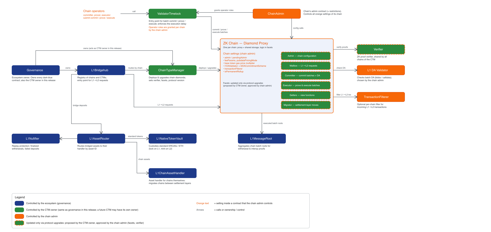

# Contracts overview

`era-contracts` contains the contracts that coordinate ZK chains on L1, settle their batches, and move
assets and messages between chains. The architecture is
organized around four boundaries:

1. **L1 ecosystem contracts** — Bridgehub, chain type managers, chain diamonds, canonical bridges,
   message roots, governance, and upgrade infrastructure.
2. **Per-chain settlement contracts** — the diamond facets for batch commitment, proof verification,
   execution, priority operations, administration, and inspection.
3. **Shared L1/L2 protocol contracts** — asset routers, native token vaults, chain-asset handlers,
   interop handlers, and message verification. The L2 variants are initialized at fixed addresses and
   do not use constructor-set immutables.
4. **ZKsync OS protocol contracts** — fixed-address L2 contracts installed during genesis for
   bridging, message verification, interop, and atomic flows.

Continue with [the complete system map](../README.md) or use the [contract index](./README.md) to open
a domain directly.
