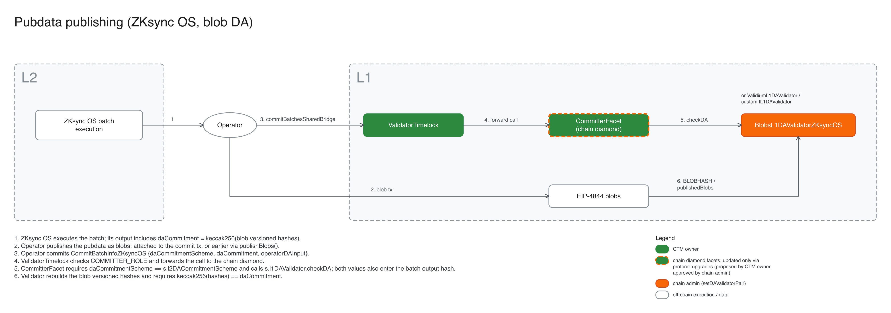

# ZKsync OS blob data availability

The standard ZKsync OS rollup pair uses the `BLOBS_ZKSYNC_OS` commitment scheme with
`BlobsL1DAValidatorZKsyncOS`.

## Batch commitment

`CommitBatchInfoZKsyncOS` carries:

- `daCommitmentScheme`, which must match the scheme stored in the chain diamond;
- `daCommitment`, the value produced by the ZKsync OS state transition;
- `operatorDAInput`, the L1 publication evidence supplied by the operator.

`CommitterFacet` passes `daCommitment` and `operatorDAInput` to the configured L1 validator. The batch
output hash also binds the scheme and commitment, so the proof public input authenticates both.

## Blob validation

For `BlobsL1DAValidatorZKsyncOS`, `daCommitment` is the keccak hash of the concatenated EIP-4844
blob-versioned hashes. `operatorDAInput` contains one 32-byte entry per blob:

- a zero entry selects the next blob attached to the current transaction through the `BLOBHASH`
  opcode;
- a non-zero entry references a blob previously recorded through `publishBlobs`, provided it remains
  within the validator's availability window.

The validator reconstructs the sequence of published versioned hashes and requires its keccak hash
to equal `daCommitment`. It also rejects malformed input and extra blobs attached to the transaction.

The validator returns zero state-diff data and empty legacy blob-opening arrays. For ZKsync OS, state
transition correctness and the batch output are verified by the proof; `CommitterFacet` rejects
non-zero legacy blob-linear hashes or opening commitments returned by a configured validator.
